# 未来国产六代机：无人机是大头，最大起飞重量或可达60吨量级

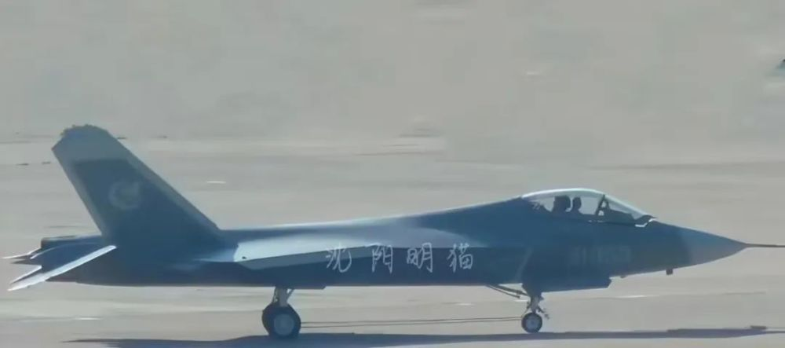

首先从沈飞的新型隐身机说起吧，我们目前看到了好多照片，这是最近的一张，目前可以看出来座舱采用了F-35/歼-20类似的内隔框整体式座舱设计，可以看到，还有座舱平显延续了歼-20的设计。

机头下方还有一个露出的黑点，尺寸很小，类似一个刀型天线，之前比较肥硕的下巴EOTS系统消失了，最让人有兴趣的是前起落架，有点奇怪，貌似有前拉杆，但是长度差了一倍左右，更像是前伸的扭力臂，座舱盖的开启方向，从F-35的后开又变回了传统的前开模式，对比看一下，机头侧面有个飞机编号，好像是31003，这应该是31家族的第三架。

这是某些网友做的FC-35和F-22的侧面对比，可以看到该机的机头是比较肥大，上下2张图对比，可以看到座舱盖的后缘倾斜角度，上图较大，下图较小，这一点说明，是两架不同飞机，不同构型。

下图有个超长的前起落架拉杆，这是和弹射器挂钩结合的独特设计，非舰载机莫属，飞行员弹射座椅和后隔框距离近很多，座舱盖后缘太高，接上一个肥厚的脊背，直接山寨F-35的设计，放弃了后视野，改EODAS监控界面，这也是一种比较时髦的设计。

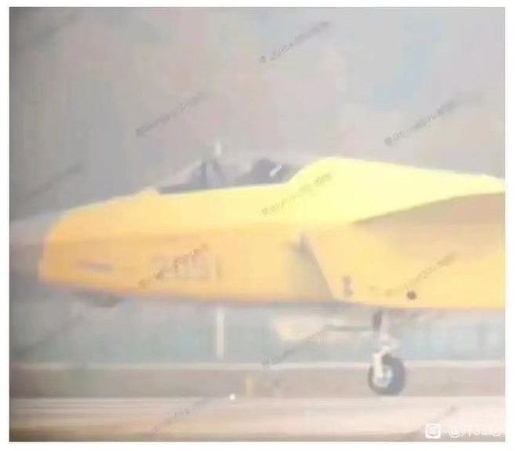

_这是最新版本的单座歼20战斗机批次最大的不同是盖子后缘抬高，脊背鼓起，增加点内部空间，高速减少一点点阻力_

从FC-35和歼-20的改进来看，经过10多年的折腾，中国设计师还是接受了F-35的设计哲学，简单解释就是：EODAS的效果还是比肉眼强，一般可以看10多km，而且是360度球形的监控画面，对于防御来袭导弹和近距离的飞机，有很好的效果，这种设计也为未来全无人战机自动作战奠定了坚实的基础，计算机识别目标总比人脑要快。

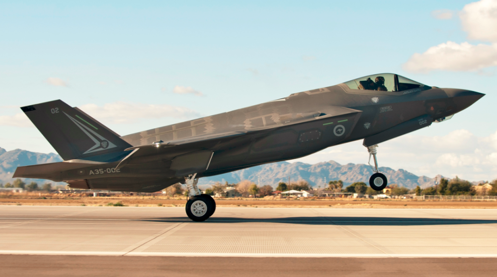

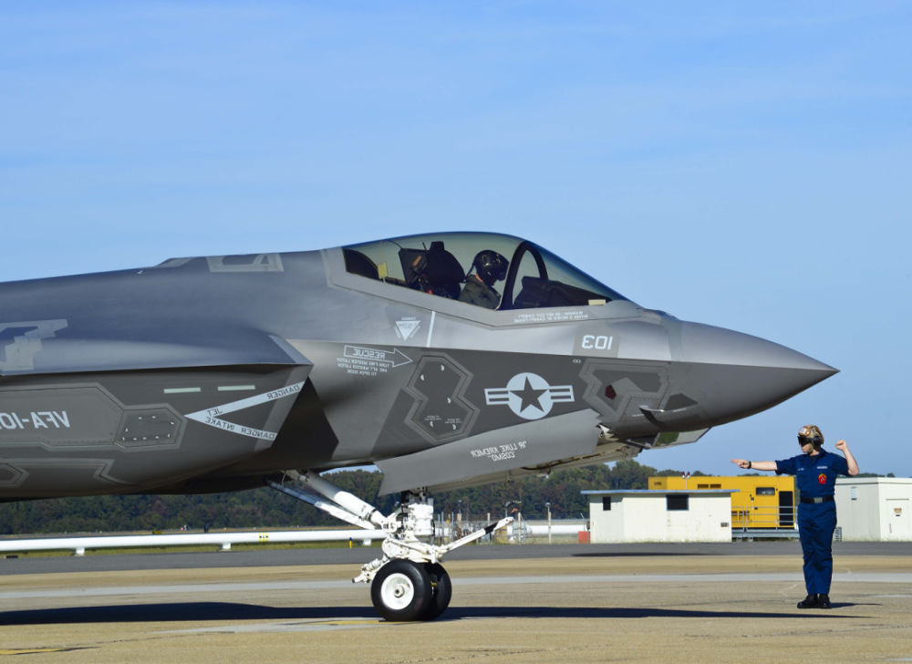

二者对比一下，FC-35飞机的后脊背抬升比F-35A/C更高一些，更流畅，F-35的座舱盖和脊背上边缘并不是特别流畅，有个明显的内凹部位见上图，就这个角度来看，东北的设计师并没有简单照抄。

这是网友CG新机和老版本真机对比，大约后脊背会多那么200-300kg燃油空间吧，对真机性能性能不大，脊背提高一些，高速阻力会减小一点，安装全新的涡扇-15，或许能达到史无前例的超巡速度和持续时间以及距离记录，也将可能赶上美帝F-22尾部雷达红外隐身等特性控制指标。

FC-35的事情，大体就到这里，下面说六代机的事。

先看美国的套路NGAD和F-22战斗机的对比，简单对比可以发现，该机的气动超级简洁，取消了平尾和垂尾，飞机平面外形几乎就是一个简单的箭头形状，这种设计不用说，就是飞高速的料，从线条来看，飞机的雷达反射发现方向，就2对，F-22战斗机有12对，这是一个巨大的飞跃，而且飞机的后掠角非常大，初步估计在60度左右，而F-22的后掠角只有42度，如此巨大的差距，让人联想起一款经典老飞机：协和。

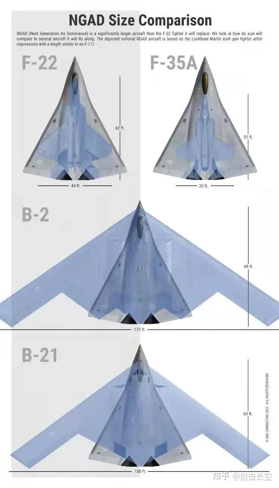

这是该机和F-22，F-35以及B-21的尺寸对比，可以看出来，该机比F-22大约大了一圈，比F-35大2圈，和B-21飞机长度差不多，但是翼展只有一半左右，B-21是轰炸机，极端强调航程，所以必须增大翼展提高升力。

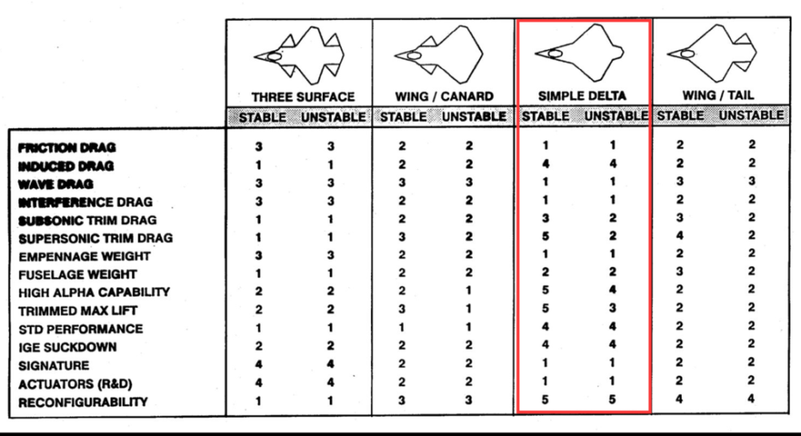

这里提供一个美国过去气动布局选择的研究结论，让我们集中在第三种，无尾布局上，可以看到，该机的优势和劣势都很明显，就是分数1分为优胜，4分最差。

好的地方在于信号控制（就是隐身），摩擦阻力最小，（亚音速飞行的福音），激波阻力最小（超音速飞行的福音），机翼机身干扰阻力小，（机翼尾翼机身都一体化了，干扰啥）机体重量最小（成本低），作动器需求少（控制面少，省钱）。

弱点在于：舵面太少，没法重构，（现在可以用推力矢量补充），大迎角性能差（咳咳，激光炮伺候），最大配平升力不太好（不考虑大迎角高机动，那就无所谓，加了推力矢量可以弥补一些），短距起降性能差，垂直举升状态下飞机接近地面/飞行甲板时排气流导致的下吸效应不好，亚音速配平阻力普通，超音速配平阻力普通，诱导阻力巨大（幻影三角翼飞机的顽症）。

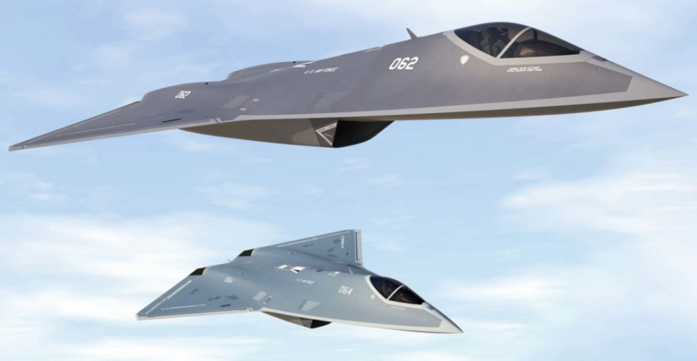

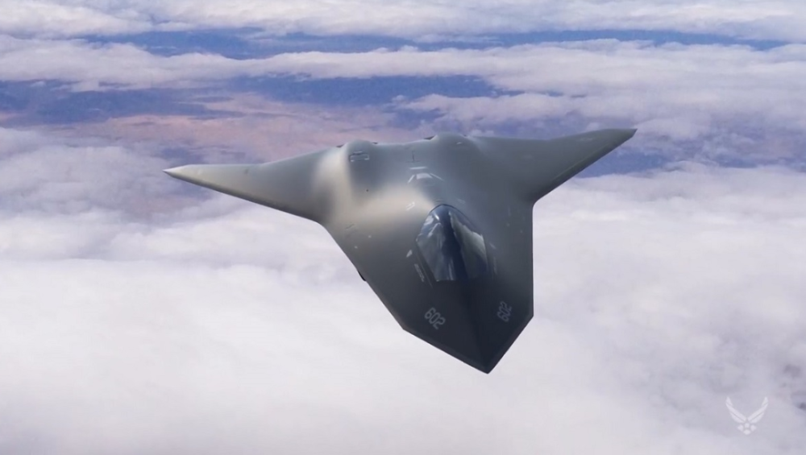

_这是美国公布的多种NGAD方案，不管哪一种方案，都凸显了一个设计：彻底取消平尾和垂尾_

就这些结论来看，大家大约能明白，美国给的六代机方案，几乎都是一个模子的光溜溜大三角翼飞机了吧。

今天的重点在六代机，所以别的气动布局的分类不提，就把栏目给大家翻译一下，大家自己下面看，（friction drag 摩擦阻力）（induced drag
诱导阻力）（wave drag 激波阻力） （interference drag 干扰阻力）（subsonic trim drag
亚音速配平阻力）（supersonic trim drag 超音速配平阻力）（empennage weight 尾部重量） （fuselage weight
机身重量） （high alpha capability 高机动能力）（trimmed max lift 最大配平升力） (STD performance
短距起降能力） （IGE suckdown 近地面吸入效应？） （signature 信号特征） （actuators
致动器（复杂度or设计难度））（reconfigurability （控制）安全性）。

最简单的逻辑就是，上世纪60年代防空导弹大发展，战斗机和防空导弹之间相互搏杀，导弹在造价，射程速度威力上完胜战斗机，战斗机要生存，就必须先干掉或者消弱防空系统的探测能力，这是根本，虽然也有长臂战术还有假目标，干扰机等套路，隐身技术目前看来最拉风，也会和其他战术和武器一起配合作战使用。

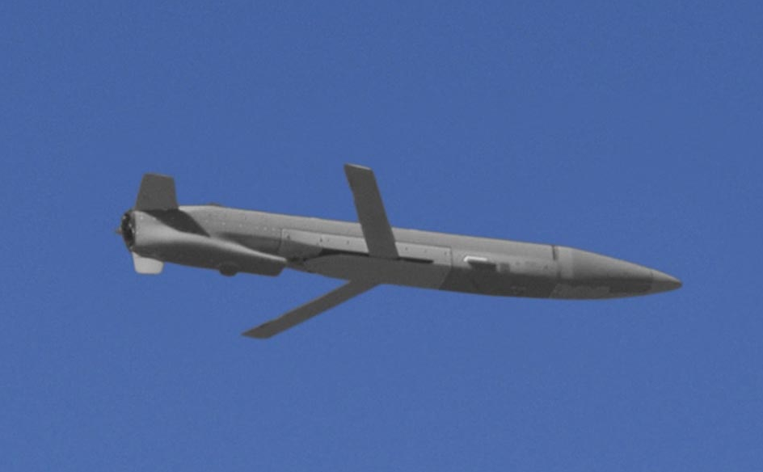

隐身飞机和诱饵导弹/无人机/干扰机一起使用，是未来作战的套路，隐身技术起的作用最大，随着时间的推移，无人机会逐步发威，并一点点取代有人机冲杀在一线。

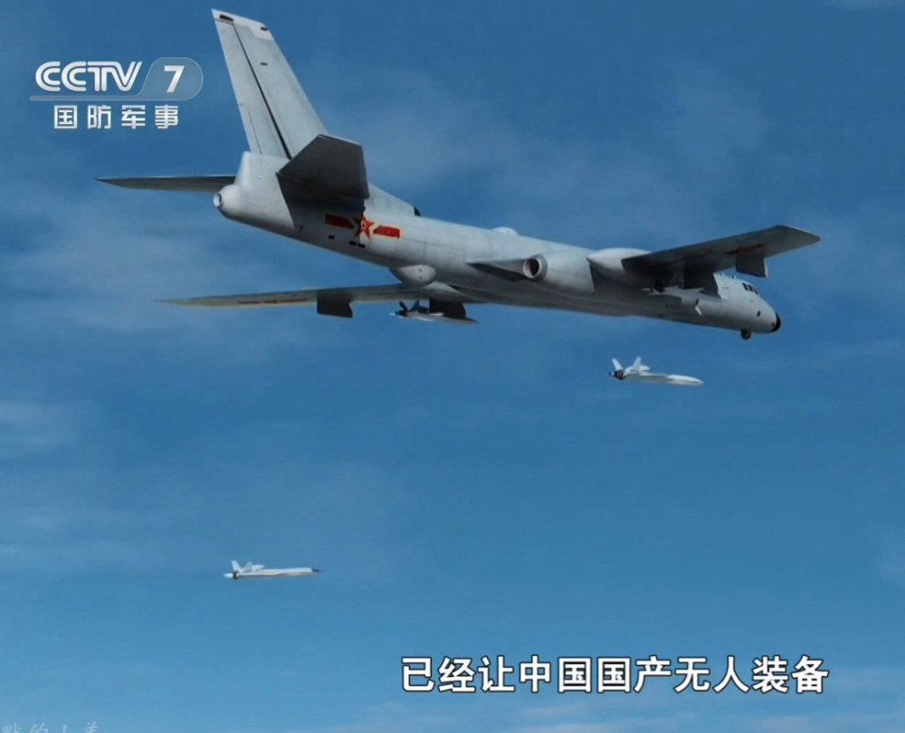

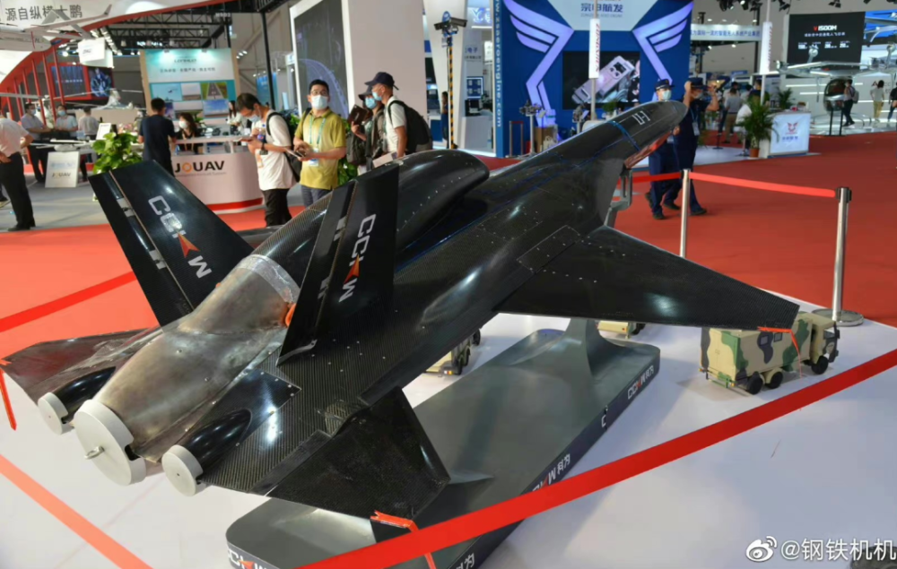

未来六代机的发展，估计无人机是大头，美国目前的计划是有人高价机NGAD200架，便宜的无人版本1000架，中国或许会加倍，现在人力成本和制造还有优势。

六代机的无人机使用，目前有些分歧，有的全部做耗材，有的则要求分开高档重复使用的和耗材类型，从物理规律来看，耗材成本低，使用的器件档次差，性能比较低，高档性能高，各有其用途，所以，未来无人机的争夺将是一场酣畅淋漓的大战，尤其门槛不太高的那些耗材机，航空的所有厂所，航天兵器等，也不会错过这个世纪盛宴，谁能吃到，还是很考验本事，一家招标，百家疯抢，想想都欢乐。

说到这里，不得不扯一下，上世纪70年代的超音速客机大战，欧洲胜出，美国放弃，美国的两款飞机，各自不同，波音的太猖狂，巡航速度高达2.7马赫，价格贵死，巡航升阻比居然高达7.95，麦道的AST方案，速度只有2.2马赫，难度低很多，经济实惠和协和类似，升阻比高达9.6，和英法协和飞机相比，飞机更大些。

_这是麦道公司的AST高速客机方案，可以看出还有一个很小的平尾和垂尾，机翼后掠角非常大了，超过70度，追求极致的高速阻力小_

协和飞机巡航速度2马赫，在经济和技术上达到了很好的平衡，速度再高代价极大，但是事后看，噪音卡死了该机的市场，对于一款民用飞机而言是死点，换成六代机这种军用型号，根本无视噪音。

按照这个要求来看，新一代六代机，应该能达到2马赫的巡航速度，这个速度的升阻比估计在8-10之间，2.5马赫的极速，再高就是热障区，代价太大，得不偿失，更高速度区间，中国和美国都在努力，大约4-4.5马赫的高速飞机，难度巨大，风险极高，目前都在探索，何时能投入使用，还是一个未知数，尤其中国在涡轮发动机上基础积累较差，单纯依靠火箭则运载效率太烂，美国人没有这些问题，但是他们也没有多少把握搞定复杂的多模态动力系统，超燃冲压理论极限10马赫，目前谁都没有正式突破，没有一个实用型号投入使用，即使是小型的导弹，何况是大型的作战飞机。

目前起飞重量最大的隐身战斗机，美国F-22和中国歼-20，最大起飞重量在35-36吨之间，未来六代机，采用两台20吨以上的变循环发动机，最大起飞重量可能达到50吨，甚至60吨量级，几乎逼近了轰-6的下限，非常恐怖。

这是两个不同的来源，第一个是成飞航展的构想，下面是上海某航电单位的模拟图，从可信度来看，二者都差不多，单发，大三角翼，无垂尾，机头棱线和机翼有个比较小的夹角，但是上图机头更尖锐更长点，下图机头短点，机翼根部弦长更长点，和美国公布的方案，差距不大。

或许有种感觉，我们的机翼后掠角更小一点，或许是对亚音速巡航做部分妥协，这需要设计师在亚音速和超音速巡航之间做取舍，美国发动机牛叉，自然可以做的更纯粹一些，我们发动机弱，在气动上就必须做更多的妥协，这种妥协在核心的隐身能力上，也不会造成台阶性的减弱。

注：本文系网络转载，版权归原作者所有。仅此标明转载来源，如涉及作品版权问题，请与我们联系，我们将在第一时间协商或删除内容！

风上风云｜云端故事

