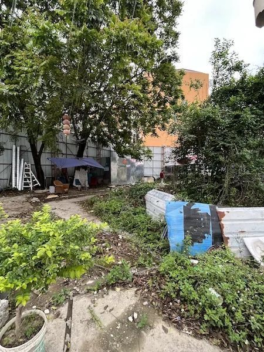
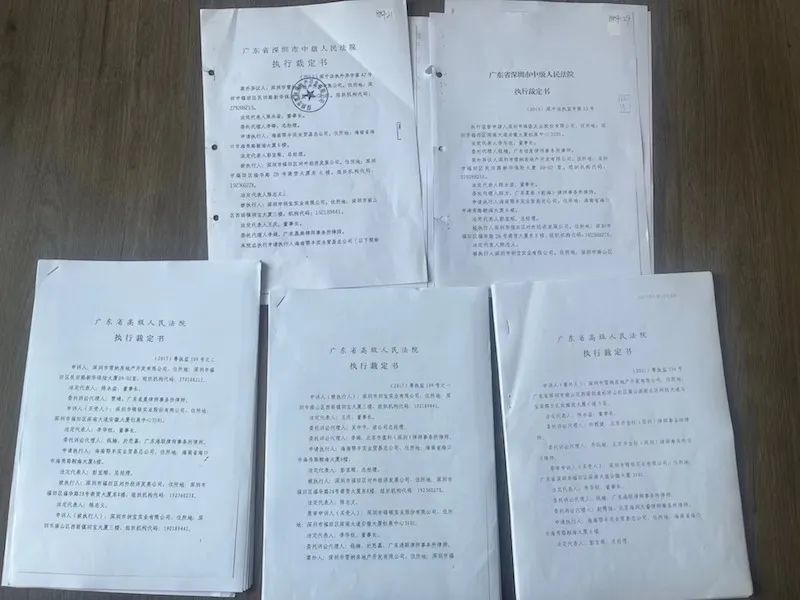

# 深圳闹市区一块1.1万平方米土地闲置26年？知情人：因法院的错误拍卖

一宗1.1万平方米的土地，沉寂26年撂荒闲置、无法开发；一次被指乌龙的拍卖，让案件涉事人从意气风发走到两鬓斑白；9份执行裁定书前后更改背后，三家公司纠纷难断，司法、行政部门各执己见。

近年来，寸土寸金的深圳一直在推动盘活闲置土地。然而，一块位于深圳市南山区深圳珠光路与沿河路交叉口东北侧的土地，若从1994年的出让时间算起，已经闲置了近30年之久。2010年，这宗编号为T402-0014的地块还曾出现在国土部核查通报的全国闲置土地黑名单中。

《华夏时报》记者通过多方采访获悉，这块地一直未开发，主要是涉及几家公司之间的法律纠纷，以及土地使用权和开发权益的矛盾、行政权与司法权之间的纷争，而起因则是26年前法院一次错误的拍卖。

河南泽槿律师事务所主任付建在接受《华夏时报》记者采访时表示，这件事情最根本的原因是1997年深圳市中级人民法院在对该宗土地权益进行拍卖时，未能向国土部门查清这宗地的权属情况，导致了一次错误拍卖，并且在案外人主张权益后法院也没能及时为错误的拍卖行为承担责任，解决争议，做出具有可操作性的执行裁定。

4月7日，《华夏时报》记者实地调查发现，这一地块如今黄土裸露且杂草丛生，因多年闲置已变成暴露在闹市之中的“野生”停车场。放眼望去，周边既有多年的商铺和居民楼，也有已开发完毕的新楼盘，还有处在热火朝天施工状态的工地。与周围车水马龙的繁华相比，这宗26年撂荒闲置的土地俨然成为城市中心的一块“疮疤”。

**揭秘闲置疑云**

事件的起因源于1994年，原本，项目地块由深圳市规划国土委出让给深圳市圳宝实业有限公司（下称“圳宝公司”）和深圳中建实业股份有限公司（下称“中建公司”），两家公司分别占该项目地块45%（自用）和55%（可进入市场）的土地使用权益。

中建公司因自身原因选择退出该地块项目的权益，随后，圳宝公司又与深圳市雪纳房地产开发有限公司（下称“雪纳公司”）签订合作开发协议。1997年7月，圳宝公司、中建公司、雪纳公司三方达成协议并和原深圳市规划国土局签订原合同第一补充协议，约定雪纳公司承接中建公司在这宗地内的权益。

但圳宝公司卷入一宗合同纠纷案，作为第三人被诉讼法庭，因无力承担被法院判决偿还的185万多元款项，在1997年被深圳市中级人民法院裁定将这宗地房地产100%的开发权益拍卖，以清偿债务。

1997年11月，深圳市锦银实业股份有限公司（下称“锦银公司”）经司法拍卖以约612万元竞拍到了这一地块的开发权益。

但值得注意的是，根据国土部门的相关文件，圳宝公司拥有该地块45%产权，另外55%产权归属于雪纳公司。在1997年该宗土地被进行拍卖前，法院仅只评估涉案土地55%的价值，圳宝公司对此提出异议，但拍卖后没有依法启动评估复议程序。“法院评估了地块55%部分价值，却拍卖整块地，且这
55%的权益并不属于圳宝公司。”原圳宝公司总经理吴中平在接受《华夏时报》记者采访时表示，拍卖时的评估报告显示，圳宝名下45%的权益没有评估，价值为0。另外，圳宝公司仅欠债180多万元，法院却超标的拍卖该地块，拍卖款600多万元，而且至今法院并未把多出的款项给圳宝。

对于1997年的拍卖，雪纳公司董事长陈永益在接受《华夏时报》记者采访时表示：“法院的拍卖未到行政部门查实权属情况，也没有通知国土委，雪纳公司并不欠钱，法院却把属于雪纳公司的55%也一起拍卖了，评估的也是这55%；拍卖的还是开发权益，并非土地使用权。”

对于法院对“开发权益”进行拍卖，吴中平也表示：“土地只有使用权，有史以来也没听说过拍卖开发权益，但这么多年里，法院却从来未对此做出过解释。”

付建向本报记者表示：“拍卖土地的开发权益要注意与土地使用权的协调和衔接，不能在权益不明晰的情况下直接进行拍卖。根据《国家规定确定土地所有权和使用权的若干规定》第六条的规定，开发利用国有土地，开发利用者依法享有土地使用权，土地所有权仍属国家。实践中，土地开发权益与土地使用权通常是不分开的。”

因此，拥有T402-0014地块55%土地权益的雪纳公司向深圳市中院提出案外人执行异议。随后，深圳市中院在2004年立案并对T402-0014地块土地使用权进行了查封。

直至2011年7月，法院才有了第一次裁定。深圳市中院在（2010）深中法执监字第34号民事裁定书中首次承认1997年的拍卖是拍错了：“本院将T402-0014地块100%的权益认定是圳宝公司所有，属于对案涉地块的权属没有查清，将其全部作为圳宝公司的财产予以拍卖亦是错误的，该拍卖裁定违法，应予撤销。雪纳公司对本案的异议请求部分理由成立。”

随后，锦银公司不服，向广东省高院申请复议，深圳市中院于2013年7月又下达（2012）深中法执外异字第42号执行裁定书，表示：“在当时的情况下，不能因此当然认定该55%产权归圳宝公司享有即圳宝公司享有了涉案地块100%的产权”“本院只能处分圳宝公司在涉案地块中的45%的权益”，并中止这宗地房地产开发项目中的55%权益的执行。但值得注意的是，深圳中院两次裁定承认拍卖错误的情况下，却未对认定拍卖合法有效的裁定进行撤销。

**戏剧反转再现**

2017年，案情再一次发生戏剧性的“反转”。当年7月，深圳中院对锦银公司提出的执行监督申请又作出裁定，改口称之前的裁定“适用法律错误，应予纠正”并撤销2013年的第42号执行裁定。这一次，雪纳公司、锦银公司、圳宝公司均不服，向深圳中院申诉，随后向广东省高院申请复议。广东省高院再次撤销了深圳中院的裁定，发回深圳中院重审，要求当事人和解结案。

4月7日，《华夏时报》记者在现场看到，这一闲置26年的地块如今黄土裸露、杂草丛生，边界处树木疯长，因多年闲置已成为暴露在闹市之中的“野生”停车场，俨然成为城市中心的一块“疮疤”。“拍卖时是4000多元一平方米，当时（圳宝）计划自用是为解决员工住宿问题，时过境迁，如今周围新房均价都在9万—10万元/平方米。”圳宝公司总经理吴中平向本报记者表示。

为此，《华夏时报》记者于4月10日联系到深圳规划和自然资源局南山管理局，工作人员表示采访事项需联系总局，记者进一步向对方发出协助联系总局的请求，对方表示应允并表示随后会进行联系，但截至记者发稿，对方未予回复。

如今，这一案件迟迟难以画上句号，给各方当事人都造成较大损失。一位不便具名的知情人士向《华夏时报》记者指出，除了一开始的“错拍”，根本还在于司法权和行政权对该宗土地权属认定意见不一致。

雪纳公司董事长陈永益向本报记者表示，20多年里，深圳中院、广东省高院总共下发了9份裁定书，裁定书之间互相矛盾，直到2022年6月24日，省院认定拍卖正确，雪纳公司不服，7月份向最高人民法院申请执行监督，最高法认为本案有执行违法行为，已立案审查。

_2017年后的部分裁定书_

此外，圳宝公司原总经理吴中平告诉本报记者，圳宝律师曾到深圳中院调卷，中院告知律师执行土地的卷宗已经丢失，圳宝公司认为这是罕见的、严重的失职行为。圳宝公司希望此次最高法能公平公正依法纠正深圳中院的错误，撤销拍卖，把土地还给圳宝和雪纳，圳宝公司会以其他方式妥善处理债务问题。

目前，雪纳公司与圳宝公司均已向最高法申请执行监督，现案件在最高法审理期间。

锦银公司则在此前向国土部门申请办理这宗土地使用权的过户手续，据了解，在国土部门给相关企业的回函中，其观点一致认为，深圳中院历次出具的官方材料中指明的执行标的“土地开发权益”不一致，根据《土地管理法》规定，土地开发权益不属于需要登记的不动产权利，该权益权利人变更亦无法办理过户手续，该协助事项不具备操作性。

国土部门还表示，需锦银公司协调深圳中院进一步明确协执内容，根据目前法律法规，仅有土地使用权过户，开发权益不知道如何过户。

根据记者从当事人处掌握到的权威材料，为加快盘活土地，国土部门曾多次给深圳中院去函征求处理意见，建议加快相关执行案件的处理工作，表示将依法予以协助，并指出这宗地的土地出让权属法律关系是清晰的，但法院方面对土地权属登记，并未给出明确意见。

**“开发权益”能拍卖吗？**

据知情人士透露，当前，该案件仍在最高法审理中，正常情况下，深圳当地有关部门应等最高法审理结案后再行处理。但令人不解的是，省高院却于2023年2月27日组织深圳中院举办协调会，讨论锦银公司竞拍土地的过户事宜。

“1997年拍卖‘开发权益’与现行法律法规相矛盾，按现行法律法规，开发权益是无法办理过户手续的。”雪纳公司董事长陈永益向本报记者表示，“即便锦银公司在最高院赢得了最终裁定，也只是土地开发权益，而非土地使用权，锦银公司只有在雪纳公司和圳宝公司同意的前提下，才能将土地进行过户。”

雪纳公司诉讼代理律师向《华夏时报》记者表示，法院在执行裁定中创造的拍卖“土地开发权益”而非国有土地使用权这一概念是非常荒谬的，物权是法定的、不可自己创设的权利，即所谓物权法定原则，这是民法通则、物权法、民法典都非常明确这一条。“土地开发权益是与国家土地行政管理部门签约的权利，但与国家土地行政部门签约是国家行政权力的一部分，也就是说选择国有土地开发者的权力具有严格的审批制度，属于行政合同，而非民事合同的范畴，也不可以由执行局处置、拍卖。”

对此，付建也表示，该案的相关事实和土地权属是相对清晰的，法院因执行拍卖中的错误一直做出不具有可操作性的裁定来逃避责任。事实上，土地权属认定过程中，法院拥有的权力是一种判断权，相关行政机关拥有的权力是一种处理权。行政机关的处理依赖于法院作出的判断结果。本案件在土地确权上也应当尊重司法机关的判断权。但本案件已经由于司法空转、土地闲置多年造成了巨大的损失，行政部门和司法机关如果对该宗土地权属认定及造成土地闲置的责任归属等问题存在争议，可能会涉及通过行政诉讼来解决。

在采访中，本报记者听到最多的四个字是“解决问题”。陈永益向本报记者表示：“20多年里，我从年轻人走向两鬓斑白，公司也被这个案件拖累至几乎要破产了。希望最高人民法院公平公正进行处理，早日对这个司法长跑了26年的案件进行处理。”

针对该案，付建表示：“雪纳公司与锦银公司的争议，若真是由深圳市中级人民法院执行错误导致的，法院应当积极主动承担责任；并且，该宗土地闲置多年，又造成了巨大损失，如不尽快确权、开发利用将造成更大的损失，有关部门在其中负有责任的，也应当对当事人的利益损失进行赔偿。”

付建进一步表示，事到如今司法机构应当积极与双方公司协商土地确权事宜，根据相关法律规定尽快给出终局裁定，当事人可以就有关部门执行错误或失职行为给其造成的损害，申请国家赔偿。

据前述知情人士，所以出现现在结果，主要是因为当初拍卖该地块时程序不规范导致。公开资料显示，2006年，深圳中院腐败案曝光，当时拍卖该地块的主管法官廖昭辉也牵涉到腐败案中，后获刑7年；另外，廖还曾和一些拍卖行之间有利益输送关系，制造了一些冤假错案。对于本案件来说，之所以难以纠错，主要在于法院的纠错成本太高，因此法院其实是最希望当事人出现和解的局面。

最高人民法院党组书记、院长张军近日在主持最高人民法院党组召开扩大会议时，强调抓实抓好公正与效率，紧紧围绕“公正和效率”这个主题，抓住审判工作这个“实处”，着力在促公正、提效率、强队伍上下功夫。张军表示，感受公平正义的主体是人民群众，要重视程序公正。“老百姓(36.200,-0.61,-1.66%)到法院是为了解决问题的，绝不是来‘走程序’的。程序合乎规范，同时能实质解决问题，案结事了，才是诉讼的目的、才能体现诉讼的价值。”

（来源：华夏时报）

