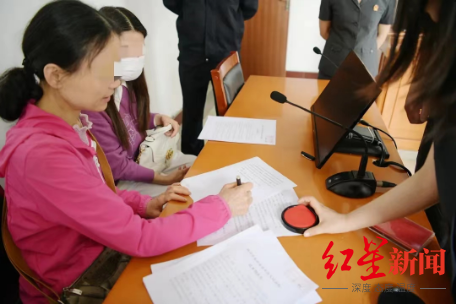

# 老旧小区加装电梯引邻里分歧，底楼业主起诉楼上10户被驳回：应具适度容忍义务

老旧小区加装电梯，是一项实实在在的惠民工程，但在现实生活中，高层住户与低层住户之间的利益冲突却可能引发纠纷。前不久，四川乐山一老旧小区底楼业主程某以侵权为由将2楼及以上10户业主告上了法庭，引发广泛关注。

4月13日，乐山市市中区法院对该市首例涉老旧小区加装电梯物权保护案作出一审宣判，判决驳回原告程某诉讼请求，认为低层住户对增设电梯应当具有适度的容忍义务。同时，该院将于近日向相关部门发送司法建议。

**老旧小区加装电梯**

**底楼业主：影响采光通风起居 把楼上10户告了**

涉案小区位于该市市中区白云街，于1999年修建，属于单位集资建房，小区内共有13个单元楼，楼高均为6层，每层2户业主。原告程某为该小区1楼业主，被告潘某某等10户业主为同单元的2楼及以上住房。

2022年年初，潘某某等多户业主发起在本单元加装电梯的申请，12户居民中有10户同意加装电梯。由于符合加装电梯业主表决规则，加装电梯的筹备工作正常启动。在此期间，1楼住户程某一直持反对意见。街道、社区多次走访协商调解，均没能达成一致意见。

据小区所在的茶坊社区党委副书记刘军介绍，此前这个小区已经加装了好几台电梯，关于涉案楼栋底楼与楼上住户存在的分歧，街道和社区组织了两次调解未果。电梯加装工程开工前夕，程某以侵权为由将2楼及以上10户业主告上了法庭。

程某认为，该电梯加装后，将影响其厨房和卫生间的采光、通风，电梯运行产生的噪音也将影响其家人日常起居和休息，请求判令被告停止侵权，立即停止加装电梯工程，或者判令各被告在加装电梯时，不得对原告的采光通风以及居住安全造成影响，并连带赔偿因加装电梯导致的原告房屋贬值损失。

2023年2月23日，案件承办法官协同相关部门、茶坊社区工作人员前往该小区，对其区域内已安装和尚未安装电梯的居民楼进行实地勘验、拍摄，并乘坐同类型电梯入户走访，查看电梯安装具体入户位置及室内采光、隐私保护等情况。

_乐山首例涉老旧小区加装电梯物权保护案一审宣判_

2月28日，该院公开开庭审理该案。庭审中，原被告双方针对“室内采光、产生噪音、隐私泄露、工程安全”“侵占共有面积及补偿”等争议焦点进行举证质证。该案因相关证据需要当事人补充，将择期宣判。

**一审判决：驳回！**

**低层住户对增设电梯应具适度容忍义务**

4月13日，乐山市市中区法院对该案作出一审宣判，判决驳回原告诉讼请求。

根据法院一审查明，案涉楼房除底楼的住户外共有10户且其中9户的年龄在55岁至67岁之间，面临或即将面临老龄化的问题，出行不便情况将更加突出。

此外，被告已提供证据证明，案涉楼房增设电梯事项已经该单元专有部分的全体业主共12户参与表决，并参与表决专有部分面积3/4以上的业主且参与表决人数3/4以上业主（即10户）同意，符合《民法典》相关规定。表决情况同时进行公示，且小区业委会在公示期间内未收到异议。公示情况已经过所在街道及社区调查核实。同时，被告增设电梯规划方案取得了相关部门“符合规划要求”的审查意见，并经相关部门审查后认为“增设电梯的勘察、建筑、结构、电气、抗震和消防均为合格”。

法院查明，案涉增设电梯对于旧房而言系增加附属设施、改造房屋功能，属于《民法典》第二百七十八条“改建、重建建筑物及其附属设施”。从增设电梯方案来看，确需占用4平方米左右的公共绿地，但案涉增设电梯并非用于经营活动，且并未占用原告的专有部分，占用公共绿地面积较小，不是小区业主通行或活动时的必经地点，从物的效用最大化发挥角度考虑，尚属于共有人容忍义务的合理范围。

法院一审认为，本案中既有住宅加装电梯的表决、审批均符合法律规定，且根据《民法典》第二百九十一条关于相邻通行权之规定,低层住户对增设电梯应当具有适度的容忍义务。关于原告主张各被告连带赔偿因增设电梯“导致原告房屋贬值损失10万元的问题”。因案涉电梯尚未修建完成，对原告房屋的采光、通风是否会造成影响，噪音是否影响原告生活以及影响有多大等问题不能确定，故对原告的该项诉讼请求在本案中不予处理，待后果实际产生后原告可另行寻求合法途径解决。

同时，法院将社会主义核心价值观写入判决，充分发挥案例在弘扬社会主义核心价值观方面的重要作用，并将于近日向相关部门发送司法建议。

**底楼业主不服将上诉**

**法官：高层业主应主动听取和尊重底楼意见**

对此，乐山市市中区人民法院民事审判第一庭庭长高奕表示，根据《民法典》关于相邻关系的规定，倡导和睦包容、互谅互让的中华民族传统美德以及和谐、友善的社会主义核心价值观。相邻各方均应当按照方便生活、团结互助、公平合理的原则处理相邻关系。

高奕认为，在类似纠纷发生时，高层业主亦应当认识到底楼业主并没有因为加装电梯而享受任何的收益或者便利。相反，加装电梯对于底楼业主的出行、通风、采光、房屋升值空间等都可能造成一定的影响。高层业主应加强事前沟通，主动听取并充分尊重底楼业主意见，对于底楼业主所持反对态度亦应当给予充分理解，予以正向沟通和合理解释;如电梯安装施工对底楼业主确有较大影响，亦应积极协商予以适当补偿，在维护自已合法权益的同时尽可能小地影响或牺牲他人的权益，避免因沟通不畅引发的不理解、不配合，甚至矛盾的激化，影响社会和谐稳定。

不过，对于一审判决结果，原告程某表示，加装电梯对其伤害是肉眼可见的，只要是住底楼的人都能感同身受，这个维权是正常维权，将会提起上诉。

红星新闻记者 顾爱刚 图据法院

编辑 邱添

