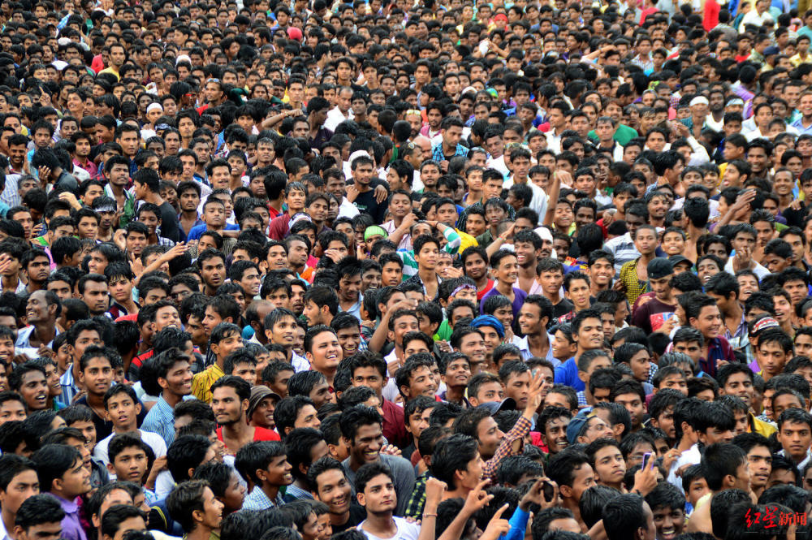
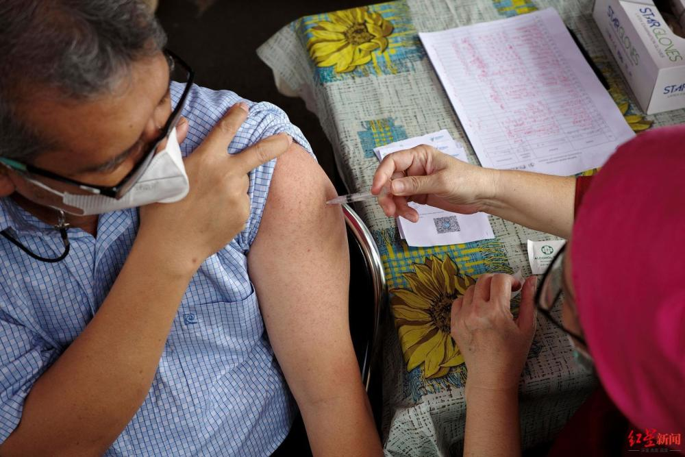

# 联合国人口事务专员：印度人口4月14日成为“全球第一”可能并不准确

一份联合国报告曾预测印度将在4月14日成为“全球第一人口大国”。不过，印度上一次真正意义上的全国人口普查还是在2011年，谁也不知道他们在这10多年里，又增加了多少人口。

联合国人口事务专员莎拉·赫托格在接受红星新闻记者采访时透露，印度可能至少要等到2024年才能重启人口普查工作，目前联合国内部只能依据粗略数据估算印度人口。

至于印度人口数量是否4月14日成为“全球第一”，赫托格表示，这个日期可能也并不准确，本月下旬联合国人口司将向媒体作出进一步准确的说明。

_一份联合国报告曾预测印度将在4月14日成为“全球第一人口大国”_

10年一普查：因疫情和技术原因，印度迟迟未启动

联合国预测印度人口可能在4月14日这一天达到1,425,775,850人，成为全球第一人口大国。

根据2011年印度人口普查结果显示，印度的人口为12.1亿。如果联合国预测精准的话，这意味着该国在12年内增加了2.1亿人，几乎相当于整个巴西的人口数量。

印度原定为每十年举行一次人口普查，2021年因新冠疫情而推迟。不过，现在疫情虽然缓解了，印度的人口普查却因为技术和后勤保障的困难而陷入停滞。没有迹象表明印度政府将在短期内重启这项工作。

人口普查中的就业、住房、识字率、移民模式和婴儿死亡率等数据至关重要，印度专家担忧，迟迟不更新这些数据会严重影响印度的经济规划以及公共政策制定。印度统计和规划部的一位高级官员承认，政府还在使用2011年的人口普查数据来预测公共预算开支。

_十年一次的人口普查因疫情等原因被推迟 据视觉中国_

两名分别来自印度内政部和注册总署的官员表示，延迟人口普查主要是由于政府决定在科技的帮助下简化此前较为繁琐的普查流程，而电子化系统的建立和数据录入需要一定时间来完成。

内政部官员透露，印度政府计划采用名为Aadhaar的国民身份证系统，并让政府可以通过一款手机App来追踪人口数据。根据印度统一身份证办公室提供的数据，截至2022年12月31日共有13亿人加入Aadhaar系统，而当时的预计人口为13.7亿。一位高级官员称，统计与现实的缺口主要是由未入学的幼童和未更新的死亡人数造成的。

该官员称，等到Aadhaar系统打造完毕时，印度政府就能拥有一个“事实上的人口实时数据系统”。

联合国专家：只能很粗略地估计，本月下旬将进行技术修正

据公开消息，联合国数据库中用于计算印度人口数的基础数据最后一次更新是在2022年7月。

赫托格对红星新闻记者表示，由于印度缺乏完整准确的人口数据，他们在实际工作中会通过各种指标观察印度生育率、死亡率和跨境移民数量的变化趋势。这些观察指标主要来自印度行政工商部门的登记系统。通过这些中间变量，联合国工作人员才能对印度人口数量有一个大致的估计。

由于这种估计的不准确性，联合国原来预测的4月14日印度成为“全球第一人口大国”也并非精准测算。赫托格表示，预计将在4月下旬对“这一天”的准确节点进行技术修正。

非政府组织印度人口基金会的瓦杰佩耶说，由于十多年来没有挨家挨户上门统计的实际数据，他们只能用抽样调查填补空白，以帮助人口统计学家了解印度的人口变化。印度前首席统计师普罗纳布森则表示，面对印度国内纷繁复杂的人口地理格局，抽样调查不可能给出十分精确的预测。

印度官员：印度政府若不及时更新数据会产生严重后果

在印度，不管是人口普查还是选举计票，这类繁琐工作一般由全国33万名公立学校教师来承担。

根据印度此前为2021年人口普查制定的计划，这些教师首先需要列出全国所有房屋的清单，保证无一遗漏。然后他们要根据这份清单挨家挨户上门发放两份问卷，并且回收每一份问卷。这些问卷的结果将被制成统计表格，最终汇总数据将在11个月后公布。据2019年推演的数据，整个人口普查过程或将耗资875亿卢比（约合人民币73.5亿元）。

2021年新冠疫情在印度肆意蔓延，使得普查工作未能如期开展。当疫情缓解后教师重返学校时，发现肩上的担子更沉重了。除了不知何时重启的人口普查外，老师们还必须在2023年九次州选举和2024年全国大选中出力。除了影响正常教学秩序外，老师们还抱怨收到的酬劳太少了。

拥有230万成员的全印度小学教师联合会的高级官员阿尔文德·米什拉表示，虽然法律规定教师必须帮助开展选举和人口普查工作，但政府必须增加他们的酬劳。“政府必须拿出系统的支付方案，”米什拉说，“教师值得尊重，他们不能一边为了地球上最大规模的统计工作而四处奔波，一边还担心自己的支出和劳累得不到合理的补偿。”

印度国家公共财政和政策研究所研究员拉什纳·莎尔玛表示，人口普查数据“不可或缺”，印度政府不及时更新数据会产生严重后果。她认为，由于消费支出调查和长期劳动力调查等研究都是基于人口普查信息做出预测，在没有最新人口普查数据的情况下，基于十几年前的数据可能使得出的结论与现实相去甚远。

红星新闻记者 郑直

责编 官莉 编辑 何先锋

