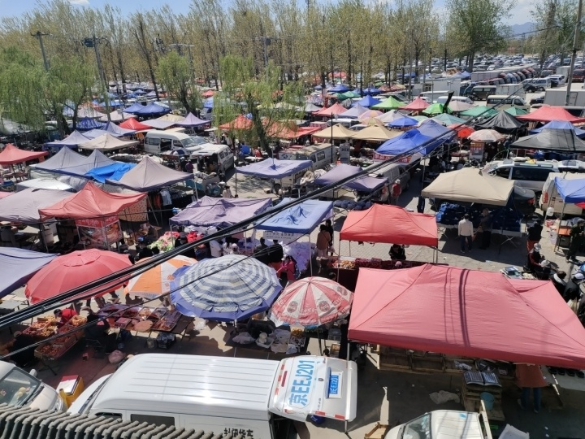
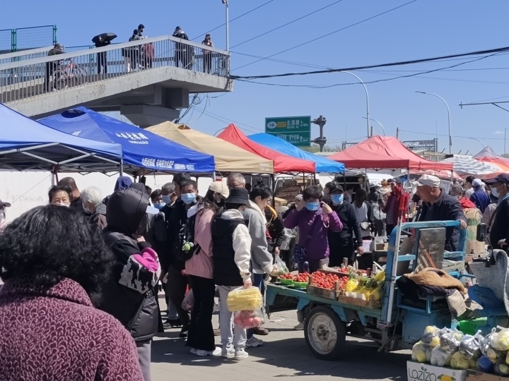
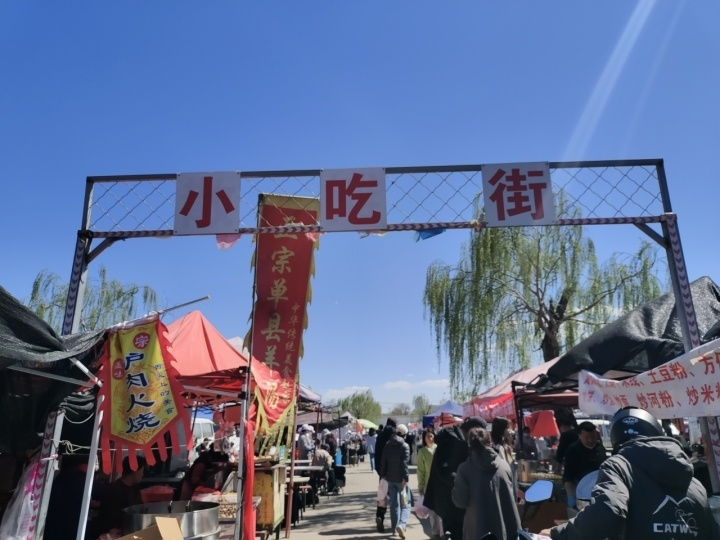
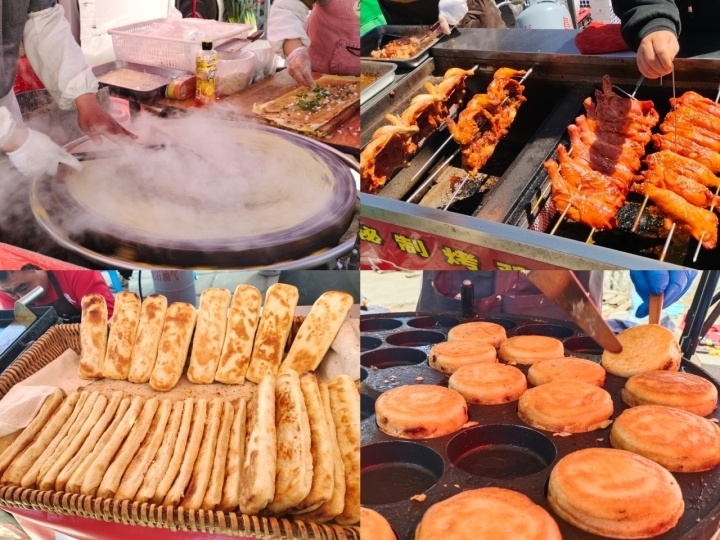
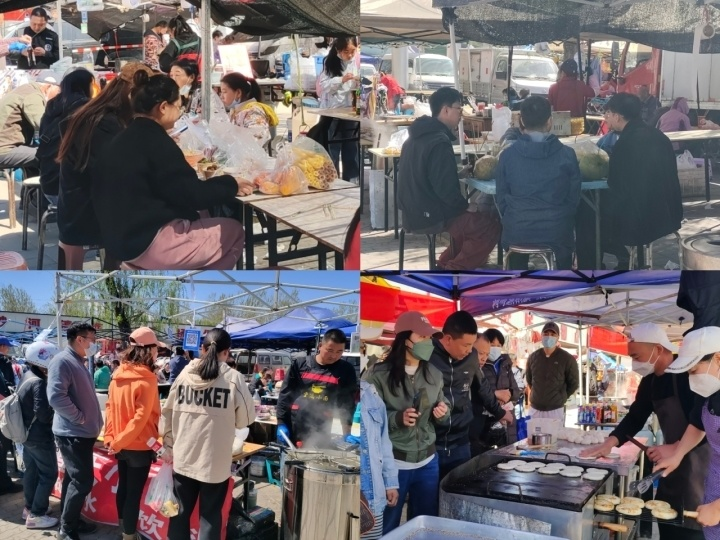
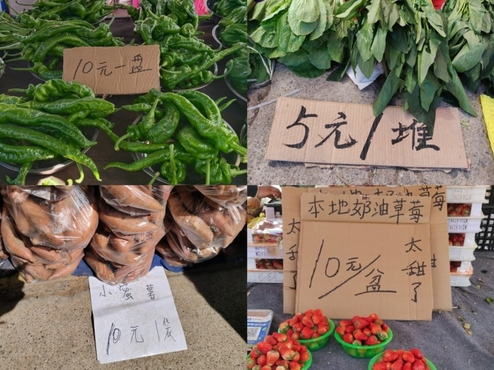
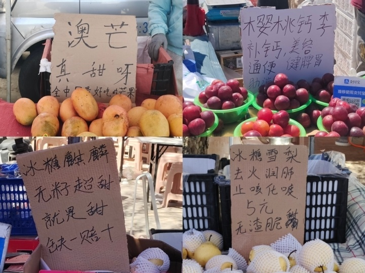
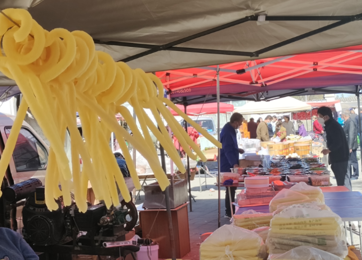
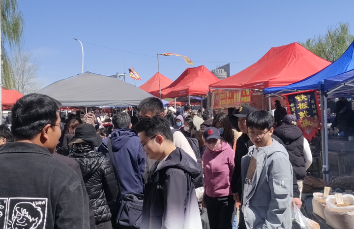

# “我，20岁，大学生，不赶早课赶大集”

最近，在北京，一种新的潮流正在年轻人中兴起——郊区赶大集。从去年年底开始，北京郊区的大集逐渐被年轻人占领，比如昌平的沙河大集、通州的台湖大集、顺义的罗各庄大集。

_昌平沙河大集_

特别是原本每周末开集的昌平沙河大集，直接被这届年轻人“吓”得周末关停了。由于赶集的人过多，一到周末，沙河大集附近堵得水泄不通，于是从上个月开始，沙河大集的开放时间调整为每周一、周三、周五。

北京的年轻人为何热衷于赶大集？潮新闻记者也清空了自己的双肩包，到北京最大的沙河大集上一探究竟。

在北京地铁8号线终点站朱辛庄站下车，换上昌73路、昌19路或者专49路公交，如果在车上看到了拎着空帆布袋的年轻人，那她们的目的地大概是一致的，到沙河大集上大买特买。

_昌平沙河大集_

“下车后跟着大爷大妈们一直走，过个天桥就到了。”快下车时，一位经常来赶集的女大学生给记者指了路。

**接地气的“小吃街”抓住了年轻人的胃**

穿着新潮的年轻人，左手一根淀粉肠，右手一个肉蛋堡，胳膊上再挂着一袋“复古版”爆米花，在大集上边逛边吃，郊区大集首先抓住了年轻人的胃。在整个沙河大集上，最受年轻人欢迎的就是这里的“小吃街”。

_沙河大集小吃街_

排着长队的“安徽正宗牛肉板面”、滋滋冒油的“摇滚烤鸡”、热气腾腾的山东大煎饼……逛累了就在“小吃街”简易的就餐区坐下，敞开吃。

“在吃这块，年轻人比岁数大的消费者更能花钱。”一位卖肉蛋汉堡的阿姨告诉记者，“沙河大集在北京很出名，很多人来这就是为了吃一些在写字楼附近吃不到的东西，从海淀、西城过来，还有从朝阳过来的。”

在附近上学的晓然和她的5个室友，早上7点多从宿舍出发，坐两站公交来赶集，“平时上早八都不用这么早起，早起上课很难，但是早起赶集很有趣。”

晓然告诉记者，她们今天来赶集的主线任务就是吃，吃一些学校食堂吃不到的东西，算了算，6个人总共吃了二十多份不同的小吃。

“有一些非常好吃，有一些也难免踩雷，但主要是这种吃法让人特别快乐。”晓然的一位室友说。

**闭眼大买特买 商场里找不到的“获得感”**

当然，年轻人来赶集也不全是为了吃，他们在大集上的“购买力”也不容小觑，买蔬菜水果、买散装零食、买二手书、买花，甚至是买5块钱一件的短袖。

“调整开集时间后，周三是附近大爷大妈的主场，到了周五，就成了年轻人的主场，附近很多大学生没课了就来赶集。”

水果摊上一位卖草莓的大叔告诉记者，“我在这摆摊4年了，就最近几个月人最多，尤其是年轻人，他们到了这好像花钱都不眨眼，也不爱还价，很痛快。”

这里的蔬菜水果，按盆卖、按袋卖、按堆卖，再搭配上一些朴实、接地气的广告语，一份5元、10元、15元，老板会热情地邀请你先尝一尝，不甜不要钱。

李杰在班里女同学的“安利”下，跟朋友一起来赶集买水果，“比起超市里25块一个的桃子，在这买水果我踏实多了。”

逛了两个多小时，李杰和朋友4个人没有一个人是空着手走的，每个人手里都拎着好几个塑料袋。“我觉得这更接近我们的消费水平，说白了就是非常接地气，花100块钱就买了一大堆，这种简单的获得感，在大型商场里就比较难实现。”

**寻找都市生活中的人间烟火气**

吃喝玩乐的背后，大家在赶集中寻找的是一种新鲜感，从快节奏的生活中短暂逃离出来，感受浓浓的人间烟火气。

“以前的北漂生活里好像只有‘漂’，没有生活，最近每个星期都来这里逛上一圈，让我觉得待业的日子里焦虑少了很多。”

几个月前刚刚从上一家公司离职的薛女士告诉记者，由于城里的房租压力太大，待业几个月来，她一直住在郊区，戒掉外卖，开始自己做一日三餐，最近又喜欢上了赶集，“开始关心粮食和蔬菜。”

“在网上看很多博主来赶集，自己也来体验一下，很新奇，但是又挺熟悉的，这不是小时候我妈经常带我逛的吗？”薛女士说，“小时候看到这些就走不动道，没想到现在也是。”

在海淀读研一的文静说，“去三里屯、国贸那些地方逛，总会有点格格不入，太拘束了，在这里就不用纠结出门穿什么衣服，也不用特意洗个头、化个妆，顶着个鸭舌帽就出门了。”

“在这里逛一逛很放松，很多东西也勾起了小时候赶集的回忆，以前我们村里也有集，小时候都有大人带着，现在长大后再来赶集，倒是还有点担心自己被坑。”文静说。

（文中晓然、李杰、文静为化名）

“转载请注明出处”

