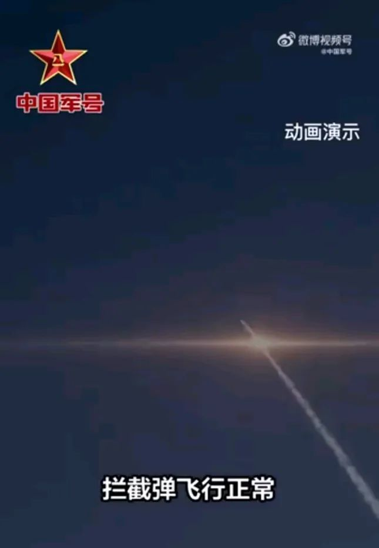
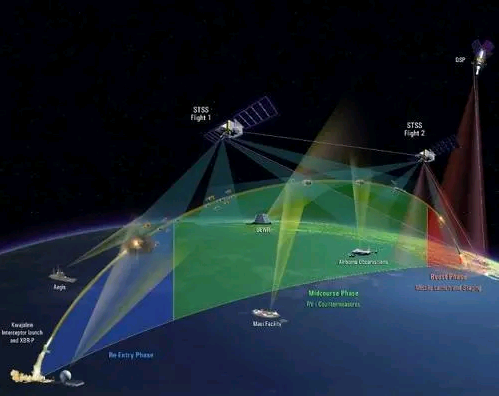

# 中国陆基中段反导拦截六战六捷！目前全球只有中美俄明确具备该能力

中国国防部14日又通报一个大新闻：2023年4月14日晚，中国在境内进行了一次陆基中段反导拦截技术试验，试验达到了预期目的。这一试验是防御性的，不针对任何国家。

老司机对比了一下，和去年6月那次反导拦截技术试验的通报相比，除了时间不同外，两份通报内容当真是一模一样。但中国军方发布消息向来是“话少事大”。虽然两份通报的内容一样，但结合背景来看，这背后的味道就不一样了。

_去年10月，中国陆基中段反导拦截试验画面首次披露_

首先，这是中国第六次宣布陆基中段反导拦截试验取得成功。此前五次分别于2010年1月11日、2013年1月27日、2018年2月5日、2021年2月4日、2022年6月19日成功进行。此外，2014年7月23日，中国国防部宣布“中国在境内进行了一次陆基反导技术试验，试验达到了预期目的”。不过与其他几次不同，2014年没有提及是在哪个阶段进行拦截。

为什么要强调中段反导拦截试验的特殊性呢？据介绍，反导拦截技术按发射地分为陆基、海基和天基，分别指反导系统在陆地、海上和天空发射。要了解什么是陆基中段反导，首先要搞清楚弹道导弹飞行的三个阶段。第一个阶段是初段，或者叫上升段，从导弹点火升空算起到末级发动机停机为止。第二个阶段是中段，从末级发动机关机开始，到导弹再入大气层为止。第三个阶段为末段，也叫再入段，也就是再入大气层到落地这个飞行阶段。

通常而言，上升段的导弹速度慢、轨迹单一，拦截技术难度最小，对己方的附带伤害小。但此时导弹往往还处于对手领土或领空范围内，需要突破重重防御，实际上非常难以实现。

而再入段的导弹飞行速度极快，洲际导弹的弹头再入速度可达15-20马赫，而且此时弹头已经与弹体分离，不但体积小，而且可能释放假弹头等干扰手段，拦截起来也非常困难。即便拦截成功，导弹残骸也可能落在本国领土上造成附带伤害。

因此中段拦截就成为针对中远程导弹乃至洲际导弹最重要的技术手段。据介绍，在弹道导弹飞行中段实施拦截，时间相对来说比较长，但由于此时导弹的弹道高度比较高，所以拦截起来仍有相当难度。中国多次成功实施陆基中段拦截试验，说明中国已经掌握了中段反导拦截相关技术，拦截成功率、可靠性都有了比较大的提升。

算上2014年的那次陆基反导拦截试验，中国公开宣布进行了7次陆基反导试验，且全部取得成功。这在国际上是什么水平呢？目前明确具备独立的陆基中段拦截能力的国家，全球也就只有中美俄，其中俄罗斯A-235战略反导系统发射的51T6M远程拦截弹，最大拦截高度在800公里以上。西方猜测，俄军2021年曾击落一颗运行在500公里轨道上的报废卫星，使用的就是这种反导系统。从技术指标上看，它完全具备中段反导拦截能力。但外界对于A-235的具体性能和作战使用，了解得并不多。

而美国的陆基中段拦截系统主力是部署在阿拉斯加和加利福尼亚两地的地基拦截弹（GBI）。这种曾被吹嘘得神乎其神的反导系统，如今其神秘外衣早已被剥下，五角大楼报告承认，GBI在1999年以来的约20次拦截试验中，成功率仅有一半。再加上该导弹无法应对当前兴起的高超音速武器，因此当前五角大楼已经基本放弃了GBI，转而全力研制它的接任者——下一代拦截器（NGI），目标是跟踪和摧毁高速、精确制导的洲际弹道导弹和高超音速武器。但按照五角大楼的计划，即便进展顺利，NGI最早也要等到2028年才能交付。

老司机注意到，中国宣布的历次“陆基中段反导拦截技术试验”中，都特意强调了是“技术试验”，这是否意味着相关反导系统尚未列装，外界还不得而知。但可以猜想的是，随着全球对高超音速武器的日益重视，以及中国在高超音速武器领域的快速突破，中国的陆基反导试验应该也会对高超音速作战环境有所考量。

