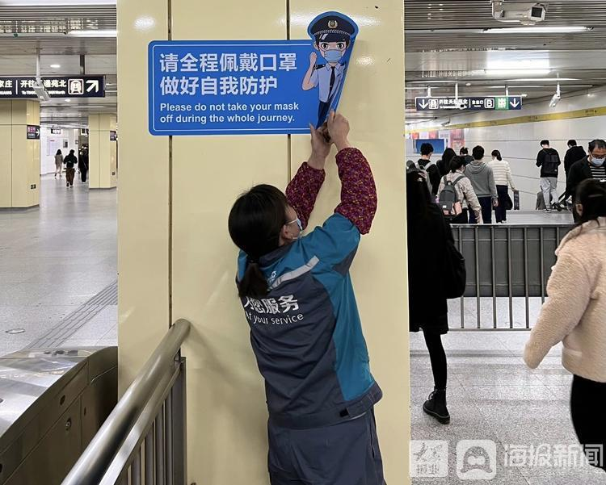
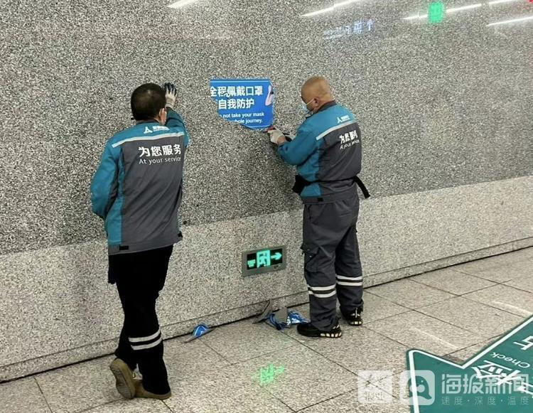
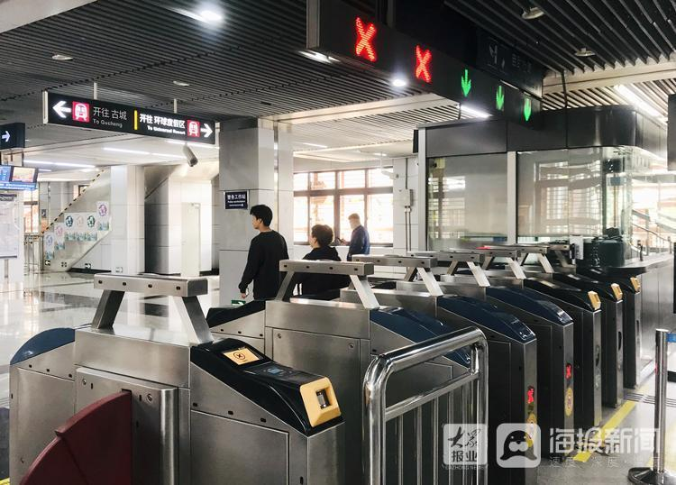

# 北京地铁内佩戴口罩提示被撕除，工作人员：乘客不戴口罩也可正常乘车

**海报新闻记者 孙佃潇 北京报道**

近日，多名网友在社交平台上反映，北京地铁内的佩戴口罩提示已被撕除，并附上相关照片。4月15日，海报新闻记者前往北京地铁1号线八里桥地铁站咨询获悉，网传信息属实，该地铁站内的相关提示亦在近日被撕除，目前已不强制乘客佩戴口罩进站。

_北京地铁内的佩戴口罩提示被撕除（源自网友）_

_北京地铁内的佩戴口罩提示被撕除（源自网友）_

八里桥地铁站工作人员告诉记者，“请全程佩戴口罩，做好自我防护”的提示已在近日被撕除。“有口罩的话尽量戴，没有的话也不强制，还是看乘客自己的意愿，不戴口罩也可以正常乘车。”该工作人员说。

随后，记者在地铁站内看到，当天已有部分乘客未戴口罩，并且顺利进站。

_4月15日，记者在八里桥地铁站内看到，有部分乘客未戴口罩进站_

据媒体报道，4月13日，全国政协委员、中国疾病预防控制中心流行病学首席专家吴尊友表示，从世界卫生组织网站公布的全球疫情数据来看，新冠全球大流行已经趋于结束，“新冠的发病和死亡对人类的威胁已经不再那么严重”。

