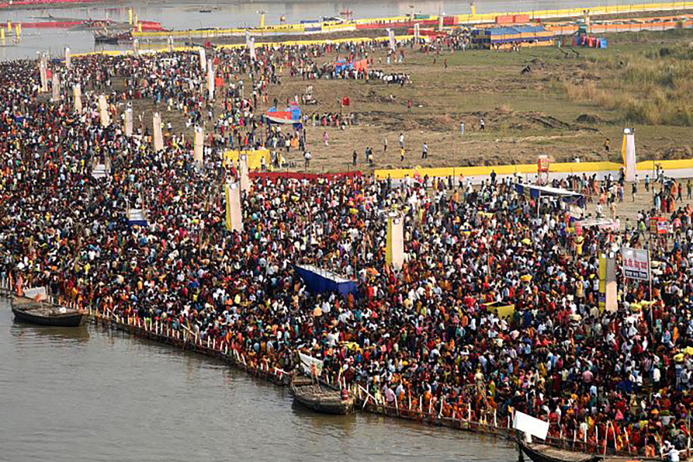
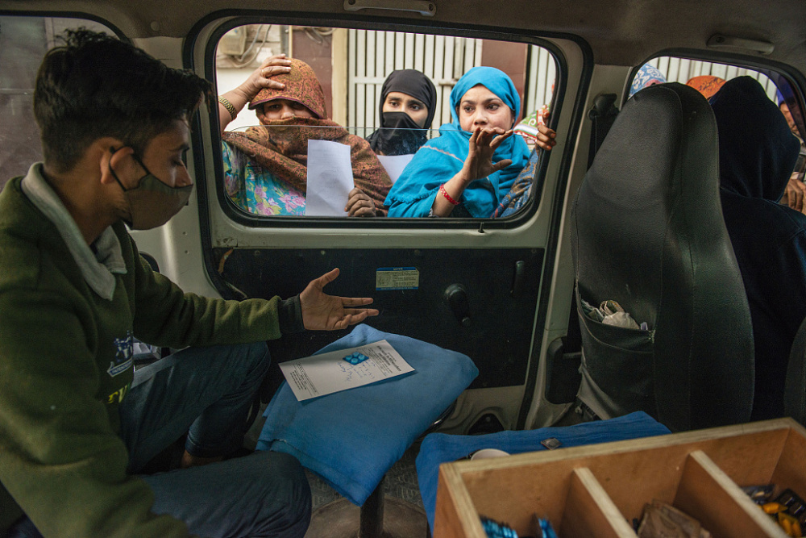

# 印度人口超越中国成全球第一，是人口红利还是负担？

_当地时间2023年1月31日，印度安拉阿巴德，佛浴节年度传统集市上，印度教信徒在聆听宗教领袖的讲话。_

自1950年开始统计人口数据以来，中国一直是世界上人口最多的国家，但情况即将发生改变。

去年7月，联合国经济和社会事务部发布《世界人口展望2022》报告，印度人口将在今年4月中旬超过中国，增至14.1亿，成为全球人口第一大国。到2023年底，印度人口可能接近14.29亿。

_当地时间2022年11月1日，印度加尔各答，人们聚集在一个市场上。_

**“人口爆炸”！**

事实上，印度人口总量超越中国是“必然”结果。

1947年印度独立时的人口约为3.5亿。此后的70多年，印度人口翻了四倍。尤其是近30年，印度人口更是呈现井喷式增长。但受疫情和技术影响，印度每十年一次的人口普查至今仍未启动，因此，印度确切的人口总数不得而知。

_当地时间2022年11月14日，印度孟买，通勤者在教堂门火车站下车。_

_当地时间2022年10月30日，印度巴特那，信徒们聚集在恒河岸边，在印度教克哈特普迦节上向太阳祈祷。_

目前联合国内部只能依据粗略数据估算印度人口。据预测，印度人口将在今年4月14日这天达到14.1亿。也就是说，在过去12年中，印度人口总量增加了2亿，相当于巴西的全国总人口。

_当地时间2021年9月23日，印度北方邦加济阿巴德，新冠疫情期间，大量印度乘客站上拥挤的火车离开车站。_

_当地时间2022年11月14日，印度新德里，Anand Vihar公交终点站外挤满了乘客。_

_当地时间2020年5月29日，印度孟买，人们聚集在洛克曼亚·蒂拉克终点站，准备乘坐火车回家。_

_当地时间2022年5月22日，印度孟买，在炎热的日子里，人们在阿拉伯海海岸拥挤的约胡海滩上玩耍。_

**“人口红利”？**

有分析认为，这一具有象征意义的“人口”里程碑表明，印度将利用“人口红利”在21世纪的世界争得一席之地。

所谓“人口红利”是指“通过增加劳动年龄人口的比例来加快经济增长和社会发展的机会”。也就是说，有劳动能力的人承担的育儿和赡养老人的压力小，这类人口占比大，由此带来的经济利益，称为“人口红利”。

_2019年7月12日，印度泰米尔纳德邦斯里佩伦布杜尔，富士康科技公司旗下的瑞星移动印度私人有限公司的手机工厂，员工在开始轮班前排队等候。_

_2017年9月，印度北方邦诺伊达Intex
Technologies India Ltd.工厂内，技术人员在组装智能手机。_

_印度制衣工人在纺织工厂工作。_

印度人口确实呈现多且年轻的状态。目前，印度25岁以下的人口占总人口的40%，根据皮尤研究中心数据，全球每5个25岁以下的人就有一个是印度人。有预测称，印度劳动力在未来10年将达到10亿，拥有可观的经济增长潜力。

国际货币基金组织（IMF）首席经济学家皮埃尔·奥利维尔·古林查斯在展望2023年全球经济时表示，在以悲观情绪和摇摆不定为特点的一年中，“印度仍然是一个亮点”
。全球巨头企业例如苹果等公司正在将劳动密集型产业转移到印度。而印度国家银行认为，该国将在2029年成为世界第三大经济体。

_当地时间2021年9月25日，印度泰米尔纳德邦马杜赖的Aurolab，员工在人工晶状体生产线上工作。_

_2020年9月9日，印度卡纳塔克邦比达迪丰田基洛斯卡汽车有限公司工厂，工人们在Innova
Crysta汽车生产线上休息时做运动。_

**“人口负担”？**

印度人口虽多而年轻，却并不均衡，其阶层分化、教育资源分配不均、女性就业率低等问题，都牵制着其经济社会发展。

_当地时间2022年6月17日，印度孟买，贫民窟全景。据人口普查的临时数据显示，孟买大约60%的人口生活在贫民窟。_

_当地时间2021年3月10日，印度新德里，拾荒者居住的棚户区。_

_当地时间2022年9月7日，印度班加罗尔，大雨过后，一名居住在贫民窟的妇女艰难地穿过被水浸透的住所。_

2019年，印度总理莫迪将印度人口快速增长现象称为“人口爆炸”，并对此感到忧心。他表示，“人口爆炸”影响了印度的持续发展，“如果人们不接受教育，不健康，那么无论是家庭还是国家都不会幸福。”

_当地时间2019年8月26日，印度海德拉巴，人们在政府发热医院的门诊排队就医。_

_当地时间2022年1月19日，印度加济阿巴德，当地为贫民窟民众提供流动诊所问诊，每周两次，每次的咨询和药品费用约为10印度卢比（0.85人民币）。_

印度新德里政策研究中心分析师苏珊特·辛格认为，印度不会迎来“人口红利”，反而会遇到“人口灾难”。

辛格表示，印度仍然是一个非常贫穷和不平等的国家，在G20国家中人均收入最低。IMF估计印度的国内生产总值为3.5万亿美元，而中国为18.3万亿美元，美国为25万亿美元。

_当地时间2022年12月6日，印度孟买，印度妇女和儿童排队领取免费食物。_

_当地时间2022年5月12日，印度新德里，贫民窟居民在铁路桥下的临时电影院观看宝莱坞电影，一家普通电影院的票价是200卢比（约18元人民币），而桥下电影院的票价是每人5卢比（约0.5元人民币），每天放映5部电影。_

_当地时间2012年12月28日，印度孟买，几名印度妇女在一家废塑料回收公司内分拣废塑料。_

此外，“人口红利”想真正发挥效用，还要看印度人口的“健康状况、受教育水平、职业培训和技能”，以及政府治理水平。辛格认为，印度的劳动力没有受到足够的教育来完成“人口红利”。据相关数据，
25岁以上的印度人有46%没有完成小学教育。

_当地时间2021年8月13日，印度加尔各答，孩子们在贫民窟的铁轨旁，正在上由西南交通警卫组织的互动课。_

_当地时间2021年8月15日，印度孟买，孩子们在一名社会活动家为贫民窟儿童设立的公交车移动教室上课。_

_当地时间2023年2月10日，印度古瓦哈蒂，一个棚户区，女孩们和她们的母亲在聆听非政府组织工作人员在童婚宣传营的讲话。_

_当地时间2022年10月14日，印度孟买，达拉维贫民窟内，由于空间限制而被拒绝参加卡通频道促销活动的儿童爬上窗户观看活动。_

辛格补充说，印度仍然是一个以农业为主的国家。农业占经济的20%，但雇用了45.5%的劳动力。此外，印度是世界上妇女就业比例最低的国家之一。

印度经济监测中心的数据则显示，在近二十年的时间里，印度的女性劳动参与率呈下降趋势：从2000年的32%下降至2021年的19%。2022年只有10%的劳动年龄妇女处于工作状态。有专家警告，如果印度的政策制定者没有创造足够的教育和就业机会，“人口红利”可能会成为“人口负担”。

_当地时间2022年9月16日，印度贾朗达尔，在一个蔬菜批发市场，一名妇女抱着孩子在燃烧垃圾的烟雾中行走。_

_当地时间2023年3月22日，印度新德里，一个居民区内，妇女在世界水日当天从流动水车上取水后，提着水罐回家。_

_当地时间2022年10月14日，印度孟买，在达拉维贫民窟，妇女们等着放学接孩子们回家。_

_当地时间2023年3月15日，印度加尔各答，妇女们正在登上火车。_

_当地时间2023年3月1日，印度加尔各答，在一家医院，妇女们排队为患有发烧和呼吸系统疾病的孩子进行健康检查。_

据BBC报道，一份来自印度理工学院2019年的研究数据显示，25-44岁的印度女性主要从事无偿家务，平均每天有八个半小时在做家务或看护工作。根据世界银行的最新数据，从2021年开始，只有不到五分之一的印度女性在从事正式工作。（印度的大部分工作都是非正式的，比如农业或家政工作，这些通常不被计算在内。）

_当地时间2023年1月25日，印度加尔各答，大雾弥漫，一名妇女头上顶着牛粪，然后将其晾干用作做饭的燃料。_

_当地时间2023年4月8日，印度那加兰邦，龙瓦村Konyak部落的妇女在厨房里做饭。_

_当地时间2023年3月20日，印度高哈蒂，一名部落妇女试图在稻田里抓小鱼，而她的孙女正躺在她背上打瞌睡。_

_当地时间2023年2月28日，印度阿杰梅尔，一名戴着面纱的妇女用牛车搬运收获的庄稼。_

_当地时间2023年1月14日，印度桑提普尔，工人们在走之前，用脚和耙子把稻子摊开。_

_当地时间2023年1月30日，印度西孟加拉邦，印度妇女使用五颜六色的纱网捕鱼。_

印度人口总量超越中国是人口发展规律的结果。根据联合国预测，未来40年印度人口仍将持续增长，到2064年将增至17亿。随着人口的不断增长，印度势必面临着诸多挑战，唯有从数量型“人口红利”向质量型“人才红利”过渡，才能让世界第一的人口数量成为真正的“红利”，然而这一切仍是未知数。

**本文图片除署名外均为 视觉中国**

**参考资料 红星新闻 北京日报“长安街知事”**

