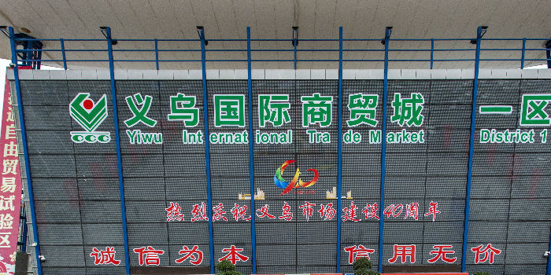

# 四月义乌，回答所有关于中国出口的猜想

_（图片来源：东方IC）_

**经济观察报 记者 田进** 4月12日早上8点半，拥有20年历史的义乌国际商贸城在嘈杂声中开始了一天的运转。

十余万员工、老板和海内外贸易商们从四面八方汇集，绵延数百米的电动车队将商贸城团团围住，紧接着，7万余个商户的卷闸门嘎吱声开始陆续响起。

2023年春节后，重新回归的中东、非洲采购商让商贸城再次沸腾起来。

商户们很快感觉到了外贸商的变化，客户预算更少了，一些客户甚至开始绕过贸易商，企图直接找到上游的工厂——为了省点钱。

这逼着商户去更低价的工厂采购商品，或者进一步压低自己的利润，但义乌商户总有办法。

如果说义乌是中国外贸之都，那么义乌商贸城就曾经是这个外贸之都最重要的城堡，这里聚集的劳动密集型产品贡献了这座城市的大部分出口额。但如今，在距离义乌商贸城这座旧城堡20公里外，一座新的王国正在崛起。

从2018年开始，晶科能源、晶澳科技、天合光能、东方日升、爱旭新能源等十余家光伏企业的生产基地在义乌拔地而起。今年年1-2月，义乌太阳能电池出口达54.1亿元，同比增长36.0%，同期义乌出口总金额为729亿。2022年义乌太阳能电池出口增长更为迅速，全年出口额增长了1.91倍。

义乌是中国出口的风向标，在今年4月上旬，人们还在为中国出口所担忧时，义乌指数的先行回暖就已经让一小部分经济学家和研报乐观地做出判断。

4月13日海关总署公布的数据很快证明了这些判断，3月中国出口金额同比增长14.7%，远高于市场预期，几乎以一月之力将中国一季度出口数据由负增长拽至正增长。

如同义乌这一外贸风向标所预示的那样，结构性的转变也在整个中国出口中发生，在整个一季度出口中，新三样（即电动载人汽车、锂电池、太阳能电池）对出口增长功不可没，合计出口2646.9亿元，同比增长66.9%，拉动中国整体出口整体增长2个百分点。

在义乌，位于新王国的企业，正在踌躇满志准备扩产，光伏经营者的判断是，这个行业不扩产，就要被淘汰；但对于旧王国的经营者，短暂的复苏下仍有种种困境，一个鲜明的感受是：他们已经不再是地方政府的关注重点，甚至不知道这些产业是否还被需要。

在义乌打拼了40余年，如今已有60几岁的周顺鞋业创始人周国柱，回看在义乌经商的风风雨雨，言谈中颇有一种英雄落寞感，他同时担任义乌市鞋业行业协会副会长。他说：“小商品的崛起促就了繁华的义乌。但现在，义乌似乎已经不再是小商品的天下。”

但或许，这并不应成为一个非此即彼的选择。

在这个本被预判将春寒料峭的3月，远超预期的出口数据又一次带给中国经济意外之喜，但海外需求减弱、进口国产业政策调整等风险依然存在，在积压订单完成后，出口是否还会维持目前的增长？对这些问题，义乌的商户和企业们仍有种种忧虑。

至少在这一时刻，义乌这座中国外贸之都，需要新王国，也仍需要旧王国。

**客户重返义乌后**

对于3月出口数据的超预期回暖，义乌早有迹象。

从出租车司机、房东、餐厅到义乌商户们，春节后返工，越来越多的义乌住户感知到，来自中东、非洲等国的客户正时隔三年重返义乌。连义乌国际商贸城周边的烧烤摊在夜晚都多了许多烟火气和异国语言交流声。非洲是目前义乌重要的出口市场，今年1-2月，义乌市进出口总值达791.9亿元，对非洲进出口136.8亿元，对沙特出口尽管仅有23.7亿，但1-2月增速接近50%。

2023年1月，义乌市公安局出入境管理局的数据显示，常驻外商才再次回到万人高位。截至3月中旬，义乌2023年以来新设外企181家，同比增长123%。义乌物流、人流、交易额、外商入驻数量、新成立公司等均在3月全面回升。

在因为订单激增，竣熙箱包创始人陈丽秀将新接订单的交货期推迟到了6月。春节前后的疫情感染和春节假期，导致公司大量前期订单被积压到今年2月下旬才开始生产，叠加新订单涌来，出货期就由以往的一个月变成了两个月。

陈丽秀表示：“随着世界各国的疫情放开，学校教学、旅行等线下活动激发了箱包的市场需求，所以去年开始箱包生意就特别好。现在货期很紧张，没办法给客户承诺何时交货，所以我们也很被动。”

重新回来的客户改了规则。

陈丽秀说，海外客户很明显的一个动作是，抵达义乌后，会先花几天时间在市场逛一圈，对比各家的报价。箱包款式、质量差不多的情况下，谁家最便宜就订谁家的货。

陈丽秀从货柜上拿出一个午餐包说到：“这个带一定保温功能的餐包，价格已经低到了3.3元，我们的利润就几毛钱。其他大的箱包，批发价20元左右，我的毛利可能就1元左右。真的有时候，价格都便宜到刷新我们的想象。”

但在过去三年疫情期间，因为没办法来到义乌线下商店，采购商只能在线上下单，出于谨慎，更愿意相信老客户箱包产品的质量和报价。

陈丽秀表示，现在价格根本就不敢报高，否则客户可能转头就去其他家订货。

为赢得价格战，陈丽秀的做法是找某华北地区省份的偏远地区工厂进行加工，因为这些地区人工更便宜。而义乌周边地区的工厂就做不到这样的低成本生产。

但就是这不到一元的利润，海外客户也不打算让义乌商户们赚。

这次回来的海外客户开始跳过商户，直接寻找商户们的上游加工厂，这也让众多没有自有加工厂的义乌商户们如临大敌。

周国柱的感受是，疫情放开以后，很多海外客户踊跃参观市场，但就是不下单。他们想弄明白过去三年从贸易公司处进货的价格是否虚高；其次，挖空心思寻找鞋子制造源头。

周国柱表示：“这两个月我的店铺每天都要接待五六波海外客人，但他们就是不下单。我曾以为放开后订单情况会好起来，但现在来看，今年新订单情况比疫情期间还差。”

义乌出口利润走低是一个长期的趋势。从事鞋子贸易15年的吴娟亲历了鞋子利润空间的一步步压低。她说，现在鞋子外贸的利润率就在5%—10%之间，相关产业链已经很成熟，商户间的利润空间也都公开透明，只有做到极致才能创造利润。

吴娟说：“怎么样才能把成本降下来？有些商家采取的举措是鞋底偷空一点材料，用差一点的装饰扣，一点点的在细节处把利润抠出来，鞋子外表上外行人根本看不出来，这都是行业公开秘密。”

周国柱甚至无奈的笑着比喻，一集装箱鞋子挣的利润现在还不如一轿车后备箱的饰品利润高，但风险前者却远高于后者。

**崭露头角的新王国**

在海外采购商的种种挑剔中，1-2月，义乌劳密产品依然完成了277.9亿元出口，增长7.3%，占义乌市出口总值的38.1%，对全市出口增长贡献率为41.8%，仅次于机电产品。

在如今的义乌，劳密产品已经不再是占比最大的出口品类，也不再是出口增长贡献率最高的品类。

真正的出口王者是机电产品。今年1-2月，机电产品出口296.2亿元，增长9.1%，占义乌市出口总值的40.6%，对全市出口增长贡献率为54.3%，机电类产品中增长最为迅速的又是光伏产业，今年1-2月二极管及类似半导体器件和太阳能电池快速增长，分别出口54.2亿元和54.1亿元，分别增长35.4%和36.0%。

这种增长得益于义乌近年吸引光伏企业的一系列措施。

从2020年3月2日与义乌政府签约到9月25日第一块组件下线，短短一年时间内，晶澳科技在义乌占地661亩、总投资102亿元的生产制造基地几乎马不停蹄的实现投产。

晶澳科技义乌基地常务副总经理杨广伟说，能快速落地义乌，一方面，得益于义乌在多方面的积极推动。另一方面，作为公司回归A股后的首个募投项目，公司上下给予高度重视。

近几年，为吸引光伏制造企业落地，滁州、乐山、曲靖、义乌等地可谓慷慨地给企业提供各种优惠政策。杨广伟也介绍，光伏出口近几年都是连续高增长，各地政府也积极响应国家号召，大力发展新能源等战略性新兴产业，助力碳达峰碳中和。义乌也是瞄准了这一块，积极贯彻国家战略，在世界小商品之都基础之上，打造光伏新引擎。

中国光伏行业协会的数据显示，2022年，光伏产业规模持续增长，多晶硅、硅片、电池片、组件产量同比增速均在55%以上。出口方面，全年光伏产品（硅片、电池片、组件）出口总额超过512亿美元，同比增长80.3%，光伏组件出口超过153吉瓦，同比增长55.8%。

光伏同样也是目前不可多得的较高利润率的制造业行业。庄英宏介绍，虽然现在行业竞争比较激烈，但相比其他制造业，利润还是有优势。行业正常来说，组合件的毛利率在15%-18%点，电池片差不多20%，硅片在25%-30%之间，硅料则在30%-35%左右。“但是现在的情况比较畸形，产业链上游利润率更高，下游反而走低。”

2020年初，晶澳科技正式在内部宣布筹建义乌生产制造基地，且2020年就要开始为公司贡献产能。“高标准”“高要求”“高速度”“高质量”也成为贯穿义乌基地建设过程中的主要关键词。该项目也被列为浙江省2020年年度特别重大项目。

2021年，晶澳科技义乌基地年产10GW高效电池+10GW高效组件项目已经全面投产，且在当年年产值突破100亿，2022年年产值进一步突破200亿。

晶澳科技义乌基地的引进只是义乌发力光伏产业的一个缩影。从2018年开始，晶科能源、晶澳科技、天合光能、东方日升、爱旭新能源等十余家光伏企业开始在义乌建设生产基地。

庄英宏说，义乌一直给人第一印象是小商品之城。但义乌政府这两年在选择转型，希望能够吸引新能源等方面的企业去建厂。首先义乌当地比较充足的人力，政府也愿意花大钱来补贴工厂建设。所以多家光伏企业开始落地义乌。

据了解，在引进多家光伏企业过程中，义乌政府会承诺为企业提供土地、设备购买等补贴以及选址、招工等方面帮扶。

庄英宏说，在国内布局光伏生产制造基地，最大的考量因素还是地方政府的补贴力度。其次才是物流便利度、工人供给等。近几年义乌、金坛、滁州的补贴力度比较大。

义乌的光伏企业以出口为主，一位当地光伏企业人士介绍，海外出口一直大概占企业总出货量的70%-80%左右。该人士介绍，2022年由于俄乌战争，欧洲市场对光伏短期爆发了较大的需求，在海外出口的占比，最高的时候能达到45%左右，此外其所在的光伏还有部分出口南美市场，占到比接近20%。

2022年，义乌光伏产业实现规上产值902亿元，占浙江省光伏产业产值的30%以上。义乌当地现已投产的电池片和电池组件产能均达到35吉瓦，占全球市场份额的近20%。

**更替之间**

周国柱很怀念曾经在义乌闯荡并收获颇丰的日子。

他最津津乐道的一个故事是，义乌的24个地摊贩用“门板”击败了义乌最大的百货公司。上世纪80年代，周国柱和其他摊贩几乎每隔几天就从路桥或温州市场进货到义乌，然后在义乌街边架起一块门板，摆放着十来双鞋，卖完又再次去拿货。

周国柱说：“那时候义乌就只有一家百货公司。摊贩不需要像百货公司那样支付员工工资，就是靠自己起早贪黑，也不怕辛苦、不怕脏。因此同样的鞋，我们的价格远低于百货公司。消费者肯定会选择我们。”

义乌是密集型产业的聚集地，但产业的升级和变化下，这些商户正在面临种种挑战。

周国柱们面临一个挑战是，在义乌这片寸土寸金的地方拿地太贵，并且即使有钱也竞争不到，这几年很多建设用地都流向了新引进的大企业，一个企业就占据几百上千亩。

目前，义乌国际商贸城约3000多家鞋子贸易商户，只有不到10家商户在义乌有工厂。

但工厂是有价值的。

吴娟此前在广东某地投资了上千万建设自己的鞋子加工厂。目前工厂共有三条生产线、几百位流水线工人。

吴娟说，拥有制造工厂的好处是，当海外客户想跳过商户找制造企业下订单时，订单依旧会回到自己手里，对于产品质量也可以把控，从而形成回头客。但运营这样生产跟贸易结合的模式并不容易，要求商户有强大的管理能力、一定的经济实力和基础人员搭配。

曾经，吴娟也尝试在义乌直接建设一个加工厂，但最终以失败告终。“目前义乌的服饰、箱包等加工厂屈指可数。更多还是义乌条件不允许，包括租金太贵、产业链不齐全。面料、扣子等材料要从广东、浙江其他地方调到义乌。但在广东，一天以内各种原材料就能全部集齐。”吴娟表示。

周国柱说，如果商户们在义乌都能做到前店后厂，生意肯定能做的更红火。如果考虑到公平性，可以不单独给一个企业，而是以协会的方式去办工厂，每个商家使用工厂其中一层或一个区域来生产制造。

租金是另一个挑战。

令周国柱感到可惜的一件事是，曾经有数十家大型鞋贸易企业因为看重义乌国际商贸城相对低的店铺租金，来此开店，但随着店铺年租金从1000元/平米逐渐上涨至2500元/平米以上，这些企业再次选择迁徙。

“他们每年的营业额都能上亿，几十个小商铺的营业额都比不上他们。他们被迫离开是很大的损失。眼看着市场人气像水一样慢慢流失，眼泪都要掉下来。我们对市场是有感情的。”周国柱表示。

在向上汇报市场发展情况时，周国柱常说的几句话是：相比去外地招一个商户，把现有商户留下来更容易。因此要细心呵护商户的生存发展，在商户经营困难时，租金等方面可以给予一定的补贴扶持，而不是宁愿让商铺空在那里。

在义乌打拼了十余年的吴娟，认为最意想不到的因素是，鞋子商户们在“衰老”。

吴娟表示：“在鞋市场逛一圈后，你可以发现，不管生意好坏，很多商户都是坐在那里玩手机、看电视等着客户上门。任何一个市场，如果处于这样的被动状态，生意都会很麻烦的。除非能做到人无我有或者价格是全市场最低，但在义乌，这两项都做不到。”

对于这样的局面，吴娟认为需要年轻血液来改善。她说，2000年初期，没有电商、直播带货，海外客户只能来义乌采购，大家都能赚的盆满钵满。而现在，老一辈商户跟不上时代，也不想去学。年轻人也不愿意来接班，天天守店太枯燥。

为了跟上时代，吴娟从2008年就开始布局电商平台并且近期零散的尝试网络直播。她也尝到了电商平台带来的诸多甜头——疫情期间，订单基本不受影响甚至有所增长。其中大部分订单都直接在线上平台跟国外客户对接。一小部分则仍延续着传统的贸易模式。

吴娟表示：“必须鼓励年轻人进来，并且把电商引进来。现在很多年轻的海外客户直接在APP上找我下单，偶尔来义乌无非就是看一下店铺是否真实存在。采取传统模式一家家店铺对比找产品，太繁琐。”

**意外惊喜之后**

周国柱在采访当天遇到的一个案例是，一位朋友抱怨欧洲一个国家本来沟通许久约定下订单，但现在临时决定取消订单，反馈说“他们本国的生意不好做，世界经济环境不好”。而这样的案例在这一两年，周国柱已经屡见不鲜。

尽管在3月，义乌以及中国出口取得了好的成绩，但海外需求的缩减、产业链转移等挑战依然长期存在，这些都给接下来三个季度的出口带来了挑战，这种挑战对于新王或旧王，都是存在的。

陈丽秀说，现在义乌箱包市场，挣钱、保本、亏钱的商户基本是三分天下。市场上也有半个月没接到一笔订单的商户。并且，制造业转移东南亚的影响也开始显现。比如公司每年向印度出口大量箱包产品，但一些简单款式、热销的箱包，印度客户已开始从中国进面料在本国加工制造。

当然义乌仍有竞争力。疫情三年，吴娟遇到的类似情况是，一位韩国客户将订单采购从义乌转移至越南。但兜兜转转后，在今年又再次回到了义乌。客户选择变更的原因是，越南工厂的皮料要从孟加拉国进口，鞋底从印度进口，导致生产、运输线拉长，即使越南人工成本便宜，综合算下来采购成本还是比国内高。

吴娟表示：“中国产业链发达程度在全世界范围内首屈一指，这也有利于我们将成本控制到极致。我估计可能会有很多客户都会逐渐像那位韩国客户一样，再次把采购单从东南亚转移回中国。”

对于接下来的行情预判，陈丽秀持谨慎态度。她说，义乌商户们更多只能在市场变动中随波逐流，没办法准确预估今年能做多少营业额。“2018年是我们的高光时刻，那时候大家基本都能赚钱。经历三年疫情冲击后，我认为市场恢复还需要一段时间。未来两三年，市场可能再次重回2018年。”

其次，出口国的政策取向也影响着大量依赖出口的国内企业。

周国柱说，现在一个明显的变化是，好多国家的客户不进口成品鞋，转而选择进口半成品，比如装饰扣、鞋面、鞋垫等，然后回到本国组装。现在的生意已变成一半卖成品、一半卖半成品。这也逼迫着商户们将精力投向半成品贸易。

究其原因，周国柱说，还是出口国的关税问题。比如一些国家，一双成品鞋的关税可能达60元，而半成品只需要15元。“他们本国制造工厂水平比较落后，于是选择把半成品买回去在本土简单组装，质量也能达到国内的80%以上，这样能节约大量关税成本。”

一位苏丹贸易商向记者介绍，一个集装箱的鞋子从中国运抵苏丹，海运费约5000美元、港口至目的地的运费约1500美元，但关税需要1万美元。

光伏出口也同样受此影响。庄英宏介绍，2023年还是会有一部分原材料价格压力影响企业出口。但最主要的影响因素还是进出口国的一些政策。比如出口到欧美等国家，相对应的政策会比较明显影响公司光伏产品出货的量。

谈及下一步，庄英宏说，公司可能采取的应对举措是不断扩产能。“未来，如果不建新产能，光伏行业企业就很容易被淘汰。所以我们还是会考虑去扩建新产能。但是具体在哪、什么时候做，可能还是具体看公司公告。”

