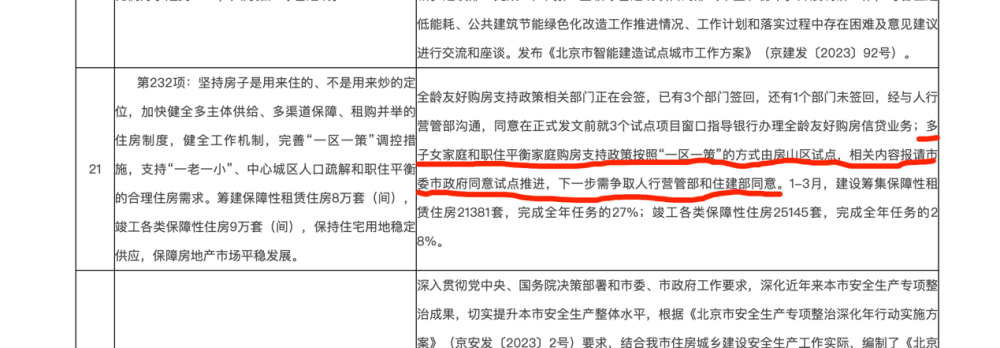

# 多孩家庭购房新政，能否一举解决“催生”“解困楼市”两大难题？

《中国经济周刊》记者 张宇轩｜北京报道

房地产低迷、生育率低下，已是当前不容忽视的两大问题。多地政府在出台楼市新政时，将“多孩家庭”作为相关优惠政策的前置条件，这类新政甚至蔓延至严格限购的一线城市。

4月10日，同一天内，北京、上海两地政府相关部门分别在披露信息中透露，或将在购房制度上对多孩家庭予以政策支持。

在此之前，发放补贴、提高公积金贷款额度、增加购房指标、降低首付比例、给予缴税补贴、优先摇号……各地出台的支持多孩家庭购房政策可谓是五花八门。据相关媒体不完全统计，制定出台过这类政策的二、三线城市已超过30个。

捕捉到这一“风声”，有业内观点认为，早前在二、三线城市接连出台的支持多孩家庭购房政策，即将蔓延到一线城市，力图促进合理购房需求的释放，同时鼓励生育、促进人口增长，以“一箭双雕”之举解决“催生”“解困楼市”两大难题。

**“争取同意”“留作参考”，京、沪有意向多孩家庭放松限制**

4月10日，北京市住建委在披露《2023年政府工作报告重点任务清单及实事事项一季度工作进展情况》时两次提到，“多子女家庭和职住平衡家庭购房支持政策按照‘一区一策’的方式由房山区试点，相关内容报请市委市政府同意试点推进，下一步需争取人行营管部和住建部同意。”

_（北京市住建委在相关文件中披露多孩家庭购房支持政策的试点推进进展。图片信息来源：北京市住建委官网）_

同一天，上海市政府官网发布了一封市民来信。

信中，该市民称，二胎家庭是改善型刚需客，四口之家确实需要三房，而年轻二胎家庭可能因为社保年限或名下已有小房，在积分制下分数很低买不到优质地段房产，既然现已鼓励二胎，而且二胎确有改善需求，“为什么（不）在新房购买上对二胎家庭采取优先政策？”，并提出“二胎家庭应不看积分直接入围摇号”。

_（上海市房屋状况事务中心对市民的回复。图片来源：上海市政府官网）_

上海市房屋状况事务中心在回复市民的要求时表示，针对“多孩家庭在新建商品住房计分制度政策上予以支持”的建议，我们将留作参考。

京、沪两市相关部门此番不同程度“表态”，被外界视作是一线城市或将出台支持多孩家庭购房政策的一种“吹风”。

易居研究院研究总监严跃进向《中国经济周刊》记者表示，市民建议背后，体现了购房市场对于政策进一步放松的期待，特别是多孩家庭对于购房政策放松的需求。说明当前住房改善过程中，相关家庭希望放松购房方面的相关限制条件，以更好满足购房需求。

而事实上，这类政策早已在超过30个二、三线城市中落地实施，各座城市在新政制定上各具特色。其中，较为引人注目的自然是限购政策松动。

如浙江杭州2022年5月出台相关政策，对于符合条件的三孩家庭，在本市限购范围内限购的住房套数增加1套；报名参加新建商品住房公开摇号销售时，参照“无房家庭”优先摇号。此外，广东东莞、江苏南京、辽宁沈阳、山东青岛、湖南长沙、浙江宁波、福建厦门等城市都有类似的放宽限购政策。

但在限购松绑方面，一线城市显然更为谨慎，而此番北京已步入“试点”“争取同意”阶段，被业内视作是“有调整空间”。

严跃进分析称，此前北京已经针对老年人落实了郊区部分市场的购房放松政策，一线城市在此类领域确实一直在探索放松的内容。但北京购房政策制定需要考虑特殊性，尤其是要考虑其非首都核心功能的转移、三环内房地产开发管控等因素。

严跃进认为，此次北京在上述文件提到的相关内容，主要集中在多子女家庭和职住平衡家庭两个层面，可以理解为是微调的政策，体现了对于特定人群或家庭购房需求的重视，也意味着后续一线城市针对特定物业、特定购房者等，会继续小幅度探索新政。

**生育成本高企，“给钱”式楼市新政兼具“催生”色彩**

对于育龄年轻群体而言，究竟是因买不起房而不愿生育，还是因生不起孩子而无意买房？不同人看法不一。生育难、买房难的根源之一自然是年轻人收入有限，特别是对于一线城市奋斗的年轻人，庞大的生育和购房支出成为其难以承受的经济压力。

根据育娲研究智库发布的《中国生育成本报告》（2022年）研究显示，据其估算，0-17岁孩子的全国平均养育成本为48.52万元。以省级行政区划分别统计，高于这一平均数据的省、直辖市有9个，其中上海、北京的养育成本分列第一、二位，分别为102.64万元、96.86万元。

按照上述数据计算，在上海、北京生育一个孩子，平均每月分别需付出4752元、4484元的成本。如果生育二孩、三孩，这个数字将翻倍增加，再叠加房贷支出，特别是高价的学区房购置成本，这对大部分年轻人的“钱包”都是一个巨大考验。

如何帮助缺钱的年轻夫妻解决买房难题？这也是不少地方政府出台新政的考量因素之一。在多地支持多孩家庭购房的政策中，解决家庭购房资金压力的措施，集中体现在向购房家庭发放补贴，以及上调公积金贷款额度等方面。

今年3月底，湖北襄阳发布通知，对于符合国家生育政策生育二孩、多孩且二孩、多孩为未成年人的家庭，在购买普通新建商品住房时，签订网签合同并完成契税缴纳，分别给予每套2万元、4万元补贴。

今年3月，安徽合肥对实施多子女家庭住房公积金优化政策征求意见，多子女家庭购买首套自住房且首次申请住房贷款的，单方最高可贷款额度提高至65万元，夫妻双方最高可贷款额度提高至75万元。

此外，湖南长沙、浙江宁波、江苏扬州、四川乐山等多个城市均有类似新政。

如果说放松限购的新政是解决多孩家庭的改善性住房需求，发放补贴、提升贷款额度的措施则更侧重于解决刚性住房需求。这在业内人士看来，不仅仅是通过“组合拳”为楼市暖场，更具有一定的“催生”色彩。

中指研究院市场研究总监陈文静认为，将住房政策与生育、人才政策结合是未来的重要方向。尽管2022年多地结合生育、人才等政策出台了激励措施，但政策力度相对有限，预计2023年对这类住房需求的支持力度将加大，尤其是在多孩家庭支持方面。

责编：杨琳

（版权属《中国经济周刊》杂志社所有，任何媒体、网站或个人未经授权不得转载、摘编、链接、转贴或以其他方式使用。）

