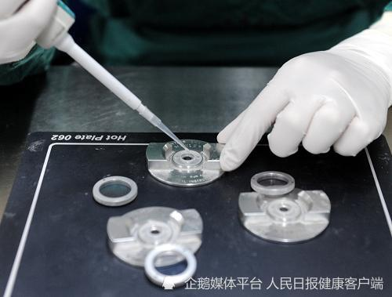

# 我国未婚女性不能申请精子库，专家：为了保护社会秩序和家庭伦理

**人民日报健康客户端记者 谭琪欣**

4月13日，“我国未婚女性不能申请精子库”的话题登上社交平台热搜，引发了网友热议。

多位专家均向人民日报健康客户端记者表示，随着社会的发展，越来越多的独立未婚未孕女性希望通过多种手段满足生育的需求可以理解，不过，放开未婚女性使用精子库精子的时机还未到，短期内社会条件还不成熟。

_河南省人类精子库的工作人员在为精子检测做准备。新华社记者李博摄_

精子库，又称人类精子银行，是指利用精子冷冻技术冻贮人类精子的设备和场所。4月14日，人民日报健康客户端记者咨询了北京大学第三医院人类精子库、四川省人类精子库、武汉华科生殖专科医院（原华中科技大学同济医学院生殖医学中心）了解到，目前对需要供精治疗的人群有严格的条件，只针对已婚的夫妻，且需提供男方无法提供精子的诊断证明，才可向医院的生殖中心申请供精。

“人类精子库的建设在治疗不育症及预防遗传病、提供生殖保险等方面发挥了积极作用。对于已婚夫妇，符合男性极度少弱畸精子症、无精或者丧失生育功能指征的，可以按照规定申请供精，进行供精助孕治疗。”
北京大学人民医院生殖医学科主任医师韩红敬接受人民日报健康客户端采访时表示。

根据原国家卫生部《人类辅助生殖技术规范》明确规定，禁止给不符合国家人口和计划生育法规和条例规定的夫妇和单身妇女实施人类辅助生殖技术。实施供精人工授精的适应症包括不可逆的无精子症、严重的少精症、弱精症和畸精症；输精管复通失败；射精障碍；男方和／或家族有不宜生育的严重遗传性疾病；母儿血型不合不能得到存活新生儿等情况。

“上述规定是有其合理性和必要性的，主要是为了保护社会秩序和家庭伦理，防止一些潜在的风险和问题。如果单身女性可以随意申请精子库，可能会带来一些复杂的社会伦理及心理问题，以及由此带来的给自己和孩子的困扰和伤害。”韩红敬告诉记者。

