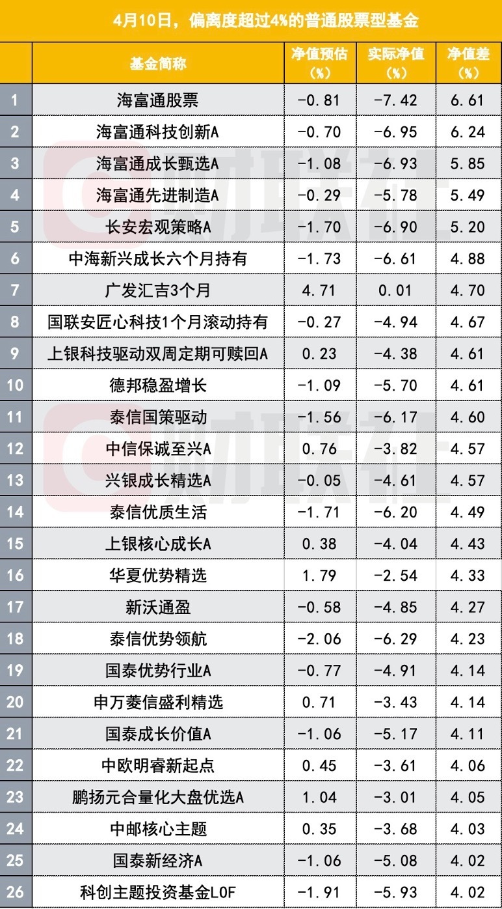
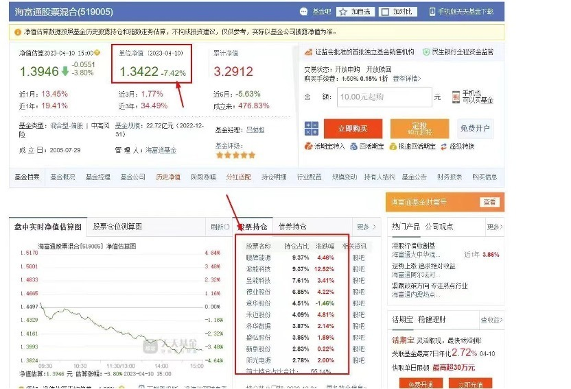

# 没买中芯就像没买茅台一样丢人？4月公募大调仓，散户化质疑冤不冤？

**财联社4月15日讯（记者 闫军）**
一周收盘沪指微涨0.32%，外表看似波澜不惊，内里实则暗潮涌动。资金在科技、消费、新能源之间的切换极快，市场快速“变脸”让基金跟风调仓暴露无遗。

“现在的公募基金就像是一列列比赛中的有轨电车，不管你用什么方法，到达终点时比别人快就可以了。”一位基金经理说，在这场比赛中，列车可能是一样的，轨道也可能是一样的，同质化的“卷”，只要比别人跑得快，可以抄作业、可以挤进别人的赛道，甚至车上乘客的感受并不重要。

这一比喻来形容当前公募基金对TMT的态度同样合适。人工智能浪潮席卷而来，TMT交易拥挤在3月中下旬达到40%以上，进入4月，公募基金依然上演着轰轰烈烈的大调仓。

有调侃称，基金经理现在没买中芯就像当年没买茅台一样丢人。

基金净值涨跌幅估算与实际披露净值之差是衡量基金调仓的重要方式，财联社记者统计显示，以新能源反弹、TMT调整的4月10日为例，有87只基金净值偏差超过3%，其中，26只偏离度超过4%，不少基金2022年底的前十大重仓股均为新能源，净值却大跌；再对比4月12日，消费股大跌，同样有多只消费主题基金大涨。净值偏差较大的基金净值走势高度契合TMT行情。

对此，有分析人士指出，短期交易拥挤度过高时，投资者在高位介入，风险收益比是较低的。而公募基金抱团ALLIn人工智能等板块也引发公募“散户化”的质疑。

一位私募人士也向财联社记者表示，当前A股市场只认景气度，炒作情绪浓厚，从价值投资角度来讲，公司利润每年有20%以上的涨幅应该是很值得投资的标的，值得长期持有，但是市场并不认可这种逻辑。像人工智能这种没有业绩支撑、没有落地场景的领域却能获得大量资金的追捧，市场中的投资者更喜欢“泡沫”的过程，最终谁为这个“泡沫”买单就是没能逃顶的人。

**实锤！公募基金上演大调仓**

抛弃新能源、消费，调仓到AI已经成为当前公募基金提高净值的捷径。

财联社记者选取本周两个时间节点来比较基金净值差额，一个是4月10日，TMT行业传出利空大跌，新能源反弹；另外一个是4月12日，消费股大跌，TMT强势。两种较为极端的行情对比之下，种种迹象表明，此前持仓与AI毫无关系的基金近期净值表现已经与后者趋同。

先来看4月10日，新能源指数迎来久违的反弹，在海外监管等多重利空之下，TMT指数大跌2.52%，风格的突然切换暴露了一大批基金的预估净值与实际净值的差距。

财联社记者统计显示，当日有87只基金净值偏差超过3%，其中，26只偏离度超过4%。从2022年底持仓判断，无限定主题以及科技类主题基金从新能源向TMT的迹象明显。比如，海富通旗下4只积极基金净值预估值与实际净值差距超过5%，甚至达到6%。

再看4月12日，消费指数跌1.33%，酒类指数大跌2.69%，TMT回归增长主线行列，以汇添富新兴消费股票为例，其2022年底前十大重仓股为泸州老窖、华熙生物、山西汾酒、五粮液、贵州茅台、舍得酒业、爱尔眼科等白酒、医美等消费领域，当天前十大重仓股显示均为下跌，预估净值为-1.37%，当日更新净值后，基金净值涨幅为1.51%，预估差2.87%。

类似从消费主题调仓的还有华泰柏瑞消费成长，其预估基金净值为-0.87%，实际净值为5.75%，偏差值为6.62%；兴银消费新趋势，预估基金净值为-0.86%，实际净值为4.4%，偏差值为5.26%。

**难挡诱惑，海富通成调仓急先锋**

热点变化快，尤其是4月10日，科技股云集的科创50大跌2.74%，新能源迅速反弹，但是从基金净值来看，不少2022年底持仓新能源的基金却没有迎来净值反弹，其中以海富通旗下海富通股票、海富通科技创新、海富通成长甄选、海富通先进制造四只基金表现最为突出，占据了基金大跌前列，当日净值表现分别为-7.42%、
-6.95%、-6.93%和-5.78%。

以海富通股票混合为例，其前十大重仓股分别为鹏辉能源、派能科技、昱能科技、德业股份、意华股份、禾迈股份、科华数据、盛弘股份、新泉股份、阳光电源，持仓均为新能源领域，在4月10日，前十大重仓股中仅一只下跌的情形下，基金净值大跌7.42%。

从净值推算，该基金走势与新能源指数走势明显不符出现在3月13日，当日新能源指数下跌0.27%，但是基金净值则大涨2.68%，对此市场推测其在当时差不多完成调仓。

这一调仓猜测在4月14日的行情中再次得到验证，新能源指数在当日涨幅为0.56%，该基金的前十大重仓股全部上涨，基金预估0.15%，但是净值披露后显示为-1.54%。

值得注意的是，上述四只基金经理均为吕越超，其当前管理规模为56.08亿元，任期最佳回报率为131.26%。根据近期披露的2022年报，他在2022年主要是泛新能源和重新定义汽车两条主线。

对于年后调仓，似乎也有迹象，他在年报中表示，今年国内经济复苏将贯穿全年的投资主线，包括消费场景的复苏、工业复苏。投资方面预计也会保持较大的投入，特别是新型基建的投入，包括国家持续推进数字经济建设和高端制造、科技的持续补短板，相应的行业扶持政策预期也会持续推出。

因此，在投资策略上，他表示，基金将围绕泛新能源、科技成长、新兴消费等方向重点布局。事实上，调仓并非孤例，财联社记者了解到，近期有多名医药、新能源明星基金经理也被迫追入了AI，从净值变动看到调仓痕迹明显。

业内：市场正从炒概念热点向业绩靠拢

在人工智能大火之际，消费、新能源等传统热门板块则备受冷落，在热门主题炒作一个季度之后，有机构指出，虹吸效应的产生反而给了很多板块均值回归的机会，后续将择机增持部分顺周期资产。

在出口数据向好与业绩支撑双重带动下，4月14日，以锂矿打头阵，新能源再次回归到C位，是昙花一现还是反弹有望？

创金合信基金经理李游认为，春节后新能源汽车方向相对收益非常差，很多个股已创近几年的新低，光伏板块部分个股也调整到比去年12月底低谷的时候更低。新能源车销量尚可，但中游整体惨淡，碳酸锂价格下跌到20万，4月份一季报披露期将是个非常关键的时间点，反弹的确定性相对较高，而对投资者来说，应该是越跌越乐观。随着电动车的反弹行情，同样看好光伏的估值修复机会。

此外，大消费方面，处于历史低位的创新药成为资金轮动回补的新目标，尤其是港股创新药成交日渐活跃，近几日日均成交约4亿元，规模超10亿元，A股方面北向资金连续5周买入白云山、博雅生物、马应龙等相关标的，而跟风追AI的基金经理则踏错行情。

广发港股创新药ETF基金经理刘杰认为，美联储加息放缓，市场资金对风险和潜在收益都较高的创新药资产偏好增强，行业公司融资难度降低，依赖融资现金流的创新药企业压力缓解，创新药企业可以通过融资现金流对企业整体现金流进行补充，支撑更多的研发管线推进，开拓未来更多的空间。

当然，更多的受访基金经理认为，TMT是今年甚至未来几年主线成为共识。买TMT就是创新和成长。当前的TMT还处于从零到一的创新，偏主题投资，享受当前的“泡沫”，接下来，将是从一到十的创新，偏价值，这个阶段就需要遴选出未来能够成功的公司了。因此要重视这些科技的创新与变化，接下来三到五年时间，TMT的创新机会会越来越多。

创金合信首席经济学家魏凤春也指出，短期内，地产链条、中药和创新药、新能源新技术、金融、医美等交易的选择大概率会增加，建议投资者可将部分仓位适当参与这些投资链条，但是在阶段性参与这些板块行情之时，不要忘了全年的投资主线。

（财联社记者 闫军）

