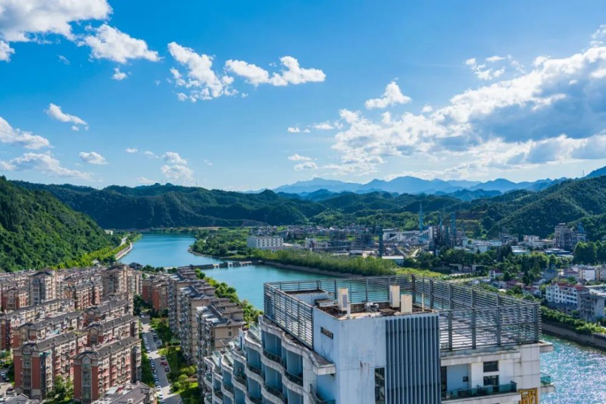

# 浙江县城开出百万年薪聘导游靠谱吗？专家：一次较为成功的“营销”

自去年以来，各地文旅局长们纷纷“集体出道”，代言家乡推广旅游业。在这股热潮中，浙江衢州开化县的百万年薪聘导游一事“异军突起”，引起了广泛关注，成为网络热点话题。

该活动于2023年初启动，吸引了全国1300多位业界达人应聘，经过层层筛选后，并于近日开启了五进一的“终极PK赛”，隶属于浙江旅游职业学院旅行服务与管理学院的“全国名导工作室”获得冠军。

开化文广旅体局党委委员、副局长汪玉清曾表示，旅游业是开化的支柱性产业，疫情三年对开化旅游行业打击很大，人才也流失得较多，因此想通过“百万年薪招导游”活动，招来人才、引来人才，并进一步培养当地的人才。

但也有网友质疑，此举有噱头炒作之嫌，招的并非是“真”导游，而是网红营销团队。

此外，尽管开化百万年薪招聘导游项目显示了对旅游行业发展的雄心和决心，但是一位导游或小团队是否能够单凭一己之力重振整个县的旅游业，仍然是一个值得商榷的问题。

**“营销事件”**

随着近期文旅市场回暖，各地都迎来了旅游小高峰，与此同时，“导游荒”却成了不得不面对的现实问题，优秀导游更是“一导难求”。

据文旅部发布的《2021年全国旅行社统计调查报告》，2019年旅行社从业人数为41.59万人，2021年降至27.88万人，两年间锐减13.71万人，签订劳动合同的导游人数也由12.17万人降至9.43万人。

中国旅行社协会导游专业委员会曾公开披露，保守估计，疫情三年间导游群体流失率达30%~40%，从与旅行社解约的情况来看，流失率高达50%以上。

中国旅游改革发展咨询委员会专家委员孙小荣接受中国新闻周刊采访时表示，疫情三年，旅游行业是受损最严重的行业之一，而导游职业是受困最严重的职业，很多导游或失业，或转行，职业自信受到严重打击。

他说，开出“百万年薪”，可以为文旅市场复苏期的开化招揽优秀导游人才，也对文旅产业振兴期的整个导游行业产生一种物质和精神激励。

因此一些业内人士认为此次高薪聘导游事件是文旅产业复苏的标志性事件之一。

不过，即便此次进入开化百万年薪聘导游决赛的五强选手，几乎都是业内资深导游，都拿过国家金牌导游，平均从业年限近20年，但不少业内人还是认为其更像一场营销。

孙小荣也认为这是一次较为成功的“事件营销”。他说，开化以“百万年薪”为吸引，开展评选活动，引发了长达三个多月的话题营销，为文旅市场复苏期的开化招揽了优秀导游人才，也提高了开化的城市知名度。

_开化县。图/图虫创意_

实际上，从高薪聘导游的赛程设置上，就可以看出，相比导游的专业能力，此次活动更看重导游们的营销能力，尤其是新媒体运营能力。

早在初赛阶段，新媒体专栏经营就被列入选手的能力考察中。决赛阶段，还需要创建开化百万导游大赛的公众号，发布开化的采风内容，以及与开化本土达人互动的内容。

如在五进一PK赛由两项组成：新媒体内容占40%，风采展示、专家领导面试占60%。

在新媒体内容上，还要求五强选手完成一个体现“开化是个好地方”的新媒体内容，并在当地媒体发布，五天后根据阅读数、评论数等数据来进行评分。

浙江大学旅游研究所副所长周永广对中国新闻周刊直言，“相比导游技能，开化更看重对方制造‘网红’水平，两者并不在一个评价体系里。”

但即便是最后获得冠军，要想全须全尾拿到所谓“百万年薪”，也并非一件容易的“差事”。

因为这笔金额，其实只有40万属于底薪，另外60万为考核奖金。

最终当选者的工作规划包括：须在开化设立金牌导游工作室，完成相关政务接待及文旅推广任务；为开化编撰景区（景点）导游词、设计完善县域精品旅游线路；为开化景区（景点、红色场馆）培训一批优秀导游；策划三场以上有影响力的文旅引流活动；须在各自自媒体开设开化旅游宣传专栏。

同时，开化要求入选的团队或个人需确保签约年度有充分的工作时间，并能在开化居住满120天。

孙小荣说，开化实际上是把原本用来做品牌营销策划的费用，巧妙地转化为一场线上线下结合的网络营销活动。结果是，品牌营销的策划方案、团队，以及创意、运营和人才培训的服务有了，品牌营销的前期效果也达到了，可谓“一举两得”。

**受重创的旅游业**

开化位于浙江省西部，衢州市西北部。开化也是个山区县，以丘陵为主，素有“九山半水半分田”之称。2022年该县GDP为181.35亿元，在衢州各区县中排行末位。

虽然自2015年2月，浙江召开推进26县加快发展工作会议，会上宣布正式决定对包含开化在内的26个欠发达县“摘帽”，并取消GDP总量考核转而着力考核生态保护、居民增收等。

开化县委书记夏盛民认为，开化在农业和工业的发展上有所限制，只有文旅产业才能做到“无穷大”，开化锚定打造世界一流生态旅游目的地的标志目标。

周永广介绍，开化向来重视生态保护，旅游业又向来富民不富财政，那么不追求GDP，改为追求共同富裕，也是一项重要选择。

虽然浙江对开化不再考核工业经济，实行以生态为先、民生为重的单列考核。但大疫三年，给开化的经济社会发展和旅游业带来了很大冲击，旅游收入和接待游客人次呈明显下降趋势。

据《2019年开化县国民经济和社会发展统计公报》，2019年开化接待旅游者1449.32万人次，旅游收入100.33亿元，占了当年全县生产总值146.8亿元的68％。而到了2022年，旅游人次下降到250人次，旅游收入也只有30亿元，骤降近七成。

这座主打全域旅游的山区小县也曾一度面临在岗导游仅剩28人的窘境。

开化《2023年政府工作报告》中提到，当下面临的挑战对标高质量发展还存在不少短板，综合实力、创新能力和产业竞争力与发达地区差距仍然十分明显；生态工业起势但未成势，产业链发展水平较低；中心城区首位度不高，城镇化水平偏低。

此外，开化旅游的劣势也较为明显。“一是群雄环伺，二是开化的文旅景区和项目，存在‘散小弱’的特点。”孙小荣说。

开化位于江西、安徽和浙江三省交界。如果以开化为中心画一个圆，方圆100公里内，北部有名满天下的黄山风景名胜区，东面是千岛湖风景区，西侧是“瓷器之都”景德镇，南面则是坐拥三清山和婺源的江西上饶。

孙小荣认为，开化在旅游资源层面和周边景区地处同一个地理环境和文化圈层，资源的同质化程度较高，“也就是说，开化在区域竞争格局中的差异性和整体性都不强。”

事实上，近几年来，开化的旅游虽然有了较快的发展，但旅游资源相对分散，旅游线路较难与外线相连接，因而市场认知度低，还未能形成旅游目的地。

就如同这个县城的旅游宣传语：开化是个好地方，听上去平淡无奇，在旅游市场的知名度和辨识度都不高。

**专家：差异定位，借强做精**

针对开化周边“群雄环伺”局面，开化的下一步怎么走？

在开化百万年薪聘导游决赛上，夏盛民透露，开化要把城市黄金位置的办公楼拿出来装修，留给前来驻扎的导游团、旅行社，还想招引短视频网红成立工作室，让各路文旅人才“拎包入住”，共同提升开化的城市品牌影响力。

开化县副县长林刘赞曾表示，“打是打不过的，还是得拼服务、拼特色、搞联盟，实现多方共赢。”

周永广建议，开化旅游既要抓生态文明，也要抓当地旅游特色。他说，之前开化所在的衢州宣传的“住衢州 游四省”过于虚浮，“不能好高骛远，要脚踏实地。”

孙小荣认为，开化旅游有着较强的区位优势与原生资源优势。由于地处浙赣皖三省交界，“边缘效应”明显，在客源市场层面，开化可以“三省通吃”。

此外，也正因处于“边缘地带”，开化受工业化经济的冲击力度相对少一些，这就意味着，它保留了相对原生的生态和文化资源，以及生活方式，而原生资源恰恰是当下及未来文旅产业发展的根基，工业经济“边缘化”的劣势会转化为旅游经济的优势。

孙小荣建议，开化文旅的未来发展要“差异定位，借强做精”，“不做观光，做度假，培育开化生活方式”，孙小荣说。

他认为，不管比山、比水，还是比文化，开化都跟周边大景区存在差异，因此做观光旅游不具备优势。开化要差异定位，做“精致度假”，挖掘和培育具有“在地原生文化”特征的休闲度假生活方式，比如精品乡村旅游、乡村民宿集群、生态康养旅居、原生研学课堂、精品美食等。

“培育新业态，营造新场景，创建新品牌，形成某种业态类型的规模化集群。”他说。

此外，他认为开化要不比“大而全”，要做“小而美，美而精”，以精致的城市休闲和乡村度假构筑开化式“小城生活”，与周边具有强引流能力的旅游城市、大品牌景区形成良性互动，互联互通。

作者：陈淑莲

