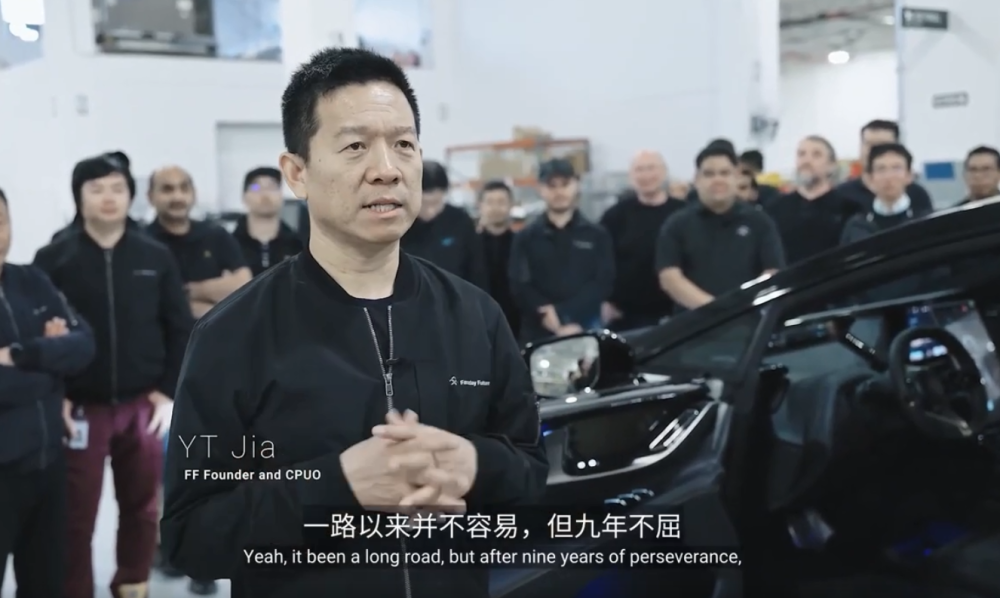

# 耗时9年贾跃亭圆梦：首辆FF91量产车下线，首位车主可能是贾跃亭

每经编辑：杜宇

北京时间4月15日9：00，法拉第未来发布FF91首辆量产车下线活动。FF全球CEO陈雪峰、FF创始人兼CPUO贾跃亭携核心高管现场见证这一里程碑时刻。

_图片来源：法拉第未来官方微博视频截图_

贾跃亭表示：一路以来，但九年不屈。今天，我们第一辆量产车的下线标志这FF历史上的又一个重要里程碑。

_图片来源：法拉第未来官方微博视频截图_

法拉第未来有关人士对上海证券报记者表示， **首辆新车车主很有可能就是贾跃亭自己。**

此前，法拉第未来宣布启动生产FF 91 Futurist量产车型，在演讲中，贾跃亭感叹到：“九年，为梦想窒息，终于迎来巅峰时刻”。

_图片来源：法拉第官方微博_

贾跃亭曾表示，旗下第一辆准量产车FF 91的百公里加速将远远超越迈巴赫，比法拉利的大多数车型也快。

作为唯一一款下一代极智科技奢华的智能互联网电动车产品， **FF 91 Futurist对标法拉利、迈巴赫、劳斯莱斯和宾利**
，以极限科技、极致用户体验和完整生态的产品DNA，带来了独特的智能互联网电动车出行体验。FF 91 Futurist拥有行业领先的1,050匹马力，
EPA认证续航里程381英里，0-60英里加速仅需2.27秒。

交付延期

据证券时报4月14日消息，FARADAY FUTURE（简称“FF公司”，中文为“法拉第未来”）在美国新闻稿发布网站Business
Wire发布的通告称，某些供应商通知公司，他们将无法满足公司的时间要求，因此公司更新了FF 91车辆的开始交付时间以及此前公布的三阶段交付计划。

根据新的规划，FF公司将于5月底开始第一阶段的交付流程，而此前时间安排是4月份。必须要强调的是，FF公司定义的“第一阶段交付”实际上并没有产生实质的钱物交换，而是一种小规模预订。

根据这则通告，第一阶段仅面对“行业专家FPO”(Future Product Officer未来主义者产品官)开展，“行业专家FPO”们将全额支付FF
91费用，以便预订车辆并接受车辆使用培训，以在第二阶段获得车辆。

第二阶段可以理解为小范围交付，FF公司称之为“未来主义者产品官（FPO）共创类交付”。即FPO(s)将全额支付费用，并将正式获得FF
91。FF公司预计第二阶段将于2023年第二季度末开始，但FF公司强调，第二阶段交付还需要满足一大条件。

直到第三阶段，FF公司称之为“全面共同创造交付”的环节，FF 91才正式进入我们常规理解的交付环节。FF公司将向所有全额支付费用的“高端用户”（spire
users）交付FF 91。FF公司同样强调，第三阶段也需要满足一项重要条件。

FF公司自我评价这种三段交付方案颇为体贴，既保障了车辆质量要求，“也将有助于缓解与预期市场需求相比的产能不足”。

那么，在第二和第三阶段，需要满足的重要条件是什么呢？

**当然是钱**
。FF公司表示，公司预计需要大量额外融资才能开始第二和第三阶段交付，并正在与其他潜在投资者进行讨论。FF公司表示，三阶段交付计划取决于及时收到足够的资金和零件并完成所需的碰撞测试。而2023年4月11日，公司手头现金约为2980万美元，其中包括150万美元的限制性现金。

截至美东时间4月14日收盘，法拉第未来报0.268美元，跌幅13.55%，市值2.03亿美元。

每日经济新闻综合法拉第未来官方微博、证券时报、每经网、公开资料

封面图片来源：法拉第未来官方微博

