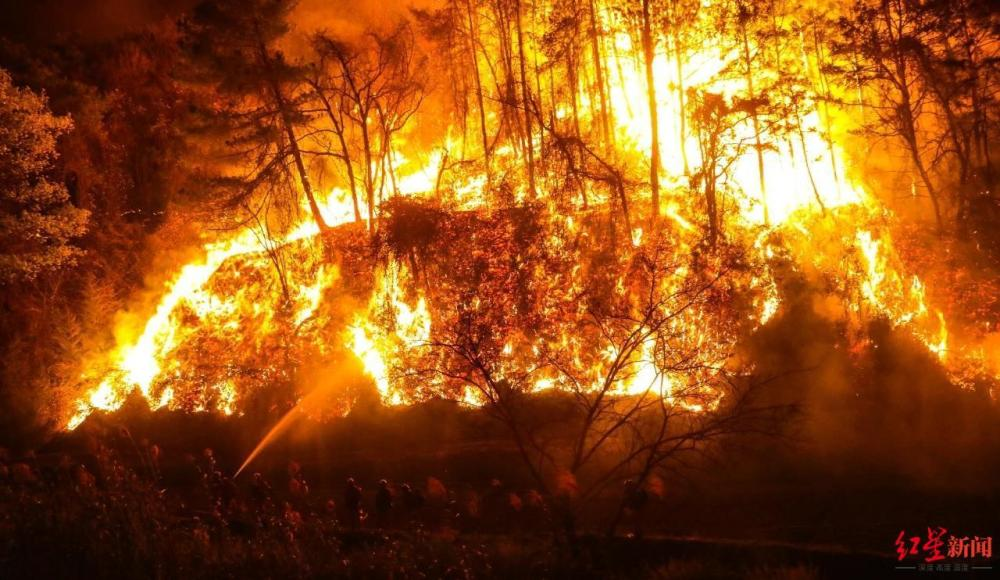
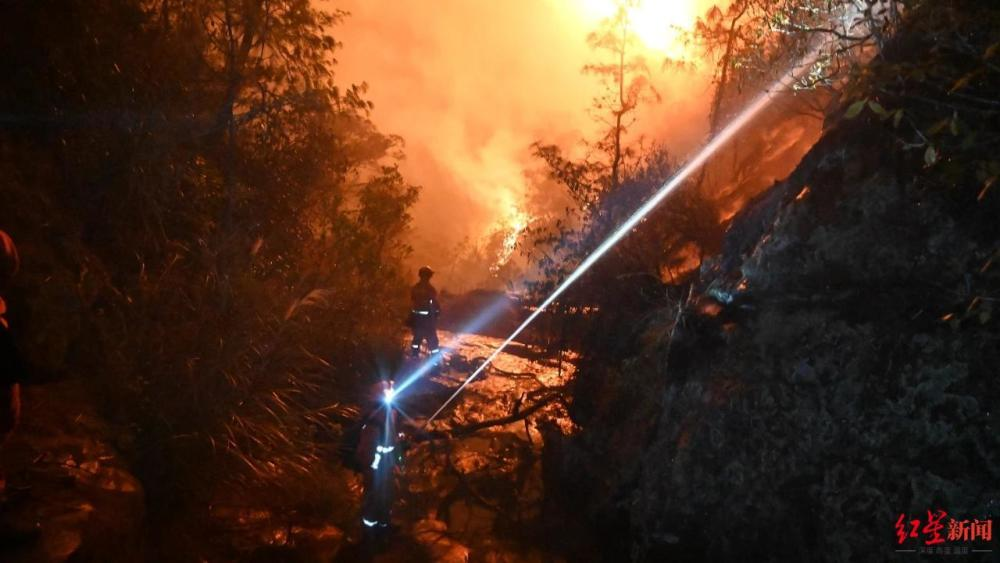
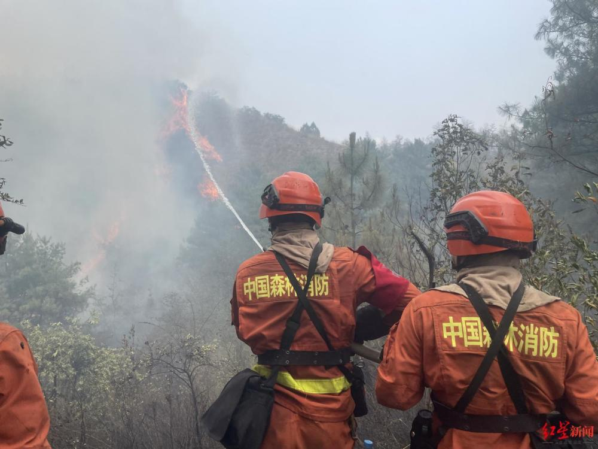
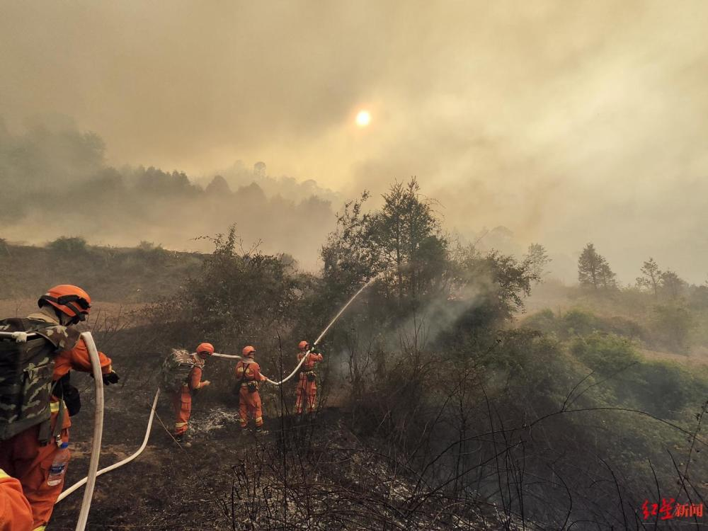
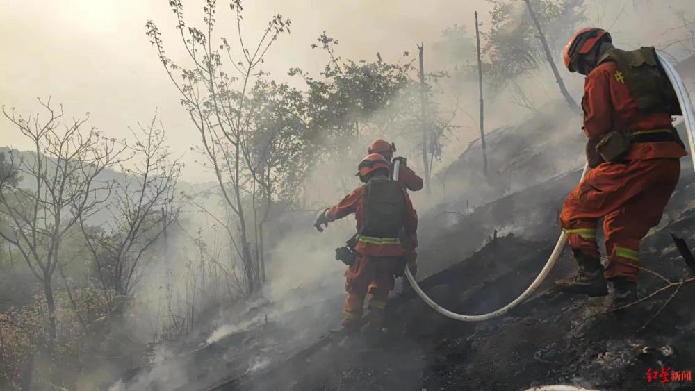

# 5天5夜，投入3000余人，云南玉溪山火现已全部扑灭，云南省森林消防总队：昼夜追击，守护了多个村庄

4月16日凌晨，红星新闻记者从云南省森林消防总队处获悉，截至2023年4月15日21时00分，经云南省森林消防总队800余名指战员和驻地消防、专业扑火队、干部群众3000余名各方力量昼夜鏖战、合力扑救下，发生在云南玉溪江川区的森林火灾已被全部扑灭，火场顺利实现合围。

此前，4月11日15时27分，云南玉溪市江川区发生森林火灾。据云南省森林消防总队相关负责人介绍，自山火发生以来，云南省森林消防总队第一时间投入总队第一、第二前指，昆明支队、昆明航空救援支队，普洱支队，新训一大队共800余名指战员，指挥、运兵、通信等各类车辆117台，车载水泵、大功率风力灭火机、高压细水雾等各类装备9000余件套进行扑救。

_↑消防员灭火，图据云南省森林消防总队_

该负责人介绍，在5天5夜120余小时昼夜奋战中，云南省森林消防总队指战员克服了险恶火场环境、连续转场作战等不利条件，因情就势运用地空配合、常规扑打、以火攻火、隔离阻火和化学灭火等多种手段，昼夜追击火头、堵截火势，圆满守护了水月村、杨家河村、围埂村、早谷田村、塔冲村等多个村庄、学校、工厂等重点目标，圆满守护了人民生命财产安全和生态安全。

此前，在4月13日火场东北线的扑救过程中，云南省森林消防总队普洱支队曾遭遇了罕见的爆燃险情。面对险情，消防人员避险成功，并完成任务。“按照联指部署，云南省森林消防总队玉溪火场参战队伍将采取分段移交方式，在确认火场实现'三无'后，将有序向当地政府移交火场。”上述负责人介绍。

红星新闻记者 蔡晓仪 王涵

编辑 张波

