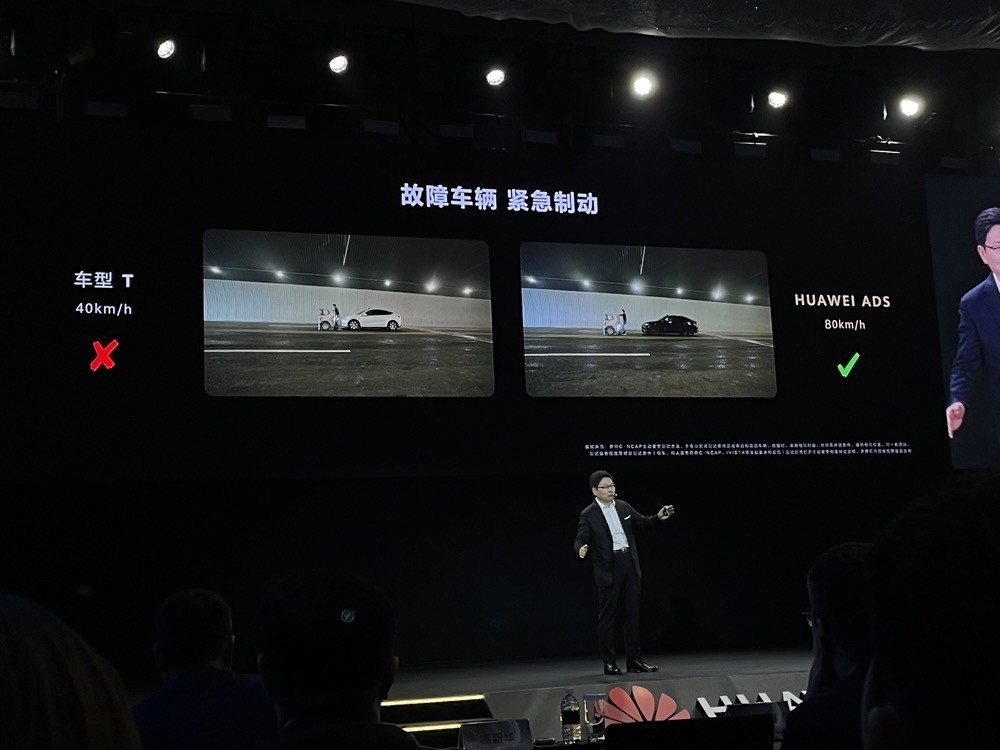
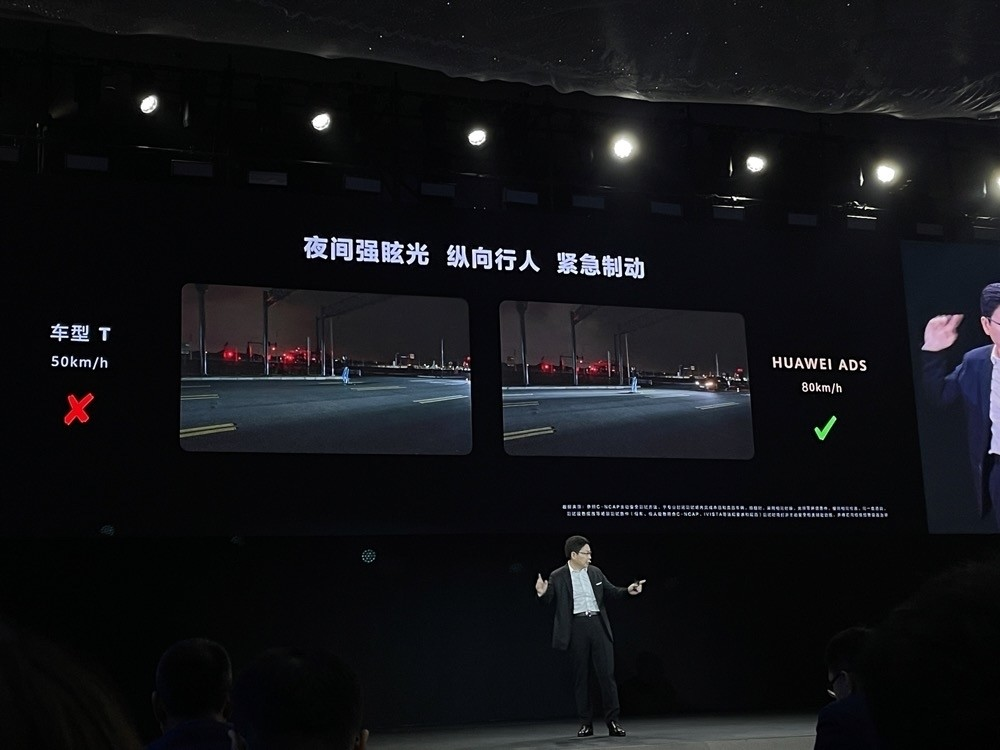
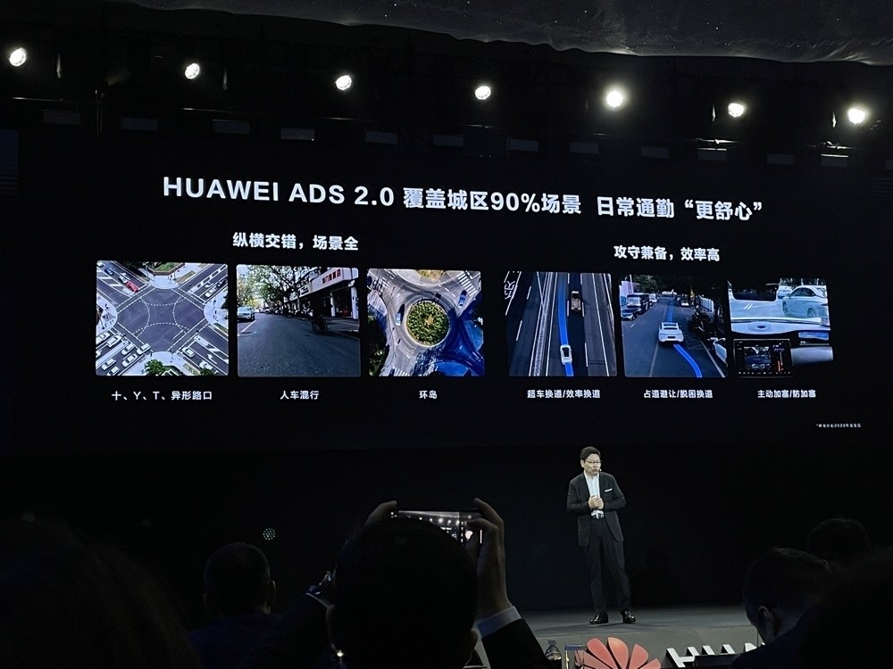
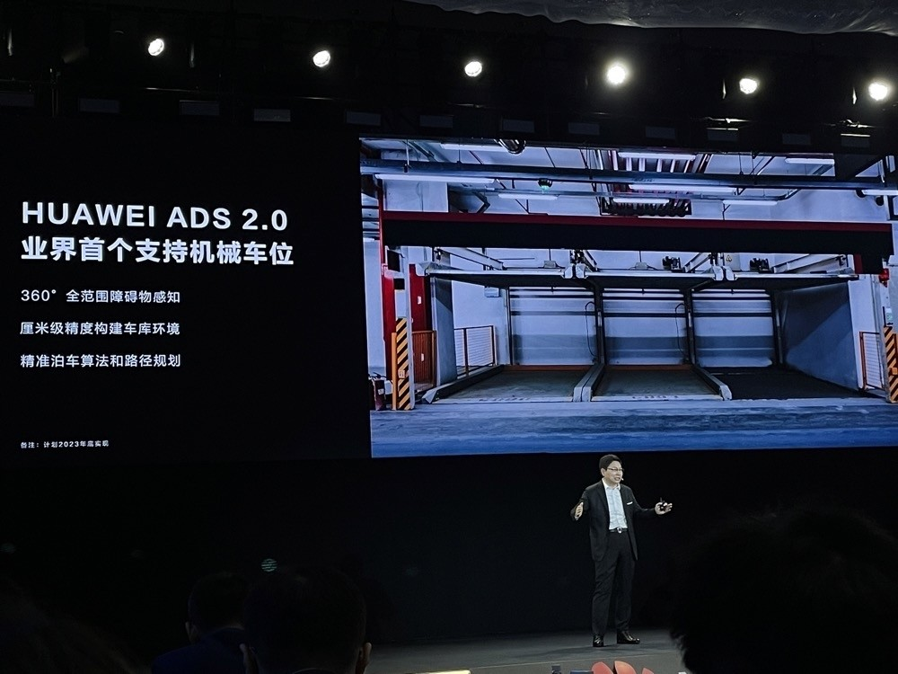
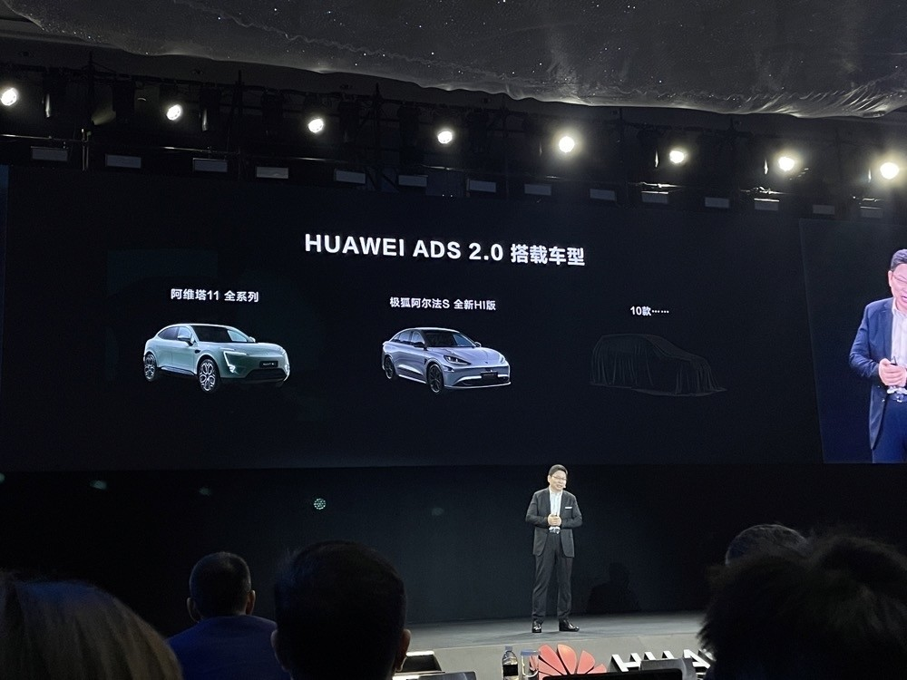
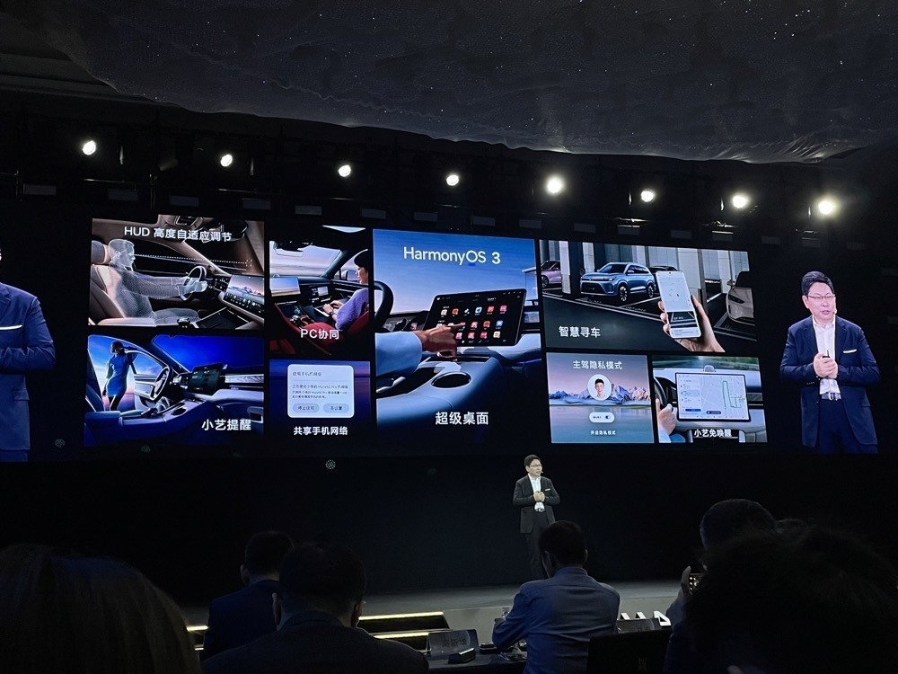
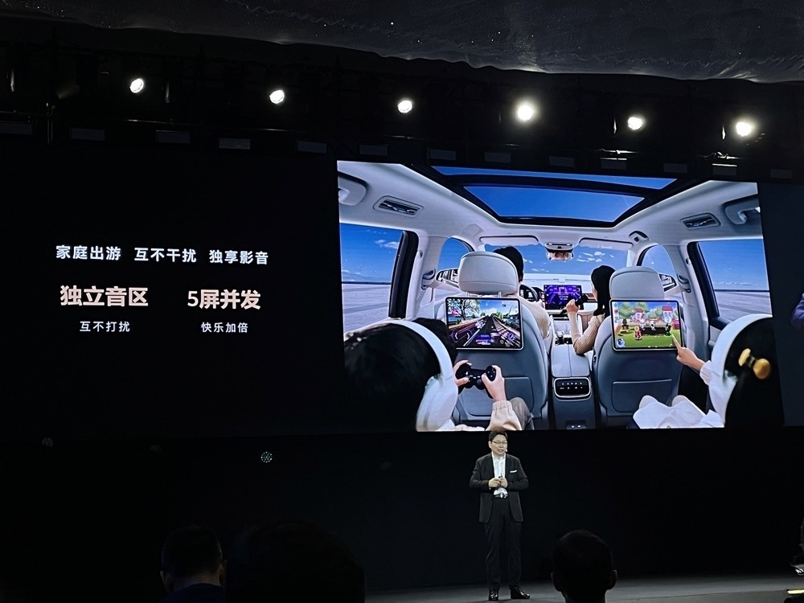
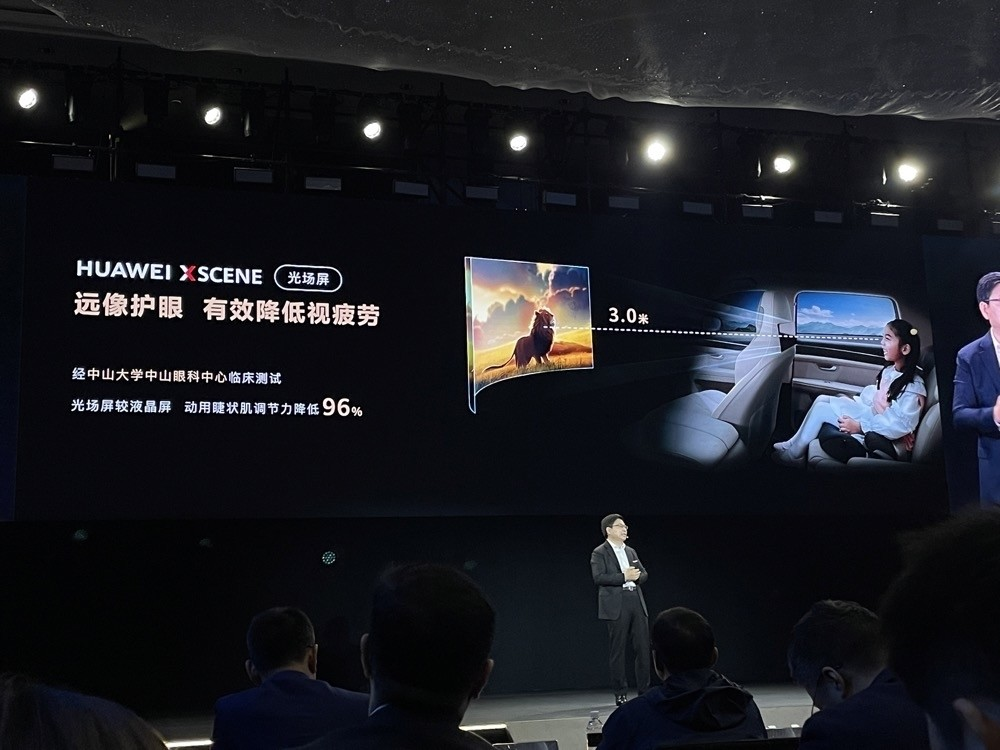
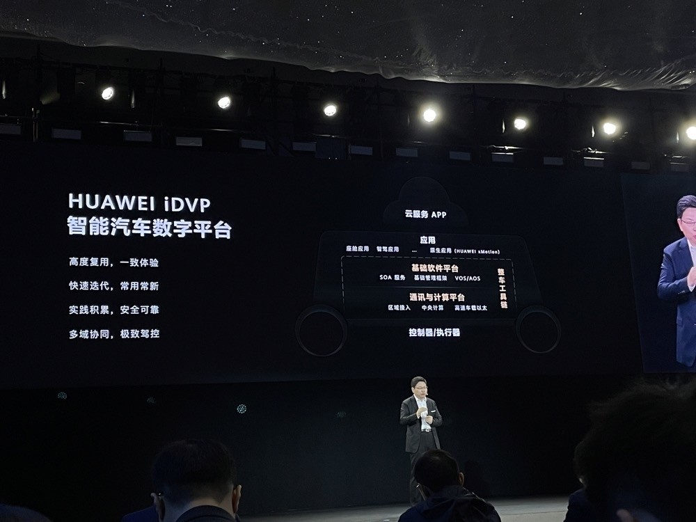
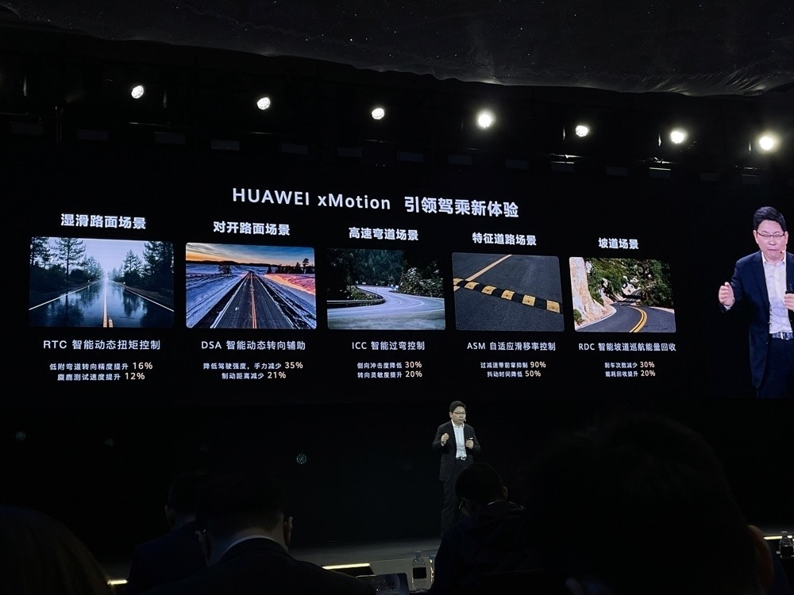

# 余承东罕见认错，与北汽合作升级，还连甩五项重磅技术更新

**作者 ｜ Juice**

**编辑 ｜ 志豪**

上海车展召开前夕，华为车BU又狠狠的秀了一把肌肉。

就在今天上午，华为常务董事、终端BG CEO、智能汽车解决方案BU CEO余承东再一次重申了华为帮助车企造好车的愿景。

而为了更好的实现这一目标，华为车BU的五大解决方案都有了全面的升级，分别推出了ADS 2.0、鸿蒙OS
3.0、iDVP智能汽车数字平台、智能车云服务和华为车载光最新产品。

_▲华为车BU五大解决方案更新_

其中最重磅的无疑是华为ADS 2.0和鸿蒙OS 3.0。华为ADS
2.0是华为在智能驾驶层面最新技术的体现，在安全层面上做了很多研发，余承东现场甚至直接对标特斯拉，多项特定场景下的测试都胜过了特斯拉。

而在城市NCA方面，华为年底前将在国内45个城市推出这一产品，并且完全不依赖高精地图。

在鸿蒙OS
3.0上，华为增加了车机和手机、电脑之间的协同性，可以自由切换应用。并且华为还进一步提升了车载智慧屏的性能和华为SOUND的能力，全面提升了鸿蒙座舱的舒适度。

另一方面，华为车载光部门也推出了很多有趣的产品如光场屏等，这些产品的加入也将会提升车辆的可玩性。

此外，华为还展示了自己在汽车数字平台和车云服务方面的进展，华为将会通过这些产品降低车辆的开发流程，帮助车企在更短的时间内开发出更好的产品。

通过今天上午的发布会来看，余承东仍然保持了他一贯的风格，发布会中多次说到“最强”、“天花板”这样的词汇，但在涉及到合作伙伴的时候，余承东也是主动认怂，称上次在百人会论坛上对北汽的言论存在错误，双方还在继续合作，并将原来的HI模式升级到了智选模式。

但整体来看，华为在汽车领域的布局已经非常全面了，正在从各个领域发力，而一旦这些产品完全上车，将会扩展目前汽车的功能边界，可能真的会颠覆汽车行业。

总而言之，华为已经成为汽车领域越来越不能忽视的玩家了。

一、城市NCA年内扩展至45城 不依赖高精地图

在发布会现场，余承东再次重申了华为“帮助车企，造好车”，而此前传的沸沸扬扬的“华为造车”终于翻到了新篇章。

为了实现“帮助车企，造好车”的目标，余承东接连公布了五大解决方案的最新进展。

第一个就是华为ADS
2.0系统，与前一代相比，这一产品有了不少的提升。首先在安全性上做了很大的提升，在主动安全层面，通过毫米波、视觉、激光等新增了白名单障碍物检测，显著提升了主动安全能力。

在展示具体功能的时候，余承东选择了向特斯拉开炮。特斯拉在40km/h时，无法识别到前方车辆尾部和后面的人，会导致事故的发生，而华为ADS
2.0可以在80km/h的速度下稳稳停下。

_▲华为ADS
2.0对于复杂场景的识别更准确_

道路前方出现静止货箱的时候，特斯拉在20km/h的速度下仍然无法躲避，而华为ADS 2.0在80km/h的速度下也可以很好的识别并且刹停。

而能够取得这样的成绩主要在于华为开发的激光融合GOD网络，激光雷达的加入可以更好对道路上的环境进行识别，即使在夜晚强眩光的情况下，也能够对纵向行人进行紧急制动。

_▲华为ADS 2.0可应对多种场景_

具体到功能上来看，华为ADS
2.0对于高速NCA做了进一步的优化，上下匝道更加自如，对于道路上突然出现的圆锥筒、水马等障碍物也能够更好的应对，在遇到施工的路段也可以自动降速和绕行。

城区NCA方面，ADS 1.0通过融合感知BEV已经有不错的表现了，而在ADS
2.0上，通过道路拓扑推理网络，可以将导航地图和现实世界匹配，在没有高精地图覆盖的情况下，也能够顺利通行。

_▲华为ADS
2.0将会重点推动城市NCA_

目前华为ADS
2.0已经覆盖了90%的场景，在今年第二季度将会在5个城市推出城市NCA，但这一阶段还需要高精地图的配合，到今年第三季度，城区NCA将会扩展到15个城市，并且不再需要依赖高精地图，第四季度将会拓展到45个城市，也不需要高精地图的辅助。

_▲华为ADS
2.0城区NCA更新计划_

而在泊车方面，华为也进行了全面的升级，可以360度搜索车位，对各种车位都能够识别并发现，并且还支持车头泊车的功能，窄车位和极窄车位也可以顺利泊入。

华为方面还计划到今年年底前实现车辆对机械车位的自动泊入。同时，华为还将在年底前实现跨地面地下停车场的代客泊车辅助AVP。

_▲华为ADS
2.0将会拓展机械车位的自动泊车_

据了解，华为ADS 2.0将会在问界M5高阶智能驾驶版本上首发，之后将陆续推送到阿维塔11全系列，极狐阿尔法S
全新HI版，而未来还有十款车型都将会上车这一功能。

_▲华为ADS 2.0搭载车型_

在介绍这一部分的时候，现场还出现了一个小插曲，余承东承认自己在百人会论坛上说错了话，华为跟北汽之间的合作并没有结束，而是从HI模式升级到了智选模式。

二、鸿蒙OS加强设备协同 下一代首搭问界M9

除了智驾能力的提升，华为鸿蒙座舱也有了很大的进步。余承东在介绍了鸿蒙OS 3.0的基础上还预告了鸿蒙OS 4.0的部分功能，而这一产品将会在问界M9上首发。

在鸿蒙OS
3.0上，车内摄像头通过对乘客眼球的识别，可以做到HUD高度自适应调节；在都采用华为的产品之后，可以在车上实现PC协同、共享手机网络，甚至在登陆了同一个账号之后，还可以将手机上的应用映射到车机上。

此外，语音助手免唤醒、提醒和智慧寻车等新功能也都会具备。

_▲华为鸿蒙OS 3.0主要功能_

这主要得益于同一个鸿蒙内核，这也给座舱系统带来了更多的玩法。在鸿蒙OS
4.0上，可以实现更加流畅的舱内跨屏，可以将前排的内容可以直接甩到后排继续观看，还可以通过手机控制。

以及用户手机上的内容，只要点一下就能够到车机屏幕上继续观看。

甚至车辆上的不同屏幕之间也可以使用不同的应用，每个座位上的乘客都可以做自己的事情，互不打扰。

_▲华为鸿蒙OS可支持多屏分立_

同时华为还带来了一个新的提升，那就是华为SOUND，通过音源高保真技术、空间计算技术和一系列的低音技术，根本上提升了车辆的音响表现。

非常有趣的是，华为还研发了独立多音区的技术，前排后排可以互不打扰，而后排新增了一个私密通话的功能，简单来说就是前排可以听到后排在说话，但是听不到后排究竟说了什么。

_▲华为SOUND支持独立多音区_

而这些并不是华为鸿蒙座舱的全部亮点，目前华为正在接纳越来越多的三方应用，而这也将会带来越来越多的座舱体验。

硬件方面，华为还发布了新一代的华为车载智慧屏，最高分辨率为2K，拥有87%的屏占比，屏幕还具备了自适应光感调节，在各种光线环境下都有着很好的色彩表现。

三、发布多款前瞻产品 提升车辆科技感

如何提升车辆的实用性和科技性，华为也做了很多努力。

华为在现场发布了一款名为XHUD的AR-
HUD产品，将HUD和AR合二为一，最高分辨率达到了1920*730像素，而且随着可视距离的拉远，其画幅也在进一步增大，在7.5米远的地方画幅为70英寸，而在10米之外画幅更是达到了96英寸。

_▲华为AR-HUD产品_

这一产品将华为智能驾驶系统和智能座舱进行了融合，智驾系统开启后的所有信息都可以显示在面前。

可以说，这一套产品真正实现了对于仪表盘的替代，而且还提供了很多仪表盘不具备的功能。余承东举了一个例子，即这一产品可以将倒车影像投影在前方，用户可以直视前方完成倒车入库。

华为还发布了一个智能车灯产品，具备260万像素的高清视场，采用了双灯融合的算法。

这一产品的可玩性也非常高，如在夜晚行驶的时候，驾驶员可以开启远光灯，而车灯会自动避免前向车辆或对向车辆的驾驶位，不干扰驾驶员的正常驾驶。

_▲华为智能车灯解决方案_

而在夜晚遇到复杂道路的时候，车灯还可以变成示宽光毯，帮助驾驶员判断车辆是否可以通过前方狭窄道路；而遇到视野不佳的十字路口时，车灯还可以变成交互光毯，进行提前预警，以防碰撞事故发生；而在弯道时，车灯更是可以根据弯道来调整灯光的照射位置，始终引导车辆安全驾驶。

另一方面，用户还可以通过车灯进行一些个性化的投影，目前华为已经开发出了完整的开发套件，可以做到常用常新。

同时，华为还发布了一款名为华为XSCENE的光场屏，尺寸可以达到40英寸，并且其在车内的观看距离可以达到3米，能够降低视觉疲劳，缓解晕车。

_▲华为光场屏_

而华为也自研了这一产品的画质算法，可以纠正畸变并且保证色彩的真实度。

四、即可帮助车企造好车 也可提供安全服务

为了更好的实现软件定义汽车，华为开发了iDVP智能汽车数字平台，打造了基础软件平台和通讯与计算平台在内的整车工具链平台，具有高度复用、快速迭代、多域协同等优势。

华为还将服务化和接口标准化，可以做到平台应用跨车型复用。

_▲华为iDVP智能汽车数字平台_

目前华为通过分层解耦，标准化API接口，API数量超过了800个，可以快速适配不同车型，效率提升了40%，平台应用跨车型复用率达到了90%。

而整个开发流程的效率也得到提升，可以快速迭代，做到常用常新。

同时，华为引入了其在ICT领域的成功实践，打造了极致可靠、安全的智能汽车数字平台，可以做到不趴窝、 不断网、不掉电、防入侵和防假冒五大优势。

_▲华为可以提供更加安全的服务_

此外，华为还发布了xMotion智能运动协同控制，可以实现驱动、制动、转向、悬架的多维度协同，实现6自由度车身全姿态控制。

_▲华为xMotion智能运动协同控制系统可以带来的提升_

搭载了这一产品后，车辆在应对湿滑路面、对开路面、高速弯道场景、特征道路场景和坡道场景都有了明显的提升。

云服务也是智能汽车领域中非常重要的一部分，华为的智能车云服务可以实现车辆全生命周期的主动关怀和贴心服务。

全车40多个部件都可以实现智能远控，核心零部件则可以做到实时守护。

以电池的守护为例，华为的VHR车云服务可以对20多种电池故障进行精准检测，对60多项指标进行监控，提前预警电池热失控，此外，华为还会检测电池的整个生命周期的健康情况。

_▲华为可以对电池做全生命周期的监控_

而云服务也让数字钥匙的便利性进一步发挥 ，另一方面又提升了车辆的安全性。另外OTA升级也离不开云服务。

结语：华为正全面助力汽车行业转型

余承东在演讲中认为智能电动汽车将重现功能手机到智能手机的变局，手机行业的分水岭是2013年，而余承东认为汽车行业的分水岭将会在2025年，之后新能源汽车的将会彻底超过燃油车，成为行业的主流。

在这个过程中，如果汽车产业不能抓住机会，可能一部分“巨人”将会倒下。

在智能汽车的发展过程中，上半场是电动化，硬件决定体验，而下半场则是智能化，软件决定了最终的体验感受。

为了应对这一潮流，华为也做了很多工作，目前已经量产交付了200万套智能化部件，已经上市的战略合作车型也有5款，此外，华为还有300+生态合作伙伴。

对于华为的鸿蒙车机，余承东来了一段自卖自夸，称其为智能车机的天花板，超过了全球所有的车机系统。

华为ADS 1.0目前落地了极狐阿尔法S HI版和阿维塔11。截止目前ADS
1.0已经OTA了7次，功能更新优化了172项，目前高速NCA已经覆盖了30万公里，涵盖259城，而在深圳、上海、广州等地已经支持城区NCA功能，泊车方面做到了可见即可泊车。

现阶段，这套系统的匝道汇入成功率从94%提升到了98%，泊入的成功率从91%提升到了95%。

ADS 1.0在各项主动安全评测上都取得了很好的成绩，而在高速上和泊车上的表现非常好，余承东现场放话：“表现已经超过了特斯拉。”

从这些表现来看，华为在汽车领域的存在感已经非常强了。

而华为已经明确了不造车，要全力帮助车企造好车，而随着产品的逐步落地，华为也将会进一步促进汽车行业的转型。

