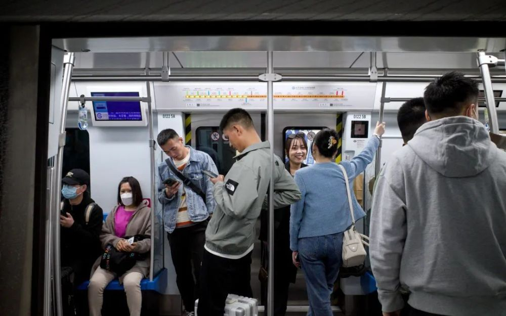
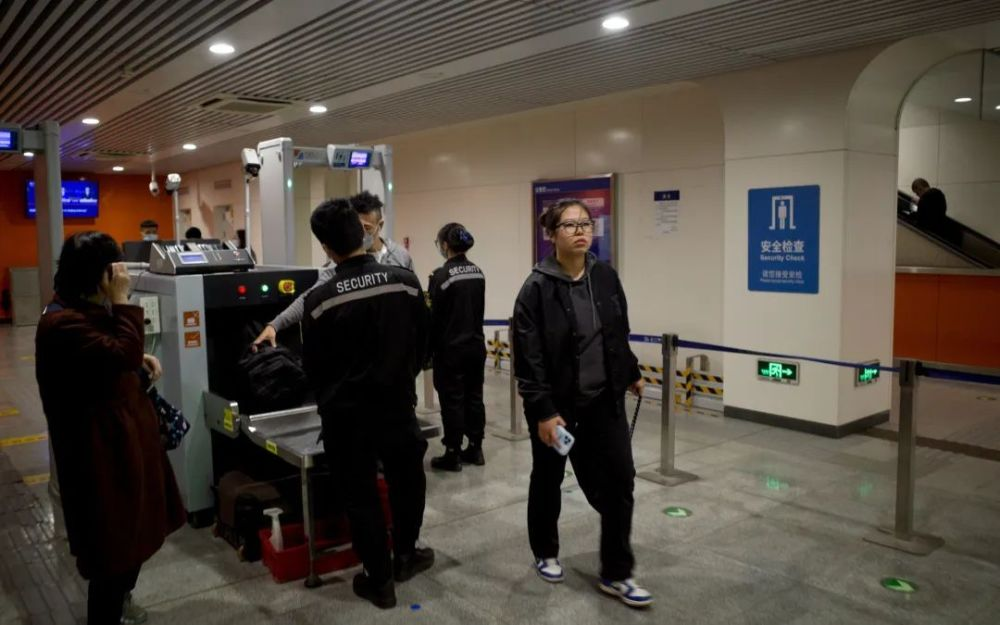
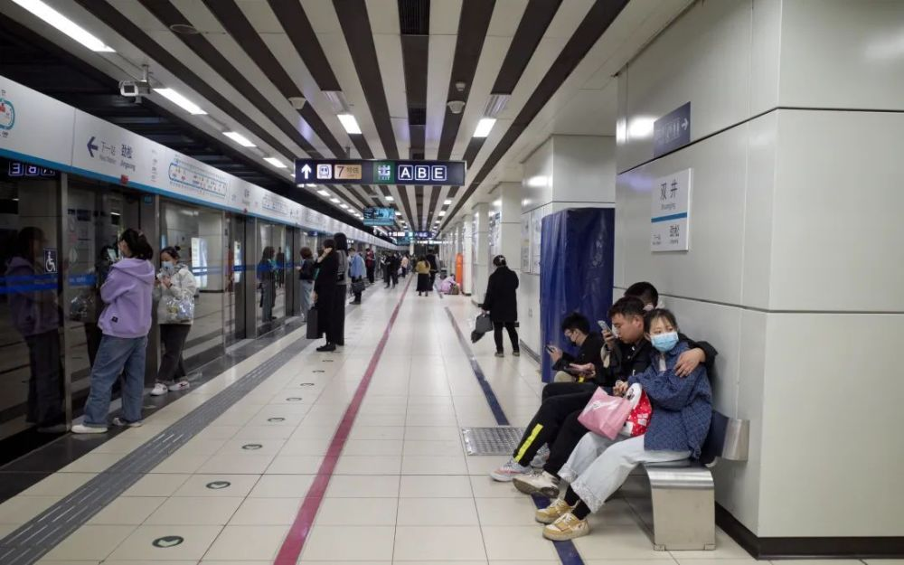

# 北京地铁已取消口罩佩戴要求，时隔近两年客流量重回1200万人次

近日，有网友反映，北京市各条地铁线路已全面放开口罩要求，乘客在进站安检、候车乘车的过程中，均无需佩戴口罩。记者从北京多个地铁站获悉，目前他们已接到相关要求，不再对口罩问题做硬性规定，完全看乘客的个人意愿。

_地铁7号线列车内，有多名未佩戴口罩的乘客。新京报记者
裴剑飞 摄_

此外，记者从北京市轨道交通指挥中心获悉，本周五（4月14日）北京轨道交通全网客运量达到1201.16万人次，这是时隔636天再次恢复至1200万人次水平。面对客流的持续增长，北京轨道交通将以更高标准、更严要求全力做好市民出行服务保障工作。

昨天晚上7点40分，记者在十号线双井站看到，有多名没有佩戴口罩的乘客顺利通过安检进入车站，工作人员也并未提醒或建议其要佩戴口罩。“这样的转变也挺积极的吧，大家对于出行也更有信心了。”一位未佩戴口罩进站的乘客表示。

_地铁10号线双井站，一位不戴口罩的乘客顺利通过安检进站。新京报记者
裴剑飞 摄_

进站后，记者同样也看到了少数正在候车的乘客也没有佩戴口罩，但这些乘客的占比并不是很高。粗略统计后发现，晚上7点45分至8点间，在站台上候车的乘客中，有三十余名乘客没有佩戴口罩，在所有同时段候车的乘客中，未佩戴口罩乘客的比例不足一成。此外，在车厢内也看到了一些不戴口罩的乘客，以结伴出行的年轻人居多。

_地铁10号线双井站内，有正在候车的乘客也未佩戴口罩。新京报记者
裴剑飞 摄_

另一个变化是，在车站内已经看不到要求乘客佩戴口罩的相关提示信息。对此，记者从多个地铁站了解到，目前他们都收到了相关通知，不再对乘客佩戴口罩事宜进行强制要求，同时，也将站内此前张贴的“乘车需全程佩戴口罩”的标语撤换下。不过，车站的工作人员仍在按照相关要求佩戴口罩。

记者昨日乘车时也注意到，虽然地铁部门已不再对口罩进行强制性要求，但部分车站内依然能够听到广播提醒，告知乘客为了自身的健康，建议在乘车过程中佩戴口罩。

对于乘坐地铁时到底是否需要佩戴口罩的问题，国家层面其实也有了明确的说法。4月12日，国家疾控局发布了预防新型冠状病毒感染公众佩戴口罩指引，明确提出乘坐飞机、火车、长途车、轮船、地铁、公交车等公共交通工具时，仅是建议佩戴口罩。

“我觉得戴或者不戴（口罩）现在已经是一种个人的自由选择了，但同样考验我们的公共规范意识。”除了一些乘客表示支持乘坐地铁可不戴口罩的新要求外，也有乘客表达了其他的看法，一位女乘客告诉记者，她认为乘客需要更加自觉，如果出现相关症状出于对他人负责任的态度还是应该戴好口罩。

记者/裴剑飞‍

编辑/刘茜贤

校对/赵琳

