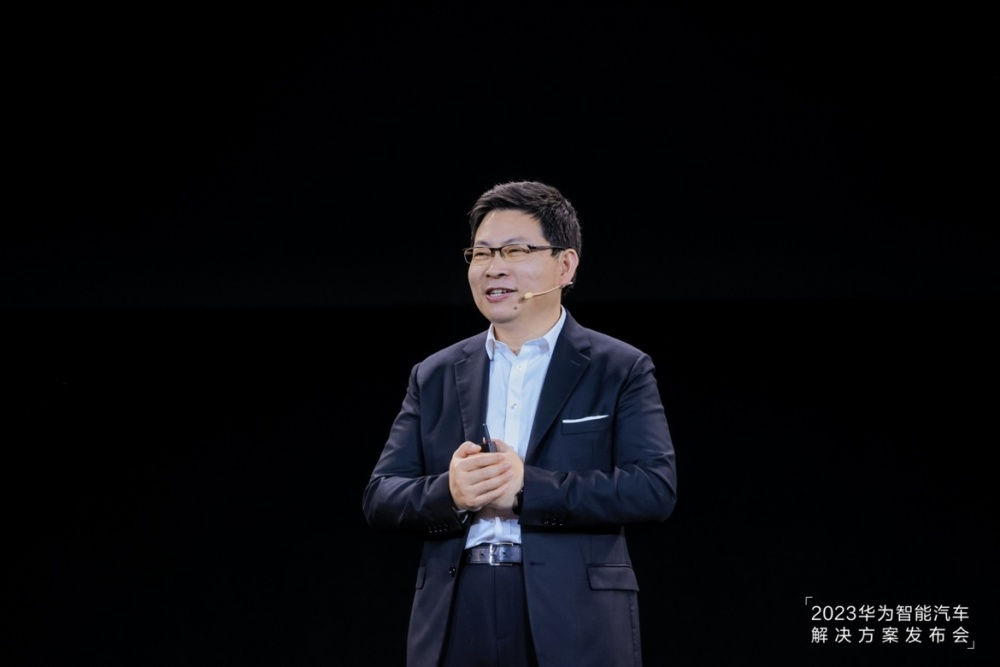

# 华为余承东：2025年传统车企面临被淘汰风险

作者 ｜ 程潇熠

编辑 ｜ 康晓

出品｜深网·小满工作室

4月16日，华为常务董事、终端BG CEO、智能汽车解决方案BU CEO余承东在华为智能汽车解决方案发布会上纠正了此前对于华为与北汽合作的说法。

余承东称，华为与北汽极狐不是不再合作了，而是合作模式从HI模式升级为了智选模式。“此前的说法有误，北汽的同事很有意见。”

今年4月1日，余承东曾在中国电动汽车百人会论坛上说，华为HI模式最开始有三个车厂（北汽、长安、广汽）与华为合作，现在基本只剩阿维塔（长安）。因此市场猜测，华为与北汽或已暂停合作。更早的时候（3月），广汽已官宣不再与华为联合开发新车型，双方仅保留供应及采购合作关系。

华为HI模式是2020年华为推出的HUAWEI
Inside全栈式方案，向车企提供华为智能驾驶、鸿蒙车机、车载计算芯片等全套华为自研的解决方案，并授权车企在车身使用“HI”Logo。

与声量较大的华为智选车模式（代表品牌：问界）相比，采用HI模式的极狐阿尔法 S HI
版、阿维塔11车型的销量表现较弱。余承东曾复盘HI模式的问题，“我们提供最好的技术，可能并不能保证最终的产品取得商业成功。”

在今日的发布会上，华为不再强调HI模式，而是以技术平台发布的模式，发布了HUAWEI ADS 2.0（Advanced Driving
System，华为高阶智能驾驶系统）及智能座舱、智能车载光、智能汽车数字平台等一系列智能汽车解决方案。

HUAWEI ADS 2.0相比1.0在高速（包括上下匝道、避障、施工修路等）、智能泊车、城市场景都有功能提升。

此外，余承东公布了一个较为激进的城市NOA（高阶辅助驾驶系统）计划：今年Q3将实现15个无图城市的落地，Q4又将新增30个无图城市的落地，达到45城。NOA全称
Navigate on
Autopilot，通常情况下指车辆可以在特定道路范围内，在无人接管的情况下自动驶达目的地。目前NOA更多使用于高速场景，城市场景较少。

《深网》了解到，HUAWEI ADS 2.0将在AITO
问界M5华为高阶智能驾驶版首发，后续阿维塔11、极狐阿尔法S･HI版也将从1.0升级至2.0，未来还将有十余款车型搭载。

在商业模式方面，与此前HI模式中华为智能驾驶解决方案打包出售给车企的方式有所不同，此次HUAWEI ADS 2.0还公布了C端购买方案，将HUWEI
ADS分为基础包、进阶包和高阶包。基础包和进阶包随车标配，高阶包由用户选择性购买。价格如下：

HUAWEI ADS 1.0一次性购买32000元，订阅包年6400元，订阅包月640元。

HUAWEI ADS 2.0一次性购买36000元，订阅包年7200元，订阅包月720元。

蔚来和特斯拉此前也公布了高阶辅助驾驶系统的按月订阅价格。蔚来NOP+每月 380元，特斯拉FSD每月199美元(约合人民币1300元)。

余承东在会上劝诫大家要抓住智能网联这个时代变迁的机会，否则未来公司可能会被时代淘汰。今天的智能电动汽车跟10多年前的智能手机时代惊人相似，2013年智能手机超过了功能手机实现了逆转，导致很多头部手机厂商迅速退出历史舞台，“现在我们看到智能电动网联汽车走出来，我们预测这个分水岭可能在2025年，会形成一个大的逆转。”

