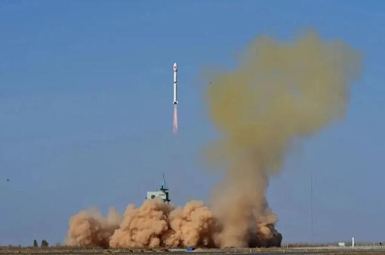

# 大陆上午发射卫星，台军又跳出来了：“飞过台湾北部外海上空”

【环球网综合报道
记者赵友平】我国首颗降水测量专用卫星16日上午发射成功。据中时新闻网、联合新闻网等多家台媒报道，台防务部门声称，大陆上午发射的卫星，其飞行轨道“通过台湾北部外海上空”，未对岛内安全造成影响。

_4月16日上午，长征四号乙遥五十一运载火箭在酒泉卫星发射中心点火升空，成功将我国首颗降水测量专用卫星风云三号G星送入预定轨道，发射任务取得圆满成功。图自“我们的太空”微信公号_

报道称，台防务部门还声称，台军均能掌握火箭发射状况，虽然大陆部分火箭残骸坠落“台湾北部外海警示区”，但对岛内安全未造成影响。

4月16日9时36分，长征四号乙遥五十一运载火箭在酒泉卫星发射中心点火升空，成功将我国首颗降水测量专用卫星风云三号G星送入预定轨道，发射任务取得圆满成功！本次发射任务的星箭均由中国航天科技集团有限公司八院抓总研制。

《环球时报》记者16日从八院获悉，风云三号G可通过探测云、水汽、气溶胶、风场等相关要素，进一步研究降水形成过程，并且能精确感知到地球大气0.2毫米/小时的降水强度变化，探测到毛毛雨般的降水强度，精准度达到国际先进水平。卫星发射后将大幅提高空间降水探测能力，为全球气象灾害的监测和预报提供有力手段。

