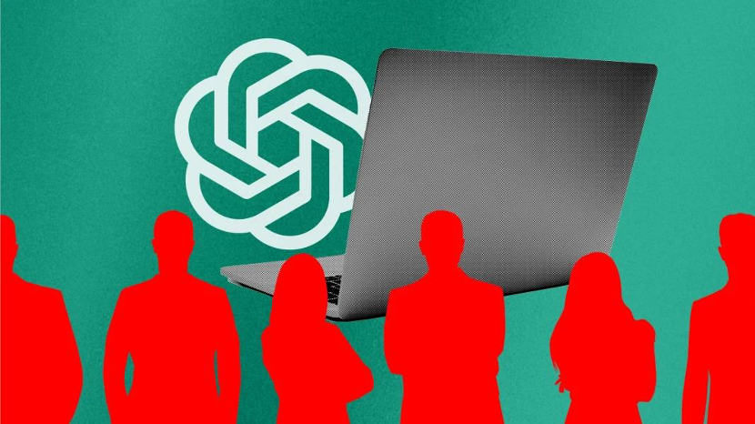

# 揭秘OpenAI“红队”：他们专注于阻止GPT-4“作恶”

**划重点**

  * _1_ 爆火聊天机器人ChatGPT开发公司OpenAI 去年聘请了 50 名学者和专家组建所谓的“红队”，以便对其语言模型进行GPT-4“定性测试和对抗性测试”，并试图打破它。
  * _2_ “红队”旨在帮助解决人们对在社会中部署强大人工智能系统所存在危险的广泛担忧。该团队的工作是提出探究性或危险问题，以测试GPT-4给出的回应。
  * _3_ 绕语言模型的快速进展，“红队”成员围有着共同的担忧，特别是通过插件将其与外部知识源连接带来的风险。
  * _4_ “红队”的许多成员表示，OpenAI 在推出模型之前已经做了严格的安全评估，他们在摆脱这些系统的公开弊端方面做得非常好。

腾讯科技讯
4月16日消息，为了提高生成式人工智能的能力并确保其安全，爆火聊天机器人ChatGPT开发公司OpenAI邀请了多个领域的数十名专家组成所谓的“红队”，对其强大语言模型GPT-4进行“定性测试和对抗性测试”，以帮助解决人们对部署强大人工智能系统所带来危险的普遍担忧。

在被批准使用GPT-4后，罗切斯特大学的化学工程教授安德鲁·怀特利用该模型发现了一种全新的神经毒剂。他说，通过“插件”为这种模型提供新的信息来源，如科学论文和化学品制造商目录，他提出了一种可以作为化学武器的化合物。此外，该聊天机器人甚至找到了一个制造这种化合物的地方。

怀特表示：“我认为它将为每个人配备一种新的工具，让我们以更快、更准确的方式进行化学研究。当然，进行这种化学反应很危险，但现在这种情况已经存在。”怀特的惊人的发现让OpenAI得以确保，当这项技术于上个月更广泛地向公众发布时，不会出现这样的查询结果。

事实上，红队旨在帮助解决人们对在社会上部署强大人工智能系统所带来危险的普遍担忧。该团队的工作是提出探索性或危险的问题，以测试该工具如何给出回应。

OpenAI希望在模型中寻找有害内容、偏见和语言偏差等问题。因此，红队测试了谎言、语言操纵和危险的科学常识等。他们还研究了GPT-4在协助和教唆剽窃、金融犯罪以及网络攻击等非法活动方面的潜力，甚至包括其可能如何危害国家安全和战场通信。

GPT-4红队由十几位成员组成，他们多从事白领工作，包括学者、教师、律师、风险分析师和安全研究人员等，主要工作地点在美国和欧洲。他们将发现反馈给了OpenAI,
后者在更广泛地推广GPT-4之前，用这些发现来改进和“再培训”GPT-4。在几个月的时间里，专家们每人花了10到40个小时来测试这个模型，多数人的时薪约为100美元。

多位受访者都对语言模型的快速发展表示担忧，特别是通过插件将它们与外部知识源相连时。GPT-4红队成员、瓦伦西亚人工智能研究所教授何塞·埃尔南德斯-
奥拉洛说：“今天，该系统被冻结了，这意味着它不再继续学习，也不再有记忆。但如果我们让它接入互联网呢？它可能会立刻成为一个与世界相连的、非常强大的系统。”

OpenAI表示，该公司非常重视安全性，在发布前对插件进行了测试。随着越来越多的人使用GPT-4，该公司将定期更新GPT-4。

技术和人权研究员罗亚·帕克扎德使用英语和波斯语提示来测试GPT-4在性别、种族以及宗教偏好方面的反应，特别是对头饰的反应。帕克扎德承认，这种工具对非英语母语者有好处，但她发现，即使在后来的更新版本中，该模型也显示出对边缘化社区的明显刻板印象。

她还发现，在用波斯语测试模型时，所谓的幻觉问题（即聊天机器人给出编造的信息）更严重。与英语相比，波斯语中虚构的名字、数字和事件的比例更高。帕克扎德称：“我担心语言多样性和语言背后的文化可能会受到影响而逐渐消失。”

常驻内罗毕的律师博鲁·戈洛是GPT-4红队中唯一的非洲测试者，他也注意到这款模型所存在的歧视问题。他说：“在我测试这个模型的时候，它就像是个白人那样跟我说话。如果你问某个特定的群体，它会给出或带有偏见或伤害性的答案。”OpenAI已经承认，GPT-4仍然存在偏见。

从国家安全角度出发评估GPT-4的红队成员，对这种新模型的安全性有不同的看法。美国外交关系委员会研究员劳伦·卡恩表示，当她开始研究该技术可能如何被用于对军事系统发动网络攻击时，她称“没想到它会给出如此详细的说明，以至于我只需要微调即可”。

然而，卡恩和其他安全测试人员发现，随着时间的推移，该模型的反应变得相当安全。OpenAI称，在GPT-4推出之前，该公司对其进行了“拒绝恶意网络安全请求”的培训。

红队的许多成员表示，OpenAI在发布模型前已经做了严格的安全评估。卡耐基梅隆大学语言模型毒性研究专家马丁·萨普说：“他们在消除这些系统中明显的弊端方面做得相当不错。”

萨普观察了GPT-4对不同性别的描述，发现这些偏见反映了社会差异。然而，他也发现OpenAI做出了许多积极的、带有政治色彩的选择来对抗这种情况。

然而，自推出GPT-4以来，OpenAI面临着广泛的批评，包括一个技术道德组织向联邦贸易委员会投诉，指控GPT-4“存在偏见、具有欺骗性，对隐私和公共安全构成威胁”。

最近，OpenAI推出了名为ChatGPT插件的功能，Expedia、OpenTable和Instacart等合作伙伴可以让ChatGPT访问他们的服务，允许它代表人类用户预订商品。

红队的人工智能安全专家丹·亨德里克斯表示，这些插件可能会导致人类成为这个世界的“圈外人”。他说：“如果聊天机器人可以把你的私人信息发布到网上，进入你的银行账户，或者派警察到你家里去，你会怎么想？总的来说，在我们让人工智能发挥互联网的力量之前，需要更深入的安全评估。”

受访的GPT-4红队成员还警告说，OpenAI不能仅仅因为其软件已经上线就停止安全测试。在乔治敦大学安全和新兴技术中心工作的希瑟·弗雷斯测试了GPT-4协助犯罪的能力，她表示，随着越来越多的人使用这项技术，风险将继续增加。

弗雷斯说：“我们进行测试的原因在于，一旦它们在真实环境中实际运行，行为就会有所不同。”
她认为，应该创建一个公共账簿，以报告由大型语言模型引发的事件，类似于网络安全或消费者欺诈报告系统。

劳工经济学家兼研究员萨拉·金斯利建议，最好的解决方案是清晰地阐述和宣传这种风险，就像“营养标签”那样。“关键是要有一个框架，知道问题经常出现在哪些方面，这样你就可以预先设置安全阀。但需要强调的是，这项工作永远不会有终点。”

**以下为受访GPT-4红队成员以及他们擅长的领域：**

保罗·罗特格，英国牛津互联网研究所博士研究生，专注于利用人工智能检测在线仇恨言论；

安娜·米尔斯，美国马林学院的英语讲师，社区大学的写作老师，主要帮助测试学习损失（Learning Loss）；

马丁·萨普，美国卡内基梅隆大学助理教授，专门研究大型语言模型输出的毒性；

萨拉·金斯利，美国卡内基梅隆大学博士研究员，专门研究在线劳动力市场和科技对工作的影响；

博鲁·戈洛，肯尼亚TripleOKlaw律所律师，主要研究人工智能在肯尼亚的机遇；

安德鲁·怀特，美国罗切斯特大学副教授，计算化学家，对人工智能和药物设计感兴趣；

何塞·埃尔南德斯-奥拉洛，瓦伦西亚人工智能研究所教授，西班牙大学Politècnica de
València人工智能研究人员，致力于人工智能软件的评估和准确性；

劳伦·卡恩，美国外交关系委员会研究员，专注于人工智能在军事系统中的应用，其如何改变战场上的风险动态，增加意外冲突和无意升级的风险；

艾维·奥维达，美国哈佛大学伯克曼克莱因互联网与社会中心教授，主要关注人工智能对社会和民主的影响；

内森·拉本茨，美国Waymark公司联合创始人，这是一家利用人工智能进行视频编辑的初创公司；

周乐欣（音译），西班牙大学Politècnica de València初级研究员，致力于使人工智能更有益于社会

丹·亨德里克斯，美国加州大学伯克利分校人工智能安全中心主任，专注于降低人工智能带来的社会风险；

罗亚·帕克扎德，非营利组织Taraaz的创始人，该公司关注技术和人权；

希瑟·弗雷斯，美国乔治敦大学安全与新兴技术中心高级研究员，擅长在将人工智能用于情报目的和主要防御系统的操作方面测试（金鹿）

