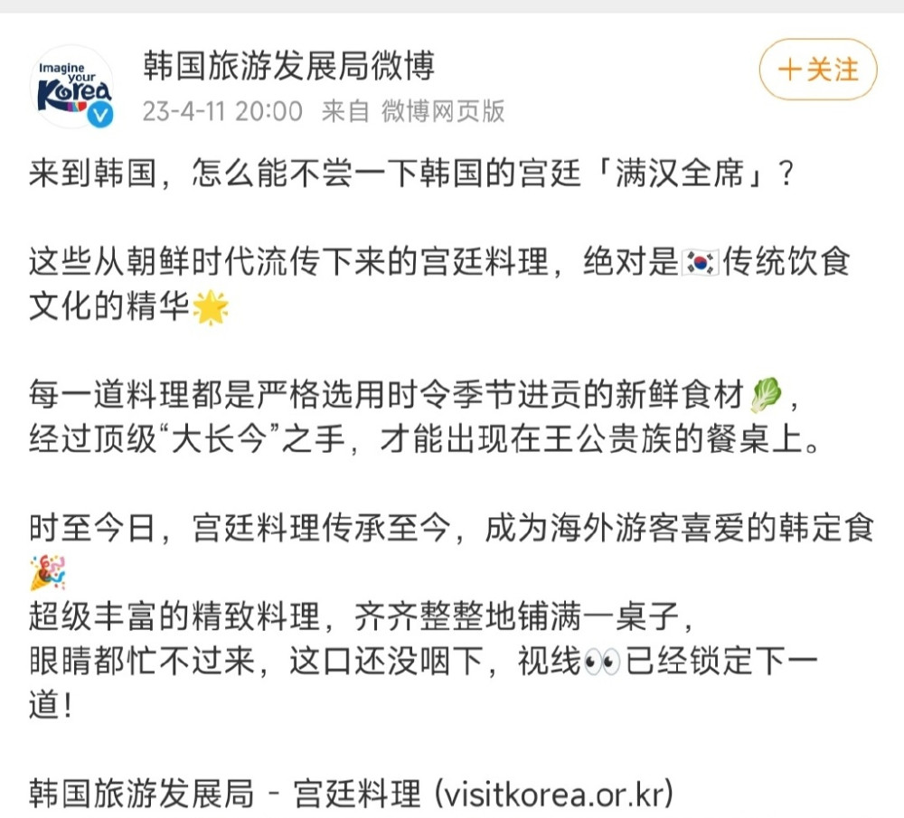
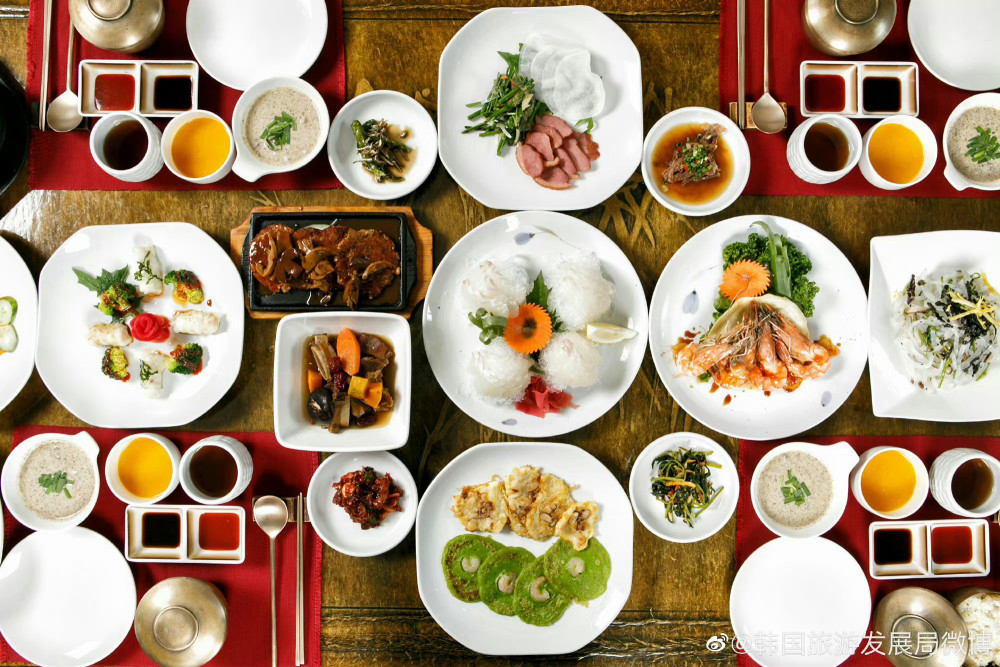
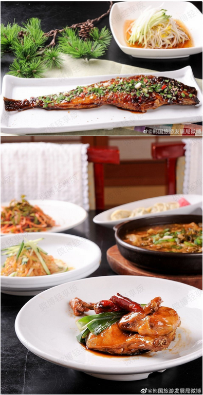
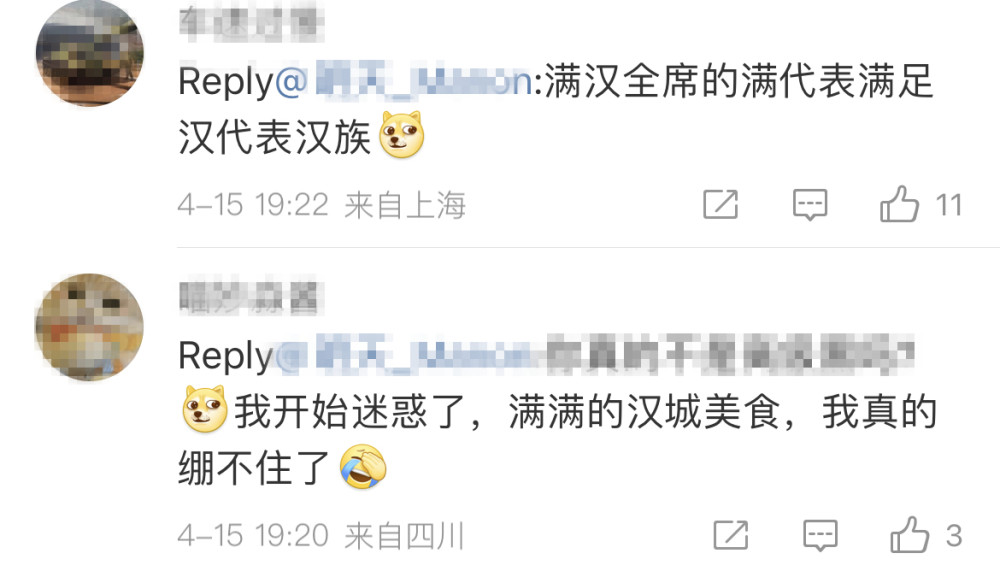
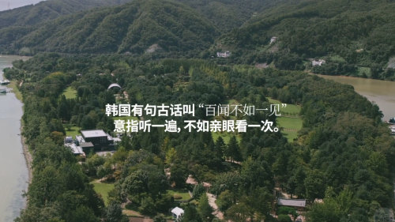

# 群英荟萃？萝卜开会！韩国旅游部门晒“宫廷满汉全席”被网友怼到删文

（观察者网讯）昨（4月15日）晚，“韩国
满汉全席”登上微博热搜第一。起因是韩国旅游发展局官方微博宣传所谓“韩国传统饮食文化精华”时，宣称不能错过韩国的“宫廷‘满汉全席’”，并附上7张图展示“从朝鲜时代流传下来的宫廷料理”，结果被网友怼上热搜。

网友质疑韩国旅游发展局对“满汉全席”一词引用不当，并调侃其晒出的所谓宫廷佳肴更像火锅店“小料区”，大有“群英荟萃
萝卜开会”之势。引发大量质疑后，@韩国旅游发展局微博 删除争议微博，并对评论区开启防护模式。

4月11日晚，@韩国旅游发展局微博
发表主题为“来到韩国，怎么能不尝一下韩国的宫廷‘满汉全席’”的博文，对“满汉全席”一词使用了中国大陆地区在竖排文稿中才使用的直角引号。

@韩国旅游发展局微博 晒出7张食物图片，包含多种调料，以及精致摆盘的拌菜、鱼虾、肉类和主食。

@韩国旅游发展局微博
称，“这些从朝鲜时代流传下来的宫廷料理，绝对是‘韩国传统饮食文化的精华’”，“每一道料理都是严格选用时令季节进贡的新鲜食材，经过顶级‘大长今’之手，才能出现在王公贵族的餐桌上”。

结果，该微博发布后引发了争议，冲上微博热搜。有网友称，宣传韩国的饮食文化当然没问题，但韩国旅游发展局的用词，尤其是“韩国的宫廷‘满汉全席’”等表述不妥。

部分网友调侃称：“你猜为什么叫‘满汉全席’”，“韩国有‘满汉’吗”，“依然是小料区”，“更适合叫‘群英荟萃——萝卜开会’”。

还有人打开“思路”，试图从韩国旅游发展局的角度解释引用“满汉全席”的原因。

引发大量质疑后，@韩国旅游发展局微博 日前删除了这条争议微博，并对评论区开启防护模式。

公开资料显示，“满汉全席”兴起于清朝，是集满族与汉族菜点之精华而形成的著名中华大宴，菜单主要通过师承、文献发掘而形成。有观点认为，“满汉全席”更多是一种“叫法”。

据央广网此前报道，故宫方面曾明确，“满汉全席”在清朝宫廷并不真实存在。一种说法是，清乾隆年间，李斗所著《扬州画舫录》中，记录了一份菜单，称其“所谓满汉席也”。据文化学者韦明铧考据，在扬州，“满汉席”曾是官场菜。

实际上，@韩国旅游发展局微博 并非第一次“借”中国语言宣传韩国旅游。

2021年1月，因韩国旅游业在新冠疫情期间受到打击，为了吸引中国游客，@韩国旅游发展局微博
策划了一场“远程韩国游”的宣传活动，并在中文宣传片中声称：“韩国有句古话叫‘百闻不如一见’。意指听一遍，不如亲眼看一次。”该表述立即引发争议。

“百闻不如一见”意指听别人说多少遍，也不如自己亲自看一下，表示多听不如亲见可靠。据《古汉语成语典故词典》，“百闻不如一见”出自《汉书·赵充国传》：“百闻不如一见，兵难隃度。臣愿驰至金城，
图上方略。”

其他国家有相似道理的谚语并不奇怪，但韩国旅游宣传片公然将中国成语宣称为“韩国古话”，还予以错误解释，当时引发了大量质疑。

**本文系观察者网独家稿件，未经授权，不得转载。**

