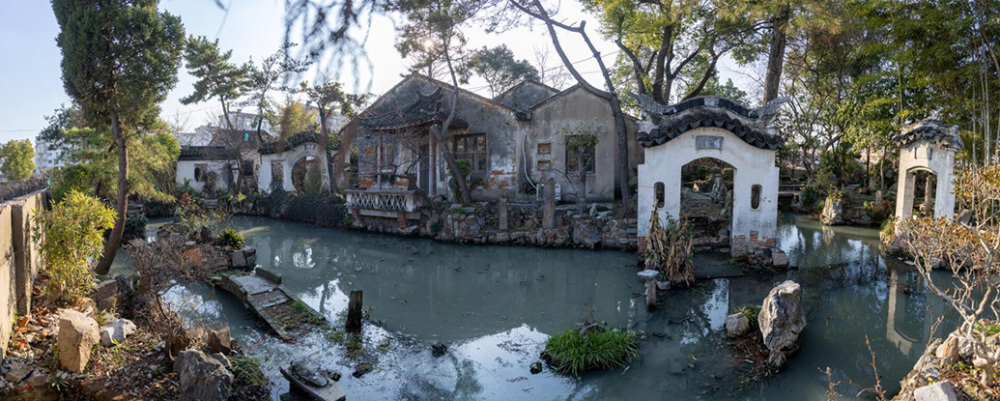
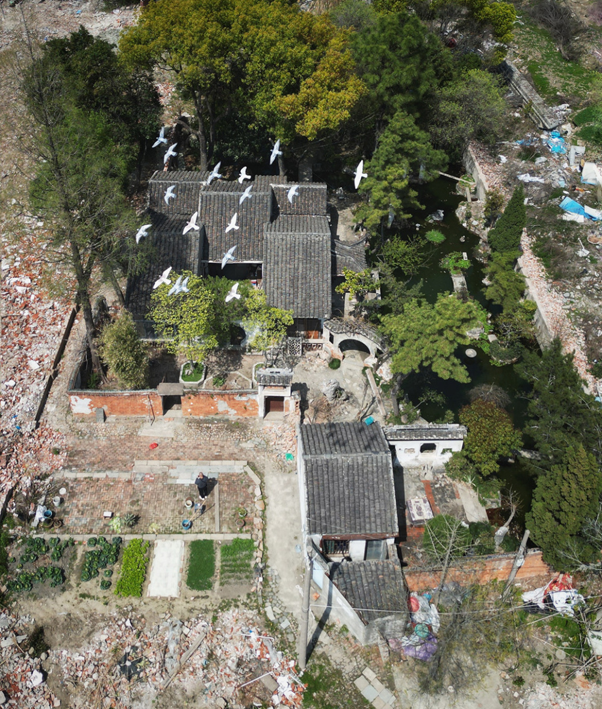
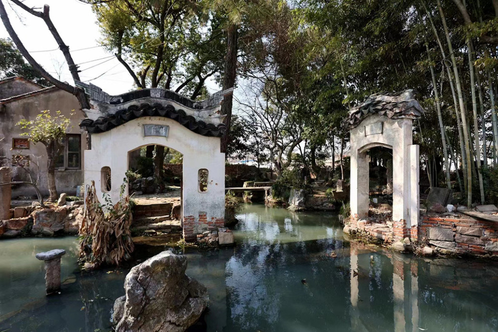
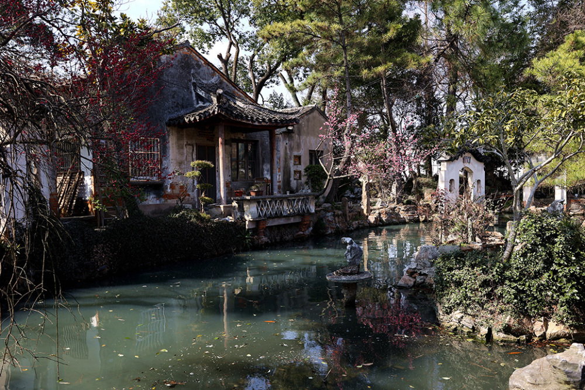

# 苏州影园是拆是留？业界呼吁保护，当地暂停拆除

影园位于苏州老城区附近，始建于1972年，是一位接受了最后一代传统私塾教育的老中医——彭昭亮设计、动工，历经四次改建而成的“私人江南园林”。彭老先生已于2020年去世，享年100岁，而光影斑驳的影园，留下了文人雅集的“寄情抒志”，成了“一人一生一园”的真实叙述，也平静地见证着四周“遍地起高楼”的现代化城市变迁。

这样的平静近期被打破，影园被列入当地拆迁清单。相比那些带有名人光环，抑或被精致呵护的苏州古典园林，影园有些粗糙，也算不上园林文化的翘楚，它在城市化进程中走向消失似乎不让人感到意外。影园所在街道规建科工作人员说，当地请专家实地考察过影园，认为就地保护价值不是很高，但出于对传统文化的尊重，可以进行异地重建，也得到了园子主人的认可。今年2月，彭家在拆迁协议上签了字，拆除影园程序合法合规。

尽管如此，当地不少文保人士认为，影园作为民间自建园林有其独特的价值，值得保留。

“园林的本质是个人营造的家园，正所谓‘一人一生一园’，融入了文人的生命志趣，如今苏州的大小园林中，几乎没有‘一人一生一园’的案例，所以影园对以园林闻名的苏州来说，有着独一无二的价值。”苏州当地一名建筑师王军（化名）向澎湃新闻（www.thepaper.cn）表示，影园若最终被拆除，还是比较可惜的。

对此，苏州当地（充分尊重并）积极回应了民间呼声，进行了慎重考量。4月13日，澎湃新闻从苏州官方获悉，对影园的拆除计划已暂停，具体拆还是不拆，上级部门将进一步研判和论证。

_影园一景
风帆 图_

**记者访园**

从城市化和商业化角度看，影园的地理位置极佳，这里紧挨苏州古城，距离繁忙的苏州火车站只有5公里。

就像是城市里的一座“孤岛”，影园被一群现代气息的摩登大厦围在中间，一起构建了极具震撼力的“冲突美学”。这里处处透露着现代繁华——绿色的围挡像伸出拥抱的双手围了几个圈，每一处的圆圈里都藏着“核心CBD”的规划发展梦想。附近不时传来轰鸣的机械施工声，工人们正在为苏州地铁8号线“陆幕老街站”赶工。

绿色围挡的拐角处，有一个临时开辟的小门，很不起眼，这是唯一通往影园的入口，就像是一个由现代转入古朴的“穿越门”。彭建东，影园建造者彭昭亮的儿子，最近经常在这个小门处等着慕名来看影园“最后一面”的访客们。

初见影园，第一眼并不算惊艳。斑驳的红砖外墙、90年代常见的用以防盗的玻璃碎片扎进墙头边沿，似乎就是乡村里最普通的宅院，很难和苏州园林扯上关系。不过，一推开门，影园就开始不动声色地“显山露水”。

古典园林大致包括山、水、石、亭台楼阁、林木花草、诗文楹联等要素，影园占了5样。占地830多平米的影园，有假山、水系、半亭、树木花草、诗文楹联。彭建东说，园子里仅30岁以上的大树就有40多棵，松、柏、竹、梅，文人墨客最喜的元素，影园里几乎都能找到。难得的是，这里的一草一木、一砖一瓦，都是园主彭昭亮手植、建造。

_影园航拍图
受访者供图_

**回溯造园**

彭昭亮是一名老中医，解放后在苏州陆慕卫生院工作。上世纪七十年代初期，为工作方便，他在陆慕觅地建园。“那会家家经济都不富裕，几乎没人会有造园的念头。”彭建东说，父亲却坚持用自己的半亩自留地与原主人换得了这块临水之地。

园子沿着程典浜水湾而建，收纳宽阔的河水为园景，因园子对岸种了一排垂柳，彭昭亮便将园子命名为“柳堤村舍”。建成后，彭昭亮好友、苏州画家王西野登门造访，发现园中处处皆有水中倒影风景，花影、树影、人影，因此建议以“影园”为名。1982年，知名书法家吴进贤以隶书题写“影园”两字，刻石镶嵌在门额上。

上世纪八十年代，彭昭亮的孙女出生，空间逐渐不够用。这时的乡村，有不少人家已改建两层甚至三层洋房。儿子彭建东打算建二层，被彭昭亮坚决阻止，最后只是在周边加盖了两间房，保留了园林风貌。园子里处处都藏着彭昭亮的小心思。比如，通向园子深处的地面上铺设的鹅卵石有多种造型，蝙蝠、葫芦、2枚交叉的铜钱，象征着“福禄双全”；园子里的门洞也多有造型，南边用于接诊的房间，门洞凿刻成上下窄中间宽的方形宝瓶形状，他希望来就诊的病人能够出入“保平安”。在枇杷树和假山中间，彭昭亮分别放了三块太湖石，造型喻比“蓬莱三岛”。有一次夜里下大雨，怕雨水混着泥沙把石头冲进水里，他连夜起来用自己的被子和毯子裹住了石头。“他对园子就像对孩子一样。”彭昭亮之女彭雪芳说。

岁月斑驳。2018年起，影园附近地块拆迁进入加速期，东侧的农贸市场、南北两侧的居民区、西侧的陆幕小学陆续拆除。周围的原始环境陆续解构，影园中的人也很难在“孤岛”中生活下去。随着周边拆迁的结束，以往的排水系统也不能正常使用，一到下雨天，周围的水直接倒灌进影园的宅子里，彭家人只能靠水泵排水。

多重不便因素之下，今年2月，彭建东签下了同意拆迁的文件。

_影园中的水门楼 受访者供图_

**探讨“留”园**

拟拆除前，彭建东想为家宅留个纪念。他托朋友联系摄影师江河（化名），想为影园留下点影像资料。

江河是苏州古城拍摄记录志愿者协会的成员，对历史文化建筑很感兴趣。第一次到影园，他就被这个园子吸引，“这竟然是一位老中医亲手造的园子，你好像能感受到园子与园主的生命连结”。当天他把拍摄的素材上传到社交平台，引起了不小的关注。此后闻名而来者众。

渐渐地，部分来访者感受到了影园的独特价值，比如资深文保爱好者田建新，对影园的文化印记感到印象深刻。“园林往往能反映出主人的学养内涵，寄托着主人的山水情怀，园主彭昭亮是最后一代接受传统私塾教育的人，与诸多苏州书画名家交游往来，多次在影园雅集，品茗、抚琴、弄墨、赏景，园中的碑刻、书画都在无形中还原了当年名士雅集的谈笑风生之景。”田建新说。

而在建筑师王军看来，影园不仅有价值，而且价值独特。从园林品类看，这本是一座郊野园林，广揽外景。随后经历了改革开放后的快速城市化进程，又逐步收缩为一座城市园林。“苏州历朝历代园林众多，但经历这种转型的园林，也许只有影园能见到。”

王军形容影园是一座低技建造的高水准园林，园虽陋小，但审美颇高，比如园中的3个坐落在水边的水门楼，既暗示了园林空间的分界，还借用门洞和花窗达到了一步一景的视线层次感，这在苏州的园林几乎见不到。此外，影园没有一味苛求传统造园法，多使用低成本的常见建筑材料，比如红砖做拱桥、水泥楼板做平桥、泥土做模具干燥后浇筑水泥花窗……王军认为，影园在精神上和空间上延续了传统文人园林的价值观和美学观，在建造工艺和材料上又回应了时代的特征。

王军认为，园林的本质是个人营造的家园，“一人一生一园”，这是历史上万千文人的生命志趣。如今苏州大小园林中，几乎没有“一人一生一园”的案例，影园对于以园林闻名的苏州来说，有着独一无二的价值。

“在造园传统失落的时代，没有这份痴情和灵巧是不可能造就此园的，它的意义不仅是一座传统园林，还代表着一种传统造园精神的延续。”王军向澎湃新闻表示。

造园是一种极具文化性的建构行为，江南地区现存的私家园林大多建造于明清时期，兴盛一时，到上世纪中后期，随着城市和生活的现代化，文人园林更是日渐远离了日常生活，逐渐落入窠臼。

_园中一景 田建新 图_

**园将何去？**

文保人士对影园价值的发现，以及“留下影园”的呼声，引起了苏州当地的高度重视。4月7日原是政府计划对影园主体进行最后拆除的日子，当天上午，拆迁被叫停。

影园所在的元和街道规建科工作人员表示，政府关注到了，也非常尊重文保人士的意见，关于影园的拆迁工作已暂停，未来拆还是不拆，还要等上级部门进一步研判。

此前有一个方案是，拆除+异地重建保护，政府部门也已经对影园进行了3D建模。不少文保爱好者和建筑学者建议，异地重建不如就地保护。

景观设计师溜溜认为，异地重建的园林，不管是追求“形似”还是“神似”，一定程度上都展现出精神性的缺失和空洞。影园传承了传统文人园林追求精神性的本质，同时作为“郊野园林”拓展了江南园林的多样性，园主人一家传承了“园林式”的生活方式，是社会变革期苏州人园林生活的“活样本”，记录了上世纪中后叶江南地区的城市和社会变迁史。“对影园的保护，不仅是对一个园林的保护，对园林精神和造园脉络的保护，更有对家宅集体记忆的保护。”

上海阮仪三城市遗产保护基金会秘书长丁枫认为，对历史建筑异地重建一般是实在没有选择才会采取的一种方式。“影园和周边水系等环境相连一体，用材都是上世纪七、八十年代特有的，时代特征是他的鲜明特色。”她建议，作为园林之城，苏州近年公布的园林名录里近一半是近20年内造起来的新园林，苏州更应重视和保护像影园这样的独特价值园林。

颇具文化价值但又缺乏“名人IP”光环，具有鲜明的平民化特征，值得保护，但似乎又没有“非保不可”的理由……影园的去留，让视历史文化为根基的苏州感到纠结。对于国内经济“最强地级市”，又是“园林之城”、“诗画江南”的苏州来说，如何做好城市发展和历史文化保护的“双面绣”，是一直在探索的重要课题。

