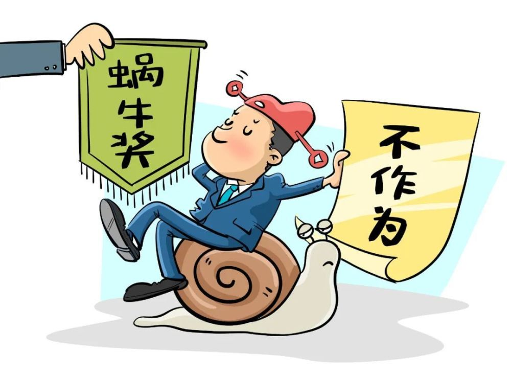
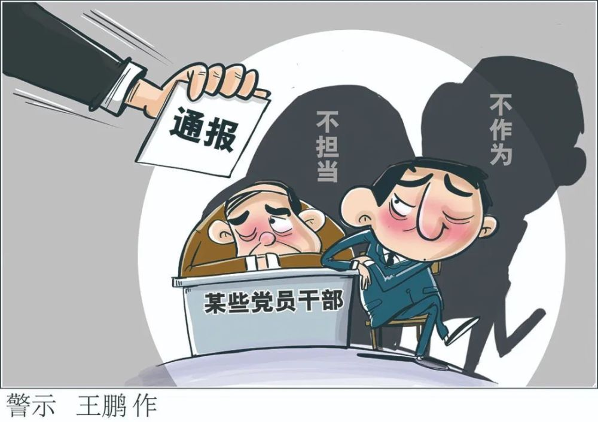

# 让“躺平式”干部“站起来、跑起来”

*本文为《半月谈》2023年第7期内容

时下，“不犯事也不干事”“不碰红线也不就高线”的干部在基层仍不鲜见，以往的干部考核和监督手段对其难以奏效。2022年以来，江苏、浙江、河南等地曾组织评定“躺平式”干部，推动干部队伍“站起来”“跑起来”。这招能否有效激发基层干部活力？

**评定“躺平式”干部，效果立竿见影**

“躺平现象会传染，机关里只要有一个人躺平，就会有两个、三个……”苏北某县教育局相关负责人说，一些干部平时不违纪违规，正常上下班，但是不愿开拓创新，更不愿承担急难险重的任务。

调研发现，基层干部可分为积极进取型、老实守摊型、消极懈怠型三种。整体而言，基层干部结构为两头少中间多的“橄榄型”。消极懈怠型干部虽是极少数，但影响干部整体干事创业氛围，还易成为单位矛盾激化的导火索。

针对此，一些地方探索治理“躺平式”干部。此前，江苏省滨海县、河南省南阳市、浙江省景宁县等地均组织过评定“躺平式”干部的活动。半月谈记者了解到，相关评定活动一般由组织部门或纪委监委开展，推出之初，成效明显。

滨海县曾采用群众推选、单位评议和组织评定相结合的方式来确定“躺平式”干部，县委组织部考察组会到各个单位发放无记名表格，列出在岗不在位、出工不出力，消极应付、得过且过等7种情形，干部、群众勾选符合这类情形的干部姓名，最终得票率30%以上的会被认定。

“在全市1000多个科室中选出150个重点科室，对科室干部公开进行群众评议，以评议结果决定奖惩，倒逼中层干部提能力、转作风。”南阳市纪委常委顾理说，南阳市通过明察暗访、视频曝光、群众评议、严格问责等手段，破解畏难畏险“不担当”、高高在上“官本位”、消极懈怠“慢作为”等突出问题。

浙江省临海市“作风建设年
项目攻坚年”领导小组办公室相关负责人表示，根据领导干部年度考核情况和“争先指数、担当指数、辛苦指数”考评结果，结合“躺平式”干部八种表现形式进行综合评议，根据排名情况确定“躺平式”干部建议名单。

半月谈记者追踪调研了解到，评定“躺平式”干部的举措一经推出，在当地干部队伍里引起不小震动。“被诫勉谈话的干部红脸出汗，还有干部当场哭着出去。”滨海县委组织部受访干部说，“躺平式”干部评定活动不仅能鞭策警醒当事人，还能对全县整体干部队伍带来警示效应。

**提供改正机会，也盼持久推进**

半月谈记者调查发现，组织相关评定的地区并没有将“躺平式”干部一棍子打死，仍提供改正奋起的机会。只要及时改正，完全可以摘掉帽子。浙江省景宁县规定，在完成整改后，干部可申请销号，并可通过努力逆袭成为“奋斗者”。

曾被认定为首批“躺平者”的某单位主要负责人事后表示，“躺平者”这个称号着实给了自己当头一棒，因此下定决心立行立改、奋起直追，跑起来谋项目、干项目，争取早日“摘旗”，甚至“移号”。

豫北一位乡镇党委书记说，评定“躺平式”干部的相关活动能起到立竿见影之效，推行地区能在短期内刹住不作为的干部作风，希望这类活动能持久开展下去。浙江省人民政府咨询委员会委员杨建华则认为，要注意防止相关评选活动滥用异化，避免造成干群关系、同事关系紧张等问题。另外，要防止评定简单化为只搞人际关系，尤其要防止劣币驱逐良币。

半月谈记者梳理发现，各地评定“躺平式”干部之初，震慑效果比较显著，但在后续推进过程中，舆论压力、人事调整、工作重点转移等因素常使评定活动面临较大困难。

2022年7月，滨海县对首次评选出的“躺平式”干部诫勉谈话后，引起舆论高度关注，此后未再继续开展评选活动。景宁县也因主要领导调整，目前只评了一期“躺平式”干部。

**把好用人导向，治标更要治本**

不少干部群众认为，不同于民营企业可采取降职减薪、末位淘汰等手段，公务员和事业编身份的人员只要不触碰红线底线，手里几乎等同于捧着“铁饭碗”。

河南省社会科学院政治与党建研究所副研究员刘刚建议，严格落实能上能下、能进能出的人事制度，破除“大锅饭”思维和“铁饭碗”现象，打破“干与不干一个样，干多干少一个样”的弊病，让自以为端上“铁饭碗”的“躺平式”干部无处容身。

西北大学公共管理学院教授翟绍果认为，一方面要切实贯彻能者上、庸者下的用人导向，让担当作为的基层干部有“奔头”，最大限度激发其活力；另一方面须减少繁文缛节为基层减负，建立合理且清晰的绩效目标，加大对基层干部的关怀力度，校准基层绩效工资水平，促进基层干部从内心深处想作为。

受访基层干部认为，当前基层事务多，追责问责压力大，也有一些干部抱有“多干多错、少干少错”的避责心态。同时，晋升机制不畅通，使一些基层干部个人价值难体现、工作心态常失衡、干事热情渐消磨。豫北一个约有80名工作人员的镇政府，正科级干部3至5人，副科级干部8至10人，副科级35岁是个坎，正科级45岁是个坎。为解决干部年龄结构偏大问题，基层倾向于任用年轻干部，超龄干部很难晋升。

在基层，最重要的激励手段仍是晋升提拔。破除基层躺平弊病首先要用好干部选拔指挥棒，优化晋升激励机制，把在一线踏实奋斗的干部识别出来、提拔上来、重用起来；干部结构优化要警惕唯年龄论、唯学历论等“一刀切”现象。基层干部成长有客观规律，不能一味追求年轻化，应注意老中青搭配。

半月谈记者：郑生竹 韩朝阳 唐弢 / 编辑：徐宁

原标题：《这招能否激发基层干部活力》

责编：秦黛新 / 校对：郭艳慧

