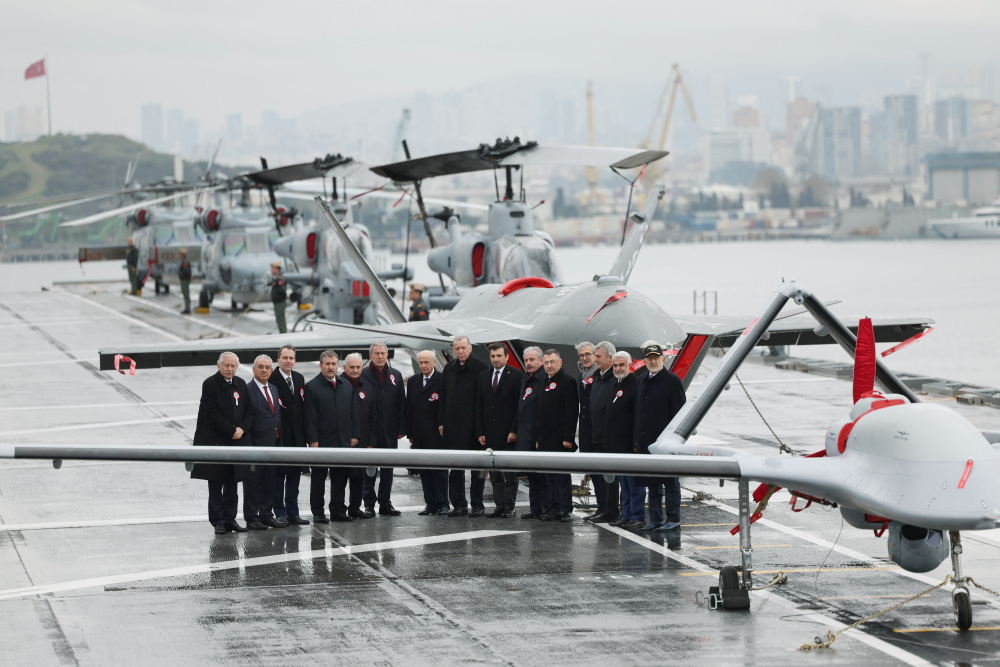

# 首艘无人机航母现身土耳其，亚太成航母赛场

_2023年4月10日，在土耳其伊斯坦布尔，土耳其总统埃尔多安（中）出席“阿纳多卢”号轻型航母服役仪式。（新华社/路透/图）_

2023年4月10日，世界第一艘无人机航母“阿纳多卢”号（TCG
Anadolu）正式服役。让人意想不到的是，全球第一个实现列装“无人机航母”的国家，并非世界头号军事强国美国，而是土耳其。

综合多家外媒报道，“阿纳多卢”号在土耳其伊斯坦布尔的塞德夫（Sedef）造船厂打造，长231米、宽32米。除了无人机外，还能搭载直升机。而舰上的武器、战斗管理、红外线搜索和追踪、光电搜索、雷射警告和鱼雷防御系统，以及雷达等，都是当地开发研制的。

土耳其总统埃尔多安称，耗时7年打造而成的“阿纳多卢”号，对土耳其国防工业来说，无疑是个转折点。

近年来，在美国航母亚太海域活动趋于频繁等因素影响下，亚太国家建造航母的热情也愈发高涨，专家预测，“无人机航母”的建设，具有独特的吸引力，下一个建造航母的国家可能将是韩国。

亚太国家的航母赛场

当今世界装备航母的国家相当有限，只有9个，共计装备航母23艘。其中亚太地区已有4国拥有航母，多艘航母正在建造中，很明显成为航母扎堆的新赛场。从时间上来讲，亚洲在二战以后装备航母的国家依次是印度、泰国、中国和日本，也许未来还有韩国。

先说印度。印度是二战后亚洲第一个装备航母的国家，可以说在亚洲国家中，印度使用航母的经验最为丰富，并且是唯一一个在二战以后将航母用于实战的亚洲国家。

作为一支继承了大英帝国地缘政治思想传统的海上力量，印度海军向来注重制海权的夺取。印度海军战略已经从近海防御和区域威慑转向远洋进攻，通过重点发展战略核潜艇和航空母舰来建立可靠的海基核威慑能力，在控制整个印度洋的基础上，逐步将印度的战略利益延伸至西起波斯湾、东至中国南海、南抵非洲的广大海域。

印度在航母的购买与建造方面投入了大量资源。该国曾经计划到2020年之前有一支至少由三艘航母组成的航母战斗群，包括“维克拉马迪特亚”号与另外两艘印度自主制造的航母。“维克兰特”号原计划2017年加入舰队服役，尽管这是一艘排水量为4万吨的中型航母，但是也足以扩大印度在印度洋区域的投射能力，同时也标志着印度成为世界上第四个拥有自主建造航母能力的国家。

而另外一艘自主建造的航母将会有更大的排水量（6.4万吨），一旦印度实现其三艘航母的计划，那么就可以保证至少有两艘航母正在服役，即可控制印度洋上的两片关键水域——孟加拉湾和阿拉伯海，从而控制印度洋。然而，由于印度航母建造计划非常不顺利，导致这个三航母计划仍然停留在纸面上。

再说泰国。20世纪80年代，泰国感觉到自身海洋安全受到威胁，最终向西班牙购买了阿里图里亚斯亲王级轻型航母。该航母的排水量只有11485吨，可以搭载9架战斗机和14架直升机，具备一定的制海能力。虽然其排水量在世界各国装备的航母中敬陪末席，但却是血统纯正的航母——舰载机、机库、飞行甲板以及升降机等一应俱全。然而，由于种种原因，该航母未能发挥应有作用，现在已经沦为运输舰，甚至是“皇家游艇”。

亚洲在战后第三个装备航母的国家是中国。虽然装备时间晚，但是起点高——海军第一艘航母“辽宁”号就是重型航母，中国海军的第三艘航母“福建”舰（尚未入列）是一艘排水量位列世界各国常规动力航母之首的“超级航母”。

第四个国家是日本。实际上，日本曾经是世界上第一个装备专用航母的国家（“翔凤”号），但众所周知，日本曾装备过的航母现在都在海底，因此二战以后日本成为第四个装备航母的亚洲国家。2021年10月3日，美国海军陆战队的F-35在日本直升机护卫舰“出云”号上完成起降测试，这标志着日本将迎来二战战败后的首艘航母。

可以说，“出云”号从设计之初，就是为了以后搭载F-35而设计的，日本共同社刊文称，“出云”级可携带18架F-35B战机。除此之外，2015年“加贺号”下水。目前，该舰正在改装，改装的目标不言而喻——航空母舰。

据多家媒体报道，土耳其“阿纳多卢”号于2016年开工建造，2019年下水，2022年试航，2023年1月交付海军。埃尔多安说，土耳其生产的“旗手”TB3型无人机、“红苹果”隐形无人机和“自由”轻型战斗机均可在“阿纳多卢”号上起降。

“阿纳多卢”号还可作为两栖攻击舰使用，最多可搭载94辆作战车辆，包括13辆坦克。

“阿纳多卢”号原本是为搭载美国制造的F-35战机量身定制，但由于土耳其先前坚持从俄罗斯购买S-400防空导弹系统，引发美国和北约强烈不满，美方把土方踢出F-35战机合作生产项目，并拒绝向土方出售这种隐形战机。土方后来调整思路，把“阿纳多卢”号改造成无人机航母。

土方的思路调整，也为其它国家建造和改造航母提供了借鉴，韩国迟早也会加入“航母俱乐部”。

韩国KBS电视台2022年10月27日透露，韩国正在全力打造轻型航母项目，预计在2024年掌握用于轻型航母的9项核心技术。

英国“海军新闻”网站称，根据韩国前总统文在寅在执政最后一年发布的“国防中期计划”，韩国将在2033年之前获得一艘3万吨级航母。作为该国代号CVX的未来航母计划的核心，该舰耗资约2.6万亿韩元。韩国是世界排名第二的造船大国，造出航母也就是个时间问题。

航母缘何扎堆亚太

航母在亚太地区集聚，具体来说，有以下几方面的因素。

一是航母本身的战略价值越来越高。航母在夺取制海权和使用制海权方面作用巨大，传统制海权的争夺，一种模式是大舰制海，如驱逐舰、巡洋舰、航空母舰战斗群以其强大的海空作战能力控制一定的海域；另一种模式是所谓潜艇制海，即战时利用潜艇的隐蔽作战能力控制某一海域。

作为海上作战平台的航母，既是信息协调的中心和关键节点，又是舰载战斗机的起降平台，在夺取制海权的战斗中发挥着关键作用。

二是亚太各国总体工业水平迅速发展。海军是一个高度依赖工业体系的战略军种。航空母舰作为现代军舰中最庞大，也是最精巧复杂的舰种，对工业能力的要求更高。近年来，中韩等国在工业领域的巨大进步使制造航母变得不再遥不可及。

三是亚太地区海权矛盾不断激化。亚太地区作为全球地缘政治热点地区，各种势力的碰撞与摩擦显得尤为频繁和激烈。在该地区，较为突出的海权矛盾有俄日南千岛群岛争端、韩日独岛（竹岛）争端、中日钓鱼岛争端等历史遗留问题，更有印度因“东进政策”引发与中国的南海海权矛盾这类新兴问题。

航空母舰是制海能力最强的舰种，1艘航空母舰上的舰载机即可控制800km×1000km的海空域，4支航母编队就能控制96.5万平方公里的大面积海域，除夺取制海权和制空权外，还可以夺取制电磁权和制陆权，其效能是任何武器都不能比拟的。因此在海权矛盾不断激化的前提下，亚太各国扎堆航母赛道便不足为奇。

需要特别指出的是，以美国为首的域外国家恶化了亚太地区的海洋安全形势。美国通过“印太战略”等地缘政治战略使该地区局势紧张，并通过拉拢相关国家的方式降低其海洋霸权护持成本，相关国家为了维护海洋权益，不得不加强海军建设，这也是亚太国家扎堆航母赛道的重要原因。

较量将愈加激烈

展望未来，亚太国家的航母竞赛带来几个方面的影响。首先是各国海军对于制海权的争夺将会更加激烈。如前所述，航空母舰是制海能力最强的舰种。夺取制海权能够确保己方兵力的海上行动自由，保障己方海上交通运输和沿海安全，同时剥夺敌方的海上行动自由，破坏敌方的海上交通运输和沿海安全，在和平年代围绕夺取制海权所进行的预置行动也是非常重要的。而航母扎堆亚太赛场，意味着各国在装备这种艨艟巨舰之后，上述预置行动的较量将会越来越激烈。换言之，亚太地区的制海权争夺会有增无减。

其次是美国的F-35C舰载机将会更多在亚太地区出现。亚太国家扎堆航母赛道带来的一个尴尬困境是航母造出来不容易，舰载机更难搞定，这就为美国向这些国家倾销F-35C舰载机提供了大量机会。

F-35C是世界上最大的单发单座舰载战斗机和世界上仅有的一种已服役的舰载第五代战斗机，其隐身能力、战场态势感知能力、垂直起降能力和电子战能力堪称出色，这些能力加上超前的设计理念使其成为当今世界最优秀的舰载机。为了平摊高昂的研发费用，更为了美国的“大国竞争”计划，F-35C将会更多地出现在亚洲的天空。

最后是亚太地区的海上摩擦可能性会增加。航母的入列意味着一国海军远洋作战能力的提高。为了维持战斗力，航母编队必须进行远洋训练与演习。尽管亚太地区的海域面积宽广，但是航母编队数量的增加使其变得更加拥挤却是不争的事实。随着这些航母编队的增加，各国海军在海上相遇的机会增加，难免会发生一些不愉快事件——中国航母“辽宁”舰就曾受到过他国军舰的恶意骚扰与挑衅。可以想见，随着航母数量的增加，类似事件会呈现增长态势。

（作者系上海政法学院东北亚研究中心副主任）

南方防务智库特约研究员 杨震

