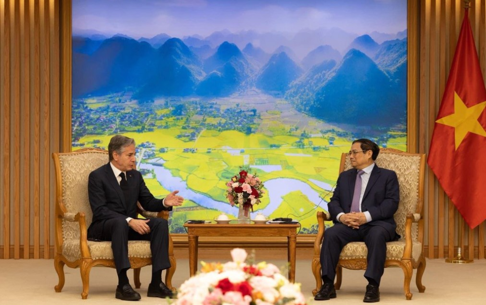
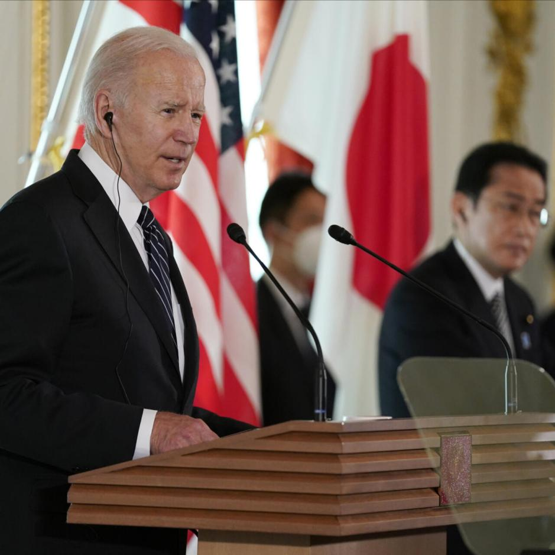

# G7外长会议开幕，又是指向中国？

据日本广播协会（NHK）16日报道，七国集团外长会议于当天在日本长野县轻井泽开幕，为期3天。此次会议内容与将在5月召开的七国集团峰会密切相关。

日本外务省早在11日就发布了此次七国集团（G7）外长会议的主要日程。三天时间将举行6场会议，并有边进餐边讨论的机会。直新闻注意到，此次G7外长会议的主要议题除了外界普遍关注的俄乌议题、核不扩散、粮食安全及气候变化等全球性议题外，中国也分摊了此次会议的较大“火力”。

彭博社称，一名美国国务院高级官员会前对该媒体称，由于日本担任今年的G7轮值主席国，因此位于亚洲的“地缘政治挑战”将受到更大关注。彭博社还提到，此次G7外长会召开之际，有两个背景值得关注：一是欧洲对华政策想法的分歧，二是美国五角大楼“泄密门”的曝光。

美联手G7对抗中国 但响应者寥寥？

近期，美国再次老调重弹，搞所谓抵制中国“俱乐部”，敦促盟友一致应对所谓“中国经济胁迫”和“军事威胁”，作为轮值主席国的日本积极响应，但欧洲方面则回应者寥寥。上周，法国总统马克龙成功访华，在返回法国的专机上，他表示欧洲必须加强战略自主性，顶住成为“美国追随者”的压力。马克龙的相关表态获得许多欧洲主流媒体积极评价。

据《日本经济新闻》4月2日透露，美国已向七国集团（G7）提议，如果中国对同盟国家和地区采取“经济胁迫行为”，他们将采取联手对抗措施。该报道还称，“如果各国能针对中国进行协调合作，中国就不容易采取胁迫性行动。”

4月2日，同时也是日本“知华派”外相林芳正式结束访华的时间。日本《朝日新闻》发表社论称，在林芳正访华前一天，日本政府宣布对先进半导体制造设备进行出口管制。《朝日新闻》认为，日本政府的目的显然是为了配合美国组建“对华包围网”。然而，该媒体评论称，中国是日本的邻国，与日本有着密切的历史联系，也是日本最大的贸易伙伴，有必要努力展开积极的“近邻外交”，以确保美中对立不会对全球稳定和经济发展产生消极影响。

实际上，关于G7峰会“联手对抗中国经济胁迫”的提议已早有预谋。今年1月共同社报道称，日本经济产业大臣西村康稔在华盛顿的一次演说中表示，针对中国“经济威压”的对策应该在5月由日本担任东道主的G7峰会上进行审议。他在演讲中说，“基于国际协调的集体应对措施将是有效的”。

不过，4月15日刚结束访华的德国外长贝尔伯克就曾表示，德中具有许多共同利益，德方愿同中方加强互动交流，增进相互了解，扩大经贸、旅游、人文等领域合作，共同维护世界贸易畅通，推动德中关系不断发展。

同时，贝尔伯克对法国总统马克龙此前关于欧盟与中国关系的言论表示支持，称欧盟与马克龙保持同一立场。

《日本经济新闻》也对此报道称，在“联手对抗中国经济胁迫”问题上，G7在规则制定方面仍然存在难题。特别是德国等国家与中国有着深厚的经济联系，如果它们与美国一起参与联合反制中国的举措，中国的反击是不可避免的。

访华失败的布林肯 绕着中国转了一圈

值得注意的是，在G7外长会开幕之际，美国国务卿布林肯还绕着中国转了一圈：11日与菲律宾讨论两国“回暖的军事关系”；15日前往河内探讨所谓“印太愿景”并寻求升级美越关系；紧接着16日就转往日本长野参加G7外长会议，讨论俄乌冲突和“印太”地区等一些“紧迫的安全问题”。

《南华早报》11日的报道一开头就点出华盛顿的真实意图，即通过强化与越南的关系进一步推动产业链供应链层面的对华“脱钩”，同时在地缘政治层面强拉河内共同“抗华”。

路透社援引多名分析人士的话说，越南对将美越关系提升至更高一级的“战略伙伴关系”态度谨慎。越南国内研究人员对《南华早报》说，河内虽然可能加强与美国的安全合作，但绝不会被美国拉入对抗中国的轨道。

对于中方会否重新安排美国国务卿布林肯访华一事，外交部发言人汪文斌在12日的外交部例行记者会上表明，“美方应停止干涉中国内政，停止损害中国利益，停止一边声称要为中美关系加装护栏，一边破坏两国关系的政治基础，同中方相向而行，推动中美关系重回健康稳定发展正轨。”

而英国《金融时报》4月15日则引述四名对中美谈判知情者报道，中国不会重新安排布林肯的访问计划。事实上，中国从未宣布过安排布林肯访华，自然也不存在重新安排的情况。

日本玩起废核与拥核“两面派”

据直新闻观察，此次G7外长会的重要议题还包含核裁军及核不扩散等议题。但讽刺的是，日本对于“拥核”的讨论近两年一直在政坛蔓延。日本前首相安倍晋三就曾表示，考虑到俄乌冲突的危险性，亚太地区的安全也难以保障，日本应该考虑“核共享”的政策，参考“北约模式”，允许美国在本土部署并拥有核武器。此前，日本政府对此不置可否，但以自民党为代表的右翼保守势力以及军国主义余孽，纷纷鼓噪起来，探讨“拥核”的可能性。

去年5月，在拜登访日期间，日首相岸田文雄表示，日本将大幅增加防卫费，从根本上强化本土防卫，并建立一定的“反击能力”。拜登则表示，美方承诺“将全面参与日本防卫”，双方将就“核保护伞”在内的“延伸威慑”保持密切沟通。

经过日美首脑会晤的鼓动，日本有关的“涉核”言论也达到了一个高峰，这种危险的气氛逐渐由政坛蔓延至民间。据日本富士新闻网此前公布的一项民调显示，近83%的日本人同意就联合使用核武器以及在日本部署美国核武器进行辩论。

作者丨李长春，深圳卫视直新闻记者

编辑丨曾子瑾，深圳卫视直新闻主编

