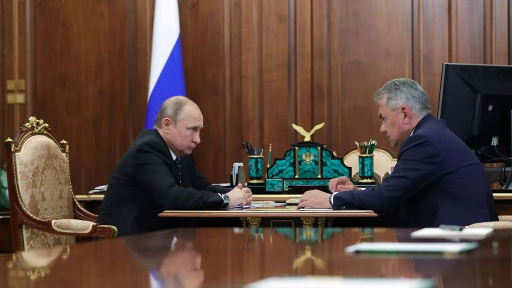
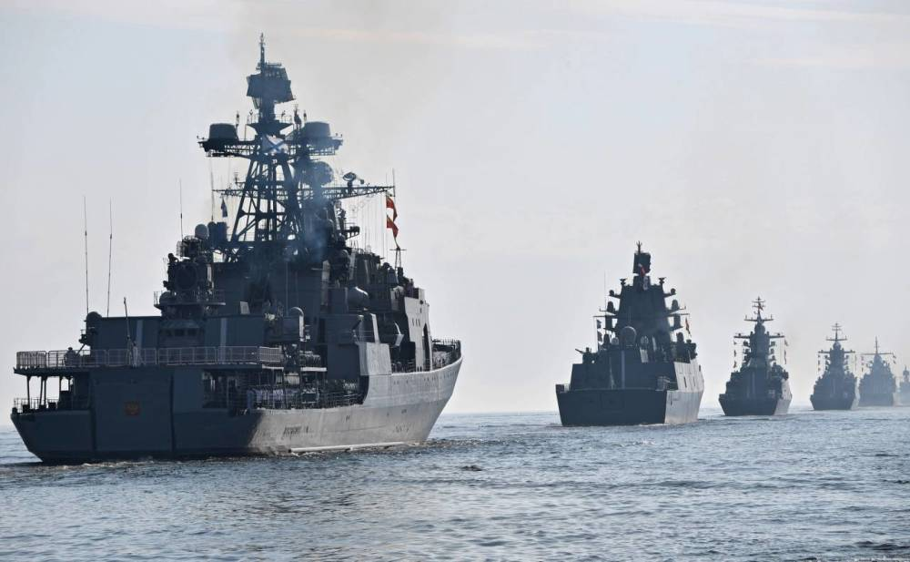

# 俄军太平洋舰队接受突击战备检查，克宫：这段时间会不平静

【文/观察者网 周弋博】

当地时间4月14日，俄罗斯太平洋舰队开始接受突击战备检查。据俄新社报道，共有超过2.5万名军人，包括12艘潜艇在内的167艘舰艇，89架飞机和直升机参加了本次检查。

综合俄新社、俄罗斯卫星通讯社消息，4月17日，俄罗斯总统普京与俄罗斯国防部长绍伊古举行会议。普京在会议中强调，俄罗斯海军舰队的力量“可以在任何方面的冲突中发挥作用”。

同日，俄罗斯总统新闻秘书德米特里·佩斯科夫在评论对普京关于俄罗斯舰队完全备战必要性的意见时表示，这段时间会不平静， 存在发生地区冲突的威胁。

_4月17日，俄罗斯总统普京（左）与俄罗斯国防部长绍伊古举行会议
图源：Sputnik_

根据普京发布的决定，4月14日，俄太平洋舰队开始接受突击战备检查，全体人员紧急响应并进入最高级别战备状态。

俄罗斯武装力量总参谋长格拉西莫夫介绍，太平洋舰队的突击战备检查将分三个阶段进行：在第一阶段，舰队将进入全面战斗准备状态，第二阶段将完成部队从常驻基地到作战训练区域的部署和展开，第三阶段将执行作战训练任务。

4月17日，绍伊古在克里姆林宫向普京汇报了对俄罗斯太平洋舰队突击检查的情况。

“按照您的决定，对太平洋舰队的突击检查从4月14日启动。动用超过2.5万名军人、包括12艘潜艇在内的167艘军舰与保障船、89架飞机与直升机。”绍伊古在与普京会面时称，受检部队进入了“完全战备状态”，在设置的限制条件下，军人们完成各种训练和战斗任务，开展受控射击和战术演练，处理兵种协作的相关问题。

普京则对绍伊古表示：“（突击检查）第一阶段确实过关了，（检查）突然开展，水平很高。我想向组织这项工作的所有人表达感谢。”绍伊古回答称：“非常感谢，我会转告。”

据绍伊古介绍，对太平洋舰队的突击检查已经进入第二阶段，即将舰队转移至鄂霍次克海南部机动作战并“查看水下情况”，期间还将检查战略导弹潜艇的战斗稳定性和开火准备情况。

报道称，这场突击战备检查将于4月18日进入第三阶段，届时俄军舰将和沿海导弹部队联合完成导弹电子发射。根据相关计划，多艘俄军战略导弹艇将前往太平洋中部，对假想敌军舰群开展模拟打击。

_俄罗斯海军太平洋舰队 资料图_

在17日的会议中，普京指出，俄罗斯在“在使用武装力量方面有明确的优先事项”。

“首先，这关系到乌克兰的方面，以及与保护我们在顿巴斯和其他新领土上的人民有关。但是发展舰队的任务，包括在太平洋战区的任务，并没有被取消或取消。”

“因此，我要求你（绍伊古）接受这项工作。当然，也要注意为其它舰队这种活动（突击战备检查）的发展和准备工作。”普京强调，俄罗斯海军舰队的力量“可以在任何方面的冲突中发挥作用”。

据俄罗斯卫星通讯社报道，同日，佩斯科夫在评论对普京关于俄罗斯舰队完全备战必要性的意见时表示，这段时间会不平静，存在发生地区冲突的威胁。

“我们周围的许多地方非常不平静，充满了冲突局势和地区冲突。我们都非常清楚这些地区冲突的地理位置，这就是问题的所在。”佩斯科夫说道。

**本文系观察者网独家稿件，未经授权，不得转载。**

