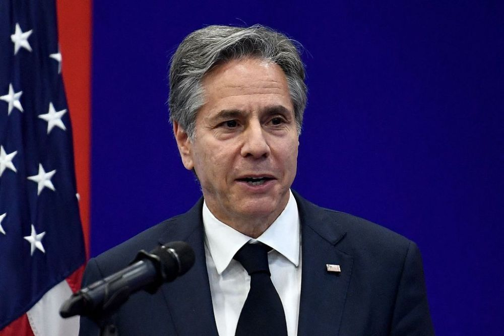

# 布林肯拉拢越南“对抗中国”，我使馆：挑拨离间注定失败

【环球时报报道记者丁雅栀】美国国务卿布林肯4月15日在河内与越共中央总书记阮富仲、越南总理范明政会谈，讨论双边关系升级等议题。据路透社报道，布林肯对越南展开访问的背景是美国“寻求巩固同盟关系以对抗中国”。

当地时间2023年4月15日，美国国务卿布林肯访问越南，在美大使馆出席新闻发布会。（视觉中国）

这是布林肯作为美国最高级别外交官对越南的首次访问。路透社报道称，在越南河内举行的新闻发布会上，布林肯表示，希望在“未来几周或者几个月内”提升两国的外交关系水平。目前尚不清楚美越双方何时会就正式关系的升级达成一致。虽然范明政15日告诉布林肯，越南政府正在制定深化双边关系的计划，但他没有具体提到是否会正式升级双方关系。路透社援引总部位于华盛顿的战略与国际研究中心高级助理穆雷·希伯特的话表示，两国可能会深化军事合作，包括讨论加强美国对越南的武器供应和军事合作。

路透社称，布林肯此次访问的目的是拉拢东南亚国家“抗衡中国”。但对东南亚国家而言，中国是重要的贸易伙伴和投资来源地，他们并不想加入与中国“对抗”的行列。分析人士对美越关系的提升也持谨慎态度。美国智库兰德公司的防务分析师德里克·格罗斯曼认为：“一方面，从越南的角度来看，没有必要站到中国的对立面……另一方面，河内不希望公开成为美国对抗中国‘印太战略’的一部分。”

郑州大学越南研究所所长于向东告诉《环球时报》记者，越南的首要考量是国家利益，注重构建利益基础上的多边与双边关系。近段时间以来，越南打造“竹式外交”格局，随风摇曳而又不完全倒向一边。去年10月阮富仲访华，近日接待布林肯，种种行为都是越南“竹式外交”的表现。在开展双边与多边外交工作中，越南希望进一步推动与美国在战略上的对接，但同时，越南也必须考虑自身长远、根本的国家利益和政治安全稳定，使美越关系维持在主权安全范围之内。于向东认为，越南短时期内不会走向与美国的实质性结盟，但其与美国的安全合作关系会继续升温。

《南华早报》称，尽管美国呼吁将两国关系正式升级为安全伙伴关系，但拜登政府和特朗普政府的努力在越南反响平平。“外交学者”网站在报道中说，美国目前仅被越南列为“第三级外交伙伴”，而中国、俄罗斯、印度和韩国是越南的“第一级外交伙伴”。尽管中国和越南在南海问题上的主张不同，但两国有着长期的政治关系。同时，越南与美国的追求并不相同：越南希望与美国合作增强战略自主、拉动经济增长，维护共产党的执政地位，而美国只是希望借越南遏制中国。

在访问越南期间，布林肯声称美国愿意帮助地区国家提高海域态势感知能力，应对其他国家对本国渔船的所谓“胁迫”行为。对此，中国驻越南大使馆16日回应称，在中国和东盟有关国家的共同努力下，当前南海局势保持稳定。中国和东盟各国积极落实《南海各方行为宣言》，同意加快推进“南海行为准则”磋商，积极致力于通过“双轨”思路妥善处理南海问题。地区国家的共同心愿是将南海建设成为和平、友好、合作之海。有关域外国家基于冷战思维和维霸本质，利用一切机会在地区搬弄是非、挑拨离间不得人心，注定以失败告终。

