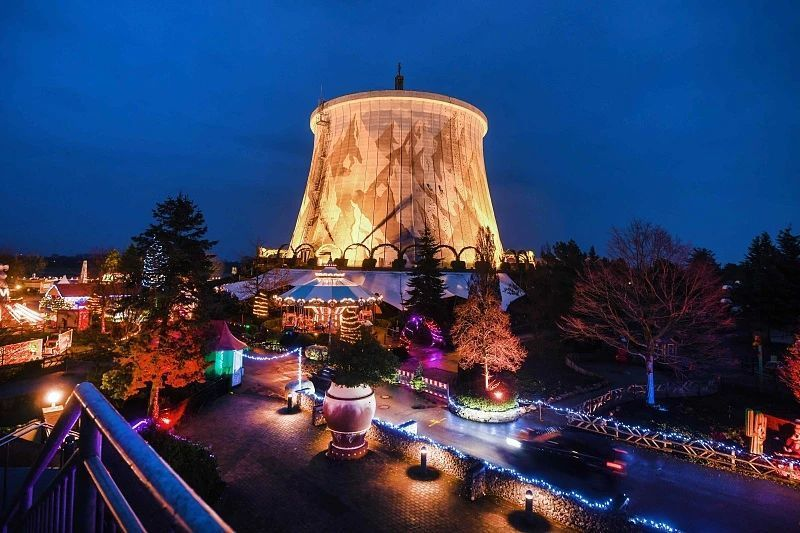
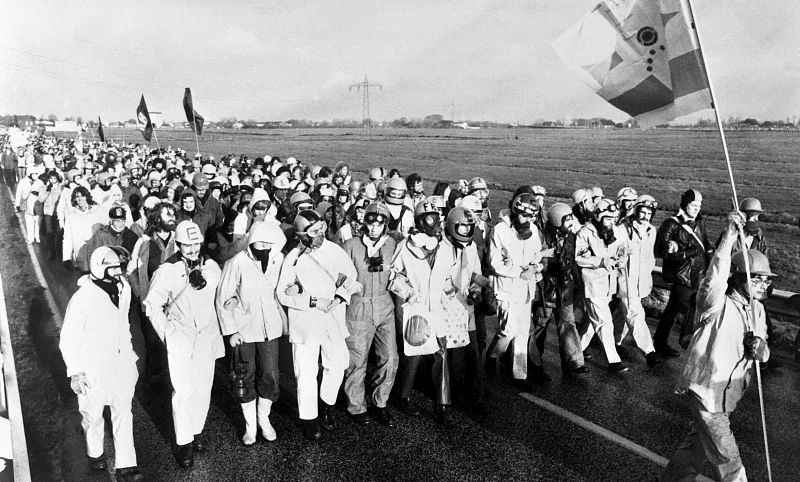
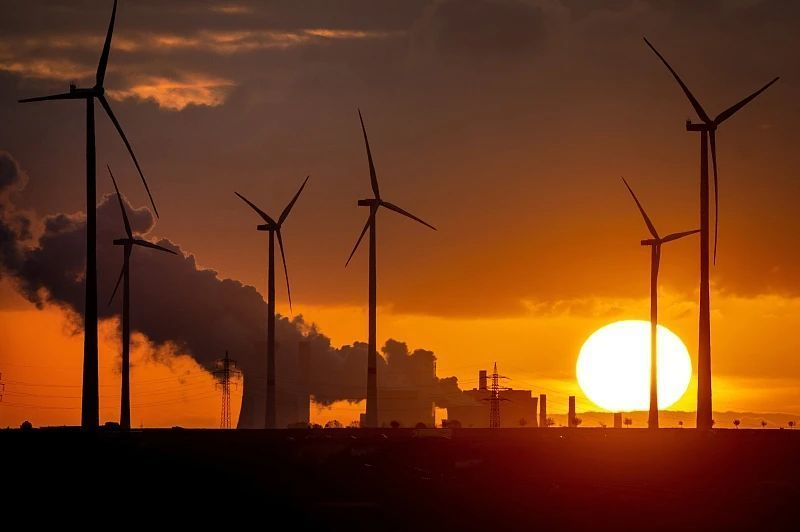

# 德国最后三座核电站关停，长达60多年的“核时代”结束

据德国之声报道，当地时间4月15日，德国最后的三座核电站——伊萨尔2号、内卡韦斯特海姆和埃姆斯兰停止运行，宣告德国长达60多年的“核时代”结束。

德国的反核运动几乎伴随着该国核能发展的整个过程，德国支持淘汰核能的人士认为，核能有风险，不如将资金投入可再生能源发展。不过，在当前能源紧张的局面下，德国关闭核电站可能带来能源缺口，进一步抬高电价。

**“是时候结束核时代了”**

就在关闭最后三座核电站的前一天，德国环境部长莱姆克在德国《每日镜报》撰文称，无论是切尔诺贝利那样由人为因素导致的核事故，还是像福岛核事故那样由自然灾害导致的核事故，灾难性核事故发生的可能性永远无法被完全排除，故而德国决定关闭最后三座核电站。

莱姆克表示，德国不需要核能；可再生能源更安全、更可持续、更有利于气候，也更加经济。与其投入大量资金让三座陈旧的核电站继续运转，不如将资金投向可再生能源。

_当地时间2020年12月11日，德国卡尔卡，核电站遗址改造的景点。图/视觉中国_

“现在是时候结束核时代，进入可再生能源时代了。”德国可再生能源联合会主席西蒙·彼得对此表示，最后三座核电站的关闭尽管姗姗来迟，仍具有划时代意义。

德国此前计划在2022年12月关闭最后三座核电站，不过，由于俄乌冲突爆发、能源紧张等因素，德国将关闭日期推迟至今年4月15日。

这三座核电站的发电量约占德国电力消耗的6%，德国计划使用可再生能源填补这部分能源空缺。但鉴于新的可再生能源项目投入使用尚需时间，德国也将暂时使用天然气和煤炭等化石能源填补空缺。

据德国联邦统计局数据，2022年，德国约44%的电力来自于可再生能源。德国副总理兼经济和气候保护部部长哈贝克表示，到2030年，德国80%的电力将来自可再生能源。德国还承诺最迟在2038年关闭其最后一座燃煤电厂，在2045年之前实现碳中和。

**顶峰时德国拥有17座核电站**

4月15日，在德国柏林，反核活动人士在勃兰登堡门附近集会，庆祝数十年的反核运动终于迎来胜利。

1960年，联邦德国修建卡尔实验核电站，并于次年投入使用，标志着德国核电事业的开端。

进入20世纪90年代，德国核电发展到达顶峰。统一后的德国拥有17座核电站，全国近三分之一的电力来自核电。

反核运动几乎伴随着德国核电发展的全过程。20世纪70年代，由于担心核能存在风险等原因，德国出现了声势浩大的反核运动。德国目前的“红绿灯”执政联盟中的“绿”（绿党）就诞生于反核运动。

_当地时间1977年4月1日，联邦德国抗议者在布罗克多夫核电站的建筑工地附近游行。图/视觉中国_

随后，1979年美国宾夕法尼亚州三里岛核电站泄漏事故和1986年切尔诺贝利核灾难进一步推动了德国反核运动的壮大。

2000年，当时德国社民党和绿党组成联合政府与电力行业达成“核共识”，禁止新建核电站，并将核电站的使用寿命限制在32年，开启了逐步淘汰核电的进程。

物理学家出身的德国前总理默克尔和她领导的基民盟起初支持发展核能。2009年，基民盟/基社盟和自由民主党组成联合政府，宣布延长德国核电站的使用年限。

2011年，日本遭遇9.0级地震和海啸，福岛核电站受损并发生泄漏。默克尔发表演讲称，这场难以想象的灾难是一个转折点。她宣布，德国将加速淘汰核能。

**多数民众反对关闭核电站，担心抬高电价**

4月15日，在柏林的反核活动人士庆祝集会的不远处，另一群示威者则在游行反对关闭德国最后三座核电站。

上周发布的“德国趋势”民调显示，在关闭最后三座核电站这件事上，59%的受访者表示反对关闭，只有34%的受访者表示赞成。人们担心关闭核电站可能进一步推高电价。

美国有线电视新闻网（CNN）对此评论称，德国人希望淘汰核能，但现在似乎时机不对。

近日，德国巴伐利亚州州长马库斯·索德尔赶在关闭前参观了伊萨尔2号核电站。他表示，关闭核电站是“一个绝对错误的决定”。“当下我们需要利用一切可能的能源。否则，我们就会面临更高的电价和企业搬迁的风险。”他说。

_当地时间2022年11月2日，德国尼德劳森，风力发电机和远处的燃煤发电厂。图/视觉中国_

巴伐利亚州是德国的工业重镇，能源价格高企让该州面临企业外迁的风险。索德尔称希望在向可再生能源过渡的过程中继续使用核能发电。

部分绿党的支持者和气候活动人士也倾向于暂时保留部分核电站。一份研究报告指出，在过去一年里，德国的碳排放量有所增加，原因是德国为了应对能源危机大量进口液化天然气并增加了煤炭的消耗量。

据CNN报道，德国一些支持使用核能的人士称，核能是一种相对低碳的能源，在气候变化影响加剧的当下，关闭核电站的做法并不明智。

美国加州大学圣巴巴拉分校气候与能源政策教授利亚·斯托克斯对CNN表示，德国关闭核电站可能的风险是化石燃料会填补核能留下的能源缺口。去年6月刊发在欧洲经济协会杂志的一篇研究文章指出，自默克尔在2011年宣布加速淘汰核能以来，德国削减核能产生的能源缺口主要被煤炭填补。

德国财政部长、德国自由民主党党主席克里斯蒂安·林德纳也在三座核电站关闭前的最后时刻呼吁保留部分核电，但未得到采纳。分析人士称，由于德国许多淘汰核能的承诺已经变成了法律法规，且投资方向已经转变，短期内重启核电的可能性很小。

接下来，德国面临的问题是如何处置核电站留下来的放射性核废料。目前，核废料被保存在核电站的临时仓库中。

德国研究人员试图寻找一个可以让核废料安全储存一百万年的地点。这样的地点须在地下数百米，且地质结构稳定，没有地震或出现地下河的风险，还需要有特殊的岩层。

据德国联邦放射性废物处理公司估计，核废料储存地点的最终选址要到2046年至2064年之间才能选定。之后，还需要几十年的时间来建造储存库、填入核废料并进行密封。

新京报记者 陈奕凯

编辑 张磊 校对 李立军

