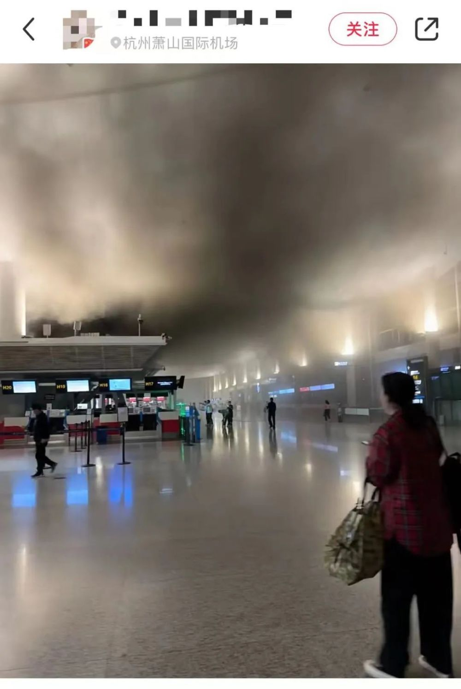
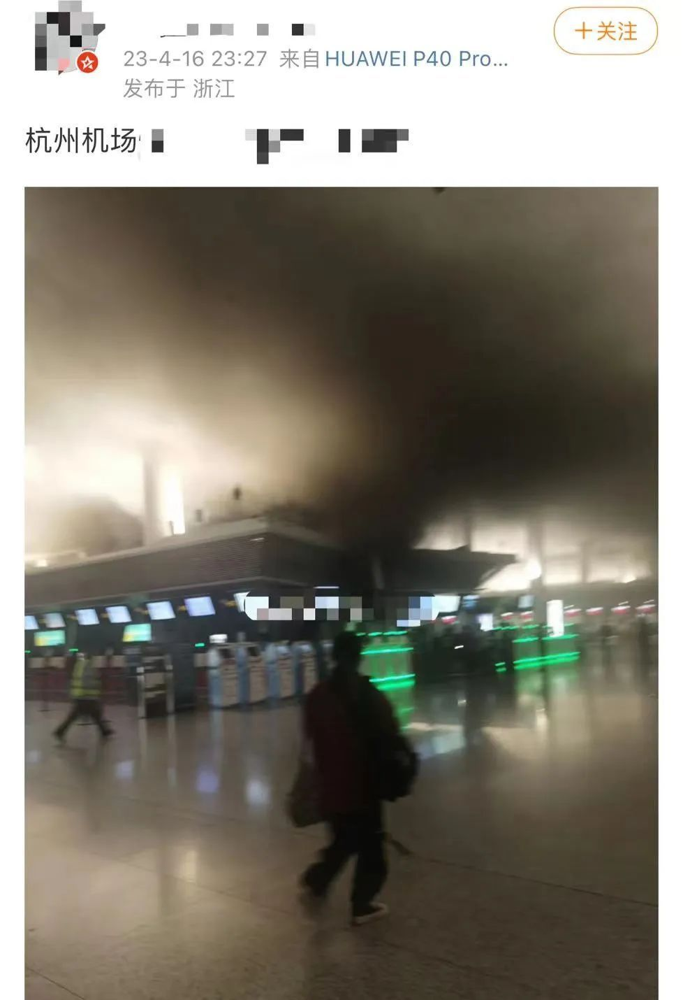
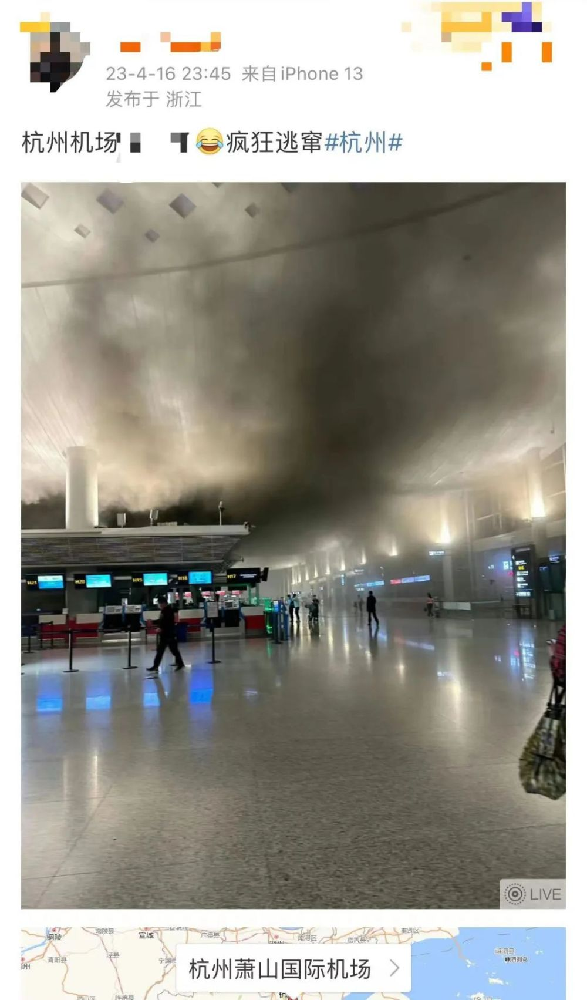
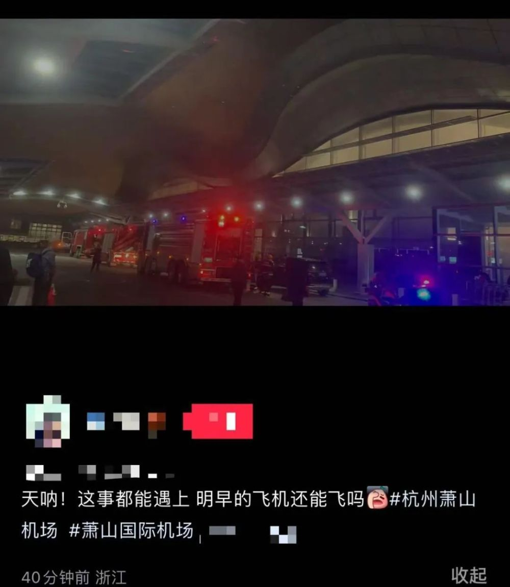
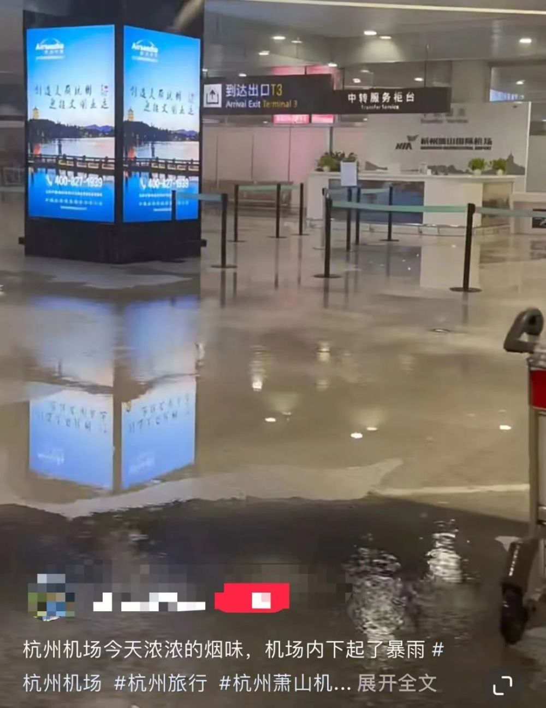
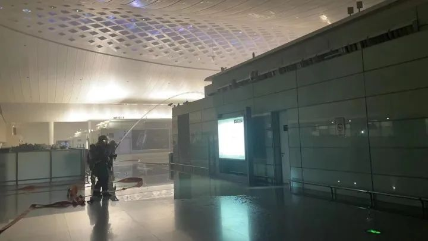
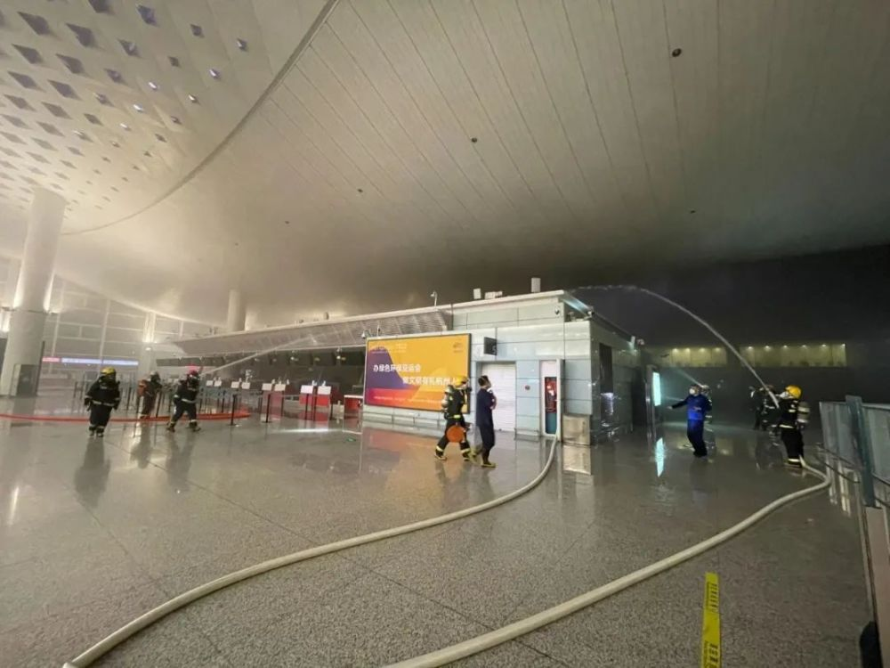
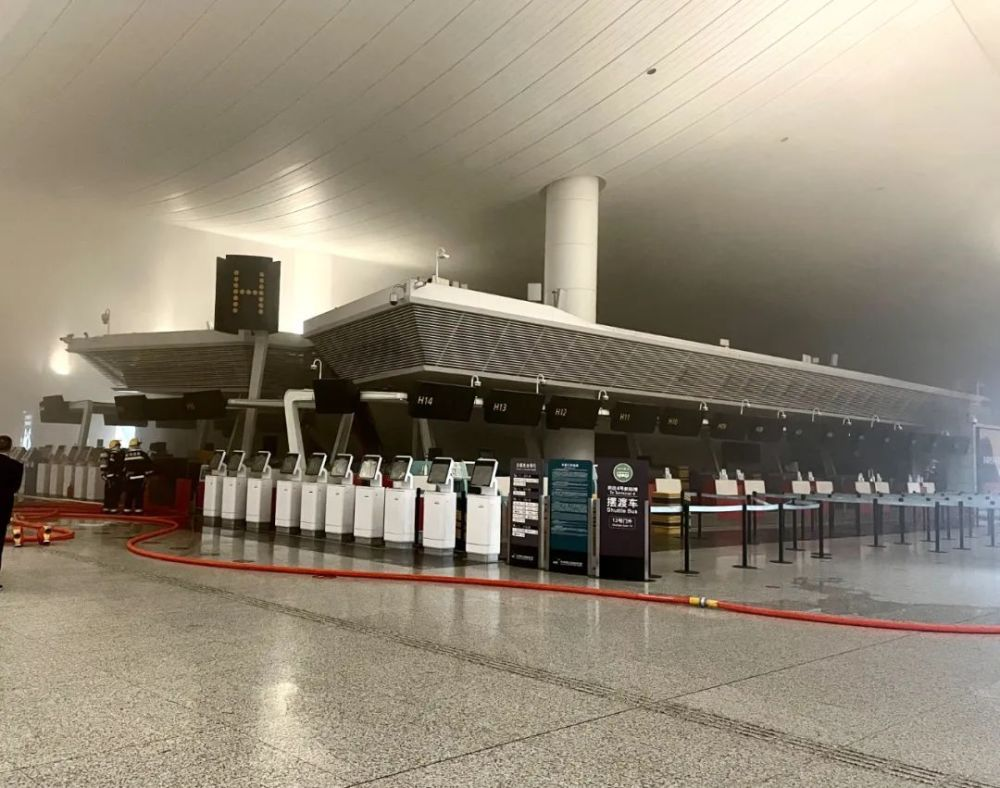
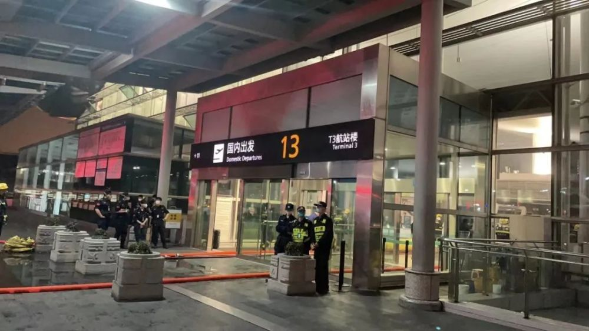

# 杭州萧山机场内浓烟滚滚，通报：烟雾及时得到控制，没有人员受困

4月16日晚上11点半前后，多位市民向潮新闻·钱江晚报报料：杭州萧山国际机场航站楼内疑似发生火情，现场浓烟滚滚。

不少网友也晒出现场图

▼

记者核实了解到，杭州萧山国际机场T3航站楼楼内有火情，起火区域位于T3航站楼出发层值机H岛附近。目前，火情已得到控制，人员都已及时疏散，无人员被困及受伤，航班进出港正常。

刚刚，杭州萧山国际机场最新通报：杭州机场夜间，T3航站楼H岛出现冒烟现象，机场消防队2分钟内到达现场，烟雾及时得到控制。冒烟时，当天航班已经结束。事件没有人员受困，机场运行没有受到影响。冒烟原因正在调查。

愿平安！

来源：潮新闻·钱江晚报综合自潮新闻·钱江晚报 记者 谢春晖、网友评论等

