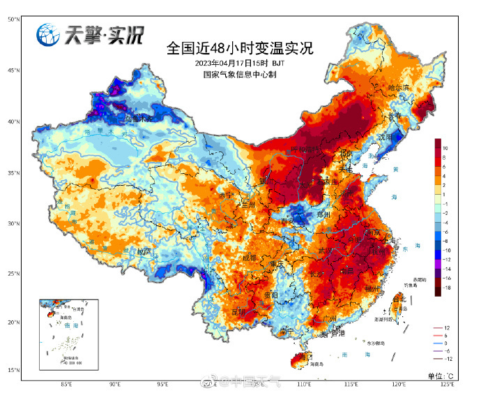

# 热到“冒烟”？12个省会级城市气温创新高 杭州热到打破同期纪录

@中国天气 微博4月17日消息，截至今天16时30分，省会级城市中，
呼和浩特23.8°C、太原26°C、济南29.4℃、合肥33.3℃（今年首次上30℃）、武汉33.8°C、南京34°C（今年首次上30℃）、杭州35.1°C（今年首个高温）、
长沙33.6°C、南昌34.5°C、重庆35.7°C（今年第二个高温）
、成都32.4°C、昆明28.9°C，气温均刷新今年来新高，其中杭州打破当地有气象记录以来4月最高气温纪录。

