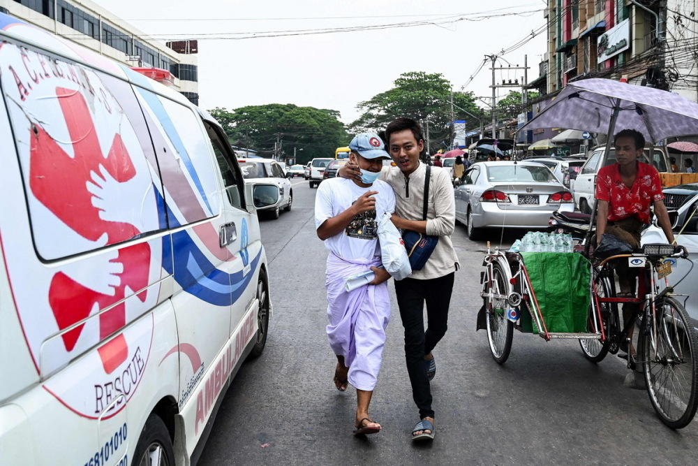

# 缅甸政府发布特赦令：超3000人重获自由，含103名外国人

_当地时间2023年4月17日，缅甸仰光，一辆载有获释囚犯的汽车从永盛监狱大门驶出。该监狱是缅甸最大监狱。_

4月17日是缅甸传统新年第一天。缅甸国家管理委员会大赦了在全国各地监狱服刑的囚犯3000余名。但目前尚不清楚从该监狱获释的人数和姓名。

据央视新闻报道，当地时间4月17日，缅甸国家管理委员会宣布，为了庆祝缅历新年和提供人道主义援助，将根据刑法401条，对3015名本国服刑人员和103名外国人实施特赦。

通告称，对于实施特赦的外国人将立即驱逐出境；而如果本国特赦人员再次犯罪，将继续执行此前未完成的刑期。

_当地时间2023年4月17日，缅甸仰光，人们在永盛监狱外等待新年特赦释放的亲友。_

_当地时间2023年4月17日，缅甸仰光，永盛监狱外，家属聚集在一辆载有获释囚犯的汽车周围。_

消息宣布后，约有百人聚集在仰光永盛监狱外，希望他们的亲友在这次特赦中获释。据悉，该监狱是缅甸最大的监狱。

据外媒报道，一位在仰光永盛监狱工作的不愿透露姓名的官员表示，特赦从4月17日开始，可能需要几天才能完成，尚不清楚从该监狱获释的人数和姓名。据缅甸政治犯援助协会(AAPP)的数据，截至4月12日，至少有17460人仍被关押在军政府的监狱中。

_当地时间2023年4月17日，缅甸仰光，永盛监狱外，家属向车内的获释囚犯挥手。_

_当地时间2023年4月17日，缅甸仰光，永盛监狱外，家属拥抱获释男子。_

4月17日是缅历新年的第一天，也是泼水节假期的最后一天。缅甸政府有在重大节日进行大赦的传统。据了解，2021年缅甸新年第一天，国管委赦免了2.3万余名囚犯。

_当地时间2023年4月17日，缅甸仰光，一名从永盛监狱获释的男子从车上走下。_

_当地时间2023年4月17日，缅甸仰光，一名从永盛监狱获释的男子与家人团聚。_

**本文图片 视觉中国**

