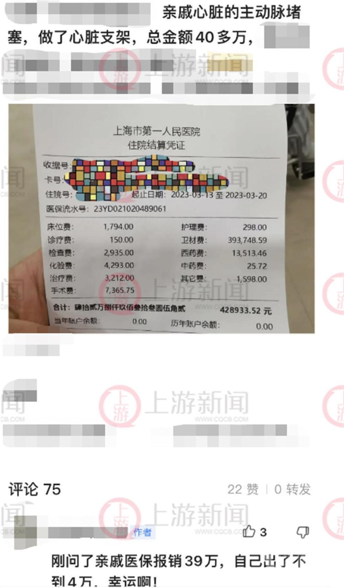

# 42万住院费实付不到4万，媒体：不降低看病成本，医保经不起如此支出

极目新闻评论员 徐汉雄

近日，一张病人在上海市第一人民医院“8天花费42万元”的住院结算凭证图片和相关文字在网络流传，引发关注和网友热议。4月17日，上海市第一人民医院宣传处回应称，已调查掌握情况，“图片的原博主已在评论中说，（患者）实付不到4万元。”（上海一患者住院8天花了43万余元？院方：医保报销39万，实付不到4万）

虽然院方作了解释，网友说，医保报销的钱也是钱，同样令人心疼，这么一大笔钱就到了医院账户。原帖博主发的文字显示，“亲戚心脏的主动脉堵塞，做了心脏支架，总金额40多万……刚问了亲戚，医保报销39万，自己出了不到4万。”

_住院“8天花费42万元”引发网友热议（图源：上游新闻）_

这个回复的信息含量比较大，一方面，医保兜底缓解看病贵，为患者看病提供保障，这个作用是实实在在的，医保惠民功不可没。另一方面，一次手术要花40多万，如果没有医保支持，普通家庭还真难以承受，看病贵依然是现实痛点，需要继续努力破解。

就如网友说的，住院8天花了40多万，谁付的钱并不是重点，而是为什么这么贵，要花这么多的钱。不降低看病的成本，医保的钱再多，也经不起这样的支出。

一次手术要花40多万，这钱到底花在哪？图片显示，其中，卫材费就占了近40万，西药费1.3万余元，中药费25元，手术费7300多元。这正是看病贵的现实，贵就贵在医疗耗材与药品上，医生的服务费并不高。

以主动脉堵塞治疗来说，懂行的网友留言称，这病比较危险，支架都不便宜，“主动脉支架与冠脉支架完全不是一回事，能救回来，庆幸吧！”“贵的器材哪一个不是数以万计!”

网上查询得知，据医生介绍，主动脉覆膜支架，一般需要几万块一个，植入生物可降解支架，费用更高，如果患者一次放了几个支架，这支架的费用就不菲。卫材费就占了近40万，以主动脉堵塞的治疗来看，也许并不奇怪。

话说回来，一次手术要花40多万，无论是谁付钱，都是难以承受之重，网友关心的看病成本，确实是需要直面的痛点。怎样把医用耗材的价格水分挤出去，把药品价格降下来，让群众就医有保障，国家层面也一直在努力，以各种方式来缓解看病贵。

统计表明，截至2021年底，基本医疗保险覆盖13.6亿人，参保率稳定在95%以上，全民医保基本实现，这是实实在在的兜底举措。另外，通过医保谈判与集采，降低医疗耗材与药品价格，以减轻医保支付与患者的负担，这方面也成效显著。

数据显示，从2019年“4+7”集采试点扩围开始，截至目前，国家已经开展8批333种药品、3批4类高值医用耗材集采，平均降价幅度分别超过50%、80%。据国家医保局相关负责人介绍，叠加地方联盟集采，已累计降低药耗费用超4000亿元。

就以冠脉支架来说，截至2023年2月28日，冠脉支架集采接续采购已完成17.85万个冠脉支架产品采购，占约定采购总量的10.3%，此轮平均中选支架价格为770元左右。数据显示，以中国医学科学院阜外医院为例，2021年和2022年，共使用约3.8万个冠脉支架，为患者减轻负担约4.8亿元。

国家医保药品目录准入谈判已经连续举行7次，除2017年外，历次谈判后价格降幅均超过50%，部分药品更是“谈”出全球最低价，医保谈判的“灵魂砍价”也屡屡引起刷屏。

一次手术要花40多万，化解这样的天价，依然要靠医保兜底、集采与谈判降价之类的举措。只有多管齐下，才能挤掉看病成本的水分。

（来源：极目新闻）

