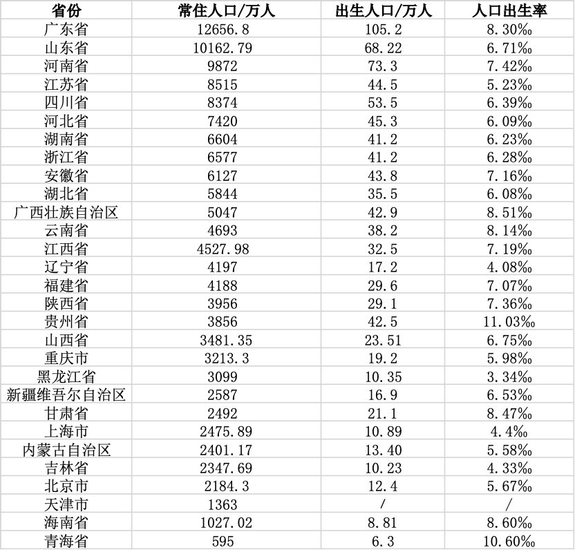

# 中国人口新格局：浙江常住人口增量最多，中西部多省人口回流

_2022年29省份人口数据概况（制图：澎湃新闻记者
滕晗）_

在中国人口负增长背景下，2022年各省份人口格局也在发生变化。截至目前，除宁夏、西藏外，全国31个省份中已有29个省份公布2022年人口情况。

从已公布的数据看，广东、山东、河南的常住人口总量分列前三的格局未变，29个省份中有17个省份常住人口数量实现正增长，常住人口增量最多的省份为浙江（37万人）；广东的出生人口最多（105.2万人），也是唯一一个出生人口超百万的省份；有19个省份人口自然增长率为负，河南、山东、甘肃、安徽、北京、云南、陕西等7个省份人口自然增长率在2022年首次转负。

17个常住人口数量正增长的省份中，江苏、湖北、安徽、山西、重庆、甘肃、内蒙古、云南、陕西、四川等10个省份人口自然增长率为负，常住人口增量最多的浙江，其人口自然增长率也仅为0.04‰，这反映了去年大部分常住人口数量增长的省份主要依靠机械增长，即人口流入。

“我国整体上处于极低生育水平和进入人口负增长的背景下，人口迁移流动对一个省份、一个地区人口总量变动所发挥的作用会越来越明显。”复旦大学人口研究所教授任远对澎湃新闻记者表示。

**人口总量前三格局未变，浙江常住人口增量最多**

从已公布数据的29个省份看，广东、山东、河南分别以12656.8万人、10162.79万人、9872万人的常住人口数量分列前三名，广东、山东也是仅有的两个常住人口数量破亿的省份。值得注意的是，广东、山东、河南分列人口总量前三的格局自2010年以来未发生改变。不过，去年这三个人口大省的常住人口数量较2021年均有下降，且广东、山东是多年来常住人口首次出现下降。

广东省统计局撰文指出，2022年，广东省外流动人口减少69.2万人，这是在2022年广东疫情散发多发的因素影响下，省外流动人口暂时回流返乡的阶段性现象。据运营商手机信令大数据显示，2023年1月返乡的跨省流动人口，2月已有84%回流广东。

与广东不同，山东常住人口减少主要原因是自然减少，澎湃新闻记者计算发现，去年山东人口机械增长为正，人口自然减少达9.45万人。

从常住人口增量看，29个省份中，实现正增长的有17个，增量排名靠前的分别是浙江（37万人），安徽、湖北（均为14万人），江西（10.58万人），江苏、广西（均为10万人），除浙江和江苏外，其余4个省份均来自中西部地区。任远认为，作为人口流动主要目的地的长三角地区、珠三角地区等的常住人口数量仍然在继续增长，中西部地区常住人口数量增加很大程度上受到流动人口回流的影响。

需注意的是，浙江在2021年也是常住人口增量最多的省份（72万人），从两年的数据计算，浙江常住人口增长主要来自机械增长，以2022年为例，浙江人口净流入为36.74万人。

相比之下，12个省份常住人口出现下降，辽宁、河北、吉林、广东、黑龙江等5个省份减少数量超过20万人，除广东外，其余4个省份人口自然增长和机械增长双双为负。

**广东出生人口数量最多，贵州人口出生率最高**

29个省份中，除天津外，均公布了出生人口相关数据。从出生人口数量看，广东（105.2万人）、河南（73.3万人）、山东（68.22万人）分列生育大省前三名，其中，广东依然保持第一，也是唯一一个出生人口超百万的省份，广东自2018年超越山东成为第一生育大省后，已连续多年出生人口位居全国首位。

河南、山东都曾是“最敢生”的省份，统计年鉴显示，两个省份曾多年每年出生人口数在100万人以上，不过，转折点都发生在2020年，彼时，两省份出生人口双双跌破100万人，且截至去年持续下降。从数据看，山东出生人口伴随着“二孩”政策实施而变化，2016年山东出生人口从上年的124万人飙涨至177万人，2017年继续维持175万人的高位，不过，随着“二孩生育势能基本释放”，2018年其出生人口较大幅下跌至133万人，随后逐年下降。

不过，需要注意的是，生育大省广东出生人口数量近年也在下滑，其近年来出生人口高峰在2017年（151.63万人），随后两年维持在143万人左右，2020年下降幅度较大，降至129.08万人，2022年逼近100万的“关卡”。

从出生率看，与2021年相比，多数省份去年的出生率均有不同程度的下滑。贵州、青海人口出生率突破10‰大关，分别为11.03‰和10.6‰，分列28个省份中第一、第二，
此外，海南、广西、甘肃、广东、云南、河南、陕西、江西、安徽、福建也超过6.77‰的全国平均水平。不过，贵州、青海等出生率较高的省份，由于其人口基数比较小，对全国人口大盘的支撑作用并不突出。

**7省份人口自然增长率首次转负，人口迁移对总量变动影响更大**

29个省份中，有19个省份人口自然增长率为负（天津未公布该数值），河南、山东、甘肃、安徽、北京、云南、陕西等7个省份人口自然增长率在2022年首次转负。与2021年相比，人口自然负增长的省份数量进一步增加。

“有一些省份人口自然负增长已长期存在，实际上我国人口自然负增长是与长期的低生育率相联系的。”任远说，因此，完善生育和家庭政策，加强生育的配套支持，是我国人口政策需要继续加强的内容。

另一方面，在人口自然负增长加深的情况下，机械增长对一个地区的人口总量增长的带动作用愈发明显。

从17个常住人口正增长的省份看，江苏、湖北、安徽、山西、重庆、甘肃、内蒙古、云南、陕西、四川等10个省份人口自然增长率为负，同时，常住人口增量最多的浙江，其人口自然增长率也仅为0.04‰。

“人口迁移流动对一个省份、一个地区的人口总量变动所发挥的作用会越来越明显。特别是东部和东南沿海地区以及特大城市，仍然是人口迁移流动的中心。这些地区的人口总量在整个国家人口负增长背景之下，依然保持继续增长。对某一个省份而言，有可能这个省份总体上人口处于负增长，但该省的中心城市、都市圈、城市群会是人口迁移流动的集聚地区，继续保持常住人口数量的增长。”任远说，因此，对这些城市的户籍制度改革以及对流动人口的公共服务等福利政策改革，需要加以重视和不断完善。

