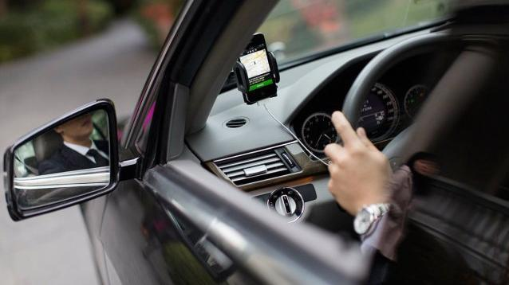

# 交通部要求平台企业降过高抽成，7月底前确保目标基本完成，有何影响

交通运输部要求平台企业降低过高抽成、调整会员费上限，影响几何？

4月17日，交通运输部印发《2023年推动交通运输新业态平台企业降低过高抽成工作方案》（以下简称“方案”）。目标任务方面，方案中表示，推动主要网约车和道路货运新业态平台公司加强与从业人员代表、行业协会等沟通协商，保障从业人员合理劳动报酬水平。推动主要网约车和道路货运新业态平台公司（以下简称“货运平台公司”）降低平台过高的抽成比例或者会员费上限，并向社会公开发布。

进度安排方面，方案指出，今年4月底前各平台主要做好相关企业的部署准备和实施方案制定工作。5月底前，沟通协商降低过高的抽成比例或会员费上限。

具体来看，方案指出，各城市交通运输主管部门督促在本地运营服务的各网约车平台公司与从业人员代表、行业协会等沟通协商，保障从业人员合理劳动报酬水平；各主要网约车平台公司基本完成降低过高抽成比例上限有关工作。相关省级交通运输主管部门组织在本省份注册的货运平台法人公司，与货车司机、行业协会等沟通协商，降低过高的抽成比例或会员费上限，保障货车司机合理收入。此外，均需主动向社会公告本企业降低过高抽成比例或会员费上限的承诺。

此外，方案指出，今年7月底前，主要推动主要平台公司确保目标任务基本完成。今年9月底前，总结评估本地保障交通运输新业态从业人员权益的工作经验和成效。10月底前，各货运平台公司总结保障货车司机权益的工作经验和成效。

**“方案或将影响平台公司经营业绩，倒逼企业改革”**

据中国物流与采购联合会3月30日发布的《中国数字货运物流发展报告》显示，2022年我国公路货运市场规模在5万亿元左右。其中，数字货运整体市场规模约为7000亿元，市场渗透率约为15%。

报告指出，数字货运物流是通过数字技术与货运物流行业深度融合、推动货运物流数字化转型的新型产业形态，包括网络货运平台和撮合交易平台。目前，有超过七成的货车司机使用过数字货运平台，数字货运平台已成为广大货车司机承揽货源的重要载体。

“抽成费用过高，且不够合理，希望平台能对该业务进一步升级。”4月17日，多位货运司机告诉澎湃新闻记者，作为跨城货运司机，其使用某平台的软件不需要支付会员费，但每一单结束后会需要上交部分抽成，名义上显示为“技术服务费”。

其中一位司机表示，每单平台抽成最低在四五十元，最高应该不超过200元，“像我们跑长途的，一个月大概十单左右，平均下来一单的技术服务费在100元，意味着每个月有一千多一年有过万元的钱需要上交给平台。”

另一位货运司机告诉澎湃新闻记者，“例如同行一些跑新疆、西藏的单子运费在两三万元，每单的抽成在180元、190元左右。而像我们跑一千多公里的中短途，运费每单在四千元，每单抽成也在100多元，这个抽取佣金的算法似乎不太考虑车型等，对比之下并不划算，此次方案的印发也进一步保障了我们司机的权益。”

物流专家赵小敏向澎湃新闻记者表示，若网约车平台或是货运平台企业的主营模式是以每单抽成或者是会员费为主，那此次方案的提出，势必会进一步影响和打击公司的经营情况。在监管下，也将倒逼企业去达到应有规范下的降本增效，让企业物流或是运输成本下降的同时，有单子做。

“此次方案的提出对业务基本上没有影响。”4月17日，一位物流上市公司的相关内部人士告诉澎湃新闻记者，“上述方案的提出或对主营数字货运的平台企业有一定影响。我们平台并没有靠佣金盈利，这块业务量很少，公司也一向重视司机权益保护，将在相关政策的指引下持续打造多方共赢的公路物流平台。”

值得注意的是，4月7日交通运输新业态协同监管部际联席会议办公室对货拉拉进行约谈，对满帮集团、滴滴出行、曹操出行等进行了提醒。约谈指出了货拉拉存在的突出问题，并要求各平台公司深刻反思，举一反三，深入查摆，认真整改。一要及时采取有效措施，维护好各方合法权益，确保行业安全稳定发展；二要持续落实“阳光行动”要求，进一步研究降低本平台过高的抽成比例或会员费，杜绝恶意压价竞争，保障从业人员合理劳动报酬水平；三要严格履行法定职责，依法合规经营，强化资质审核，确保货源真实可靠；四要完善投诉举报处理机制，及时解决广大司机反映的诉求和问题。

此次工作方案以及上述约谈、提醒对企业有哪些影响？企业将如何应对整改？对此，货拉拉、满帮集团、滴滴出行、曹操出行等企业均不予置评。

赵小敏还告诉澎湃新闻记者，一年多来，网约车平台和货运平台等代表性企业在包括该领域的多方权益保障、道路安全问题、投诉机制等问题上被行业监管部门反复约谈，但并没有做出实质性的改变。从整个行业出发，希望能看到更全方位的监管措施出来，除了监督企业降抽成、会员费等方案外，能有更详细的规则，例如需要达到什么标准，没有完全改正后将面临什么处罚等。

“约谈的问题提得都非常简单，也很朴素，还是需要企业自己去做反省，对商业模式做出变革。”赵小敏表示，尤其是一些行业内的上市公司以及即将上市的公司，从信息披露上、透明度方面以及商业模式上，都需要企业来自省和改革，来考虑存在的最大价值是什么。

**“规范和协调仍需多方参与”**

“无论是网约车平台还是道路货运新业态平台都是交通运输领域数字经济新业态。平台设置抽成比例或收取会员费是自身盈利的手段，也是平台和司机、货主等利益相关方博弈的结果。但是由于‘赢者通吃’的情况，具有优势地位的平台有动力提高抽成比例和会员费标准，光靠平台自身治理难以解决。”中物联公路货运分会秘书长周志成4月17日接受澎湃新闻记者采访时表示。

周志成表示，本次方案针对降低平台过高的抽成比例或者会员费上限提出了具体要求，但是光靠各地交通运输主管部门督促和组织平台、司机和货主等利益相关方协商可能还难以形成长效机制，存在曲解或反弹的问题。

周志成进一步表示，总体来看，受今年行业需求不振的影响，今年一季度后半期运价持续低迷，虽然是传统淡季，但是今年供过于求的市场格局较为明显，导致“淡季过淡”现象，价格跌跌不休，严重影响司机收入和就业稳定。为避免价格恶性竞争，有必要加强平台自治和行业共治力度，并形成公约、规范等规范性要求，需要利益相关方共同参与，建立平台、政府、协会“三位一体”的推进新机制。

具体来看，周志成表示，一是要发挥政府监管作用，尽快完善新业态监管的规制，明确不同利益相关方的责任义务，并做好动态监督和统筹协调。二是要加大平台自我规则，平台通过合理制定平台运营规制，规范和约束平台利益相关方的经营行为，审慎制定与利益相关者相关的经营规则，创造良好的生态环境。三是要推动社会组织共治，充分发挥行业组织等社会第三方力量，通过行业标准、行业守则等方式加强行业自律和标准规范。

