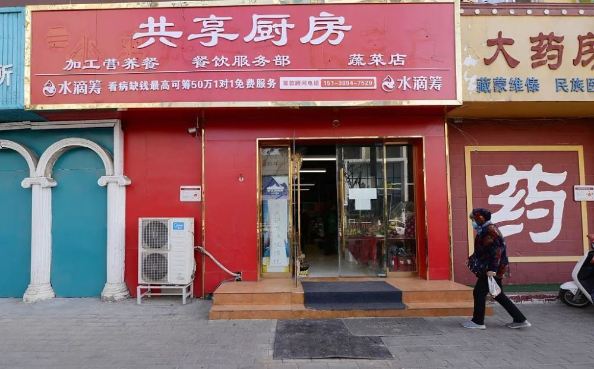
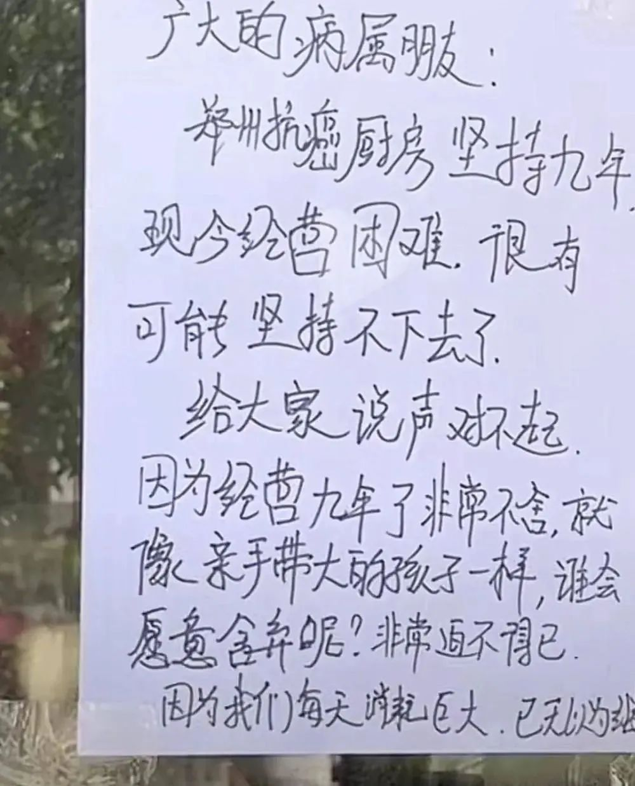
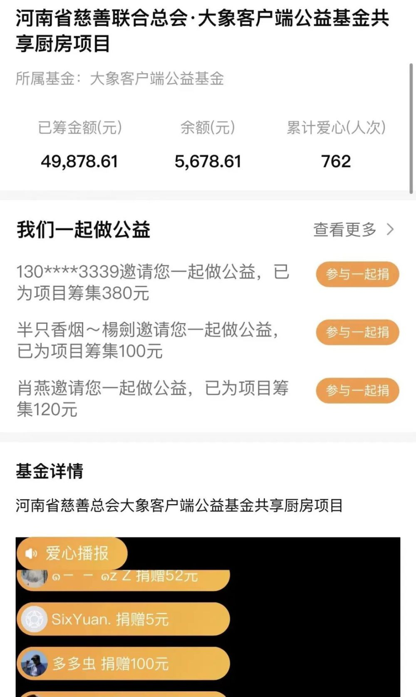
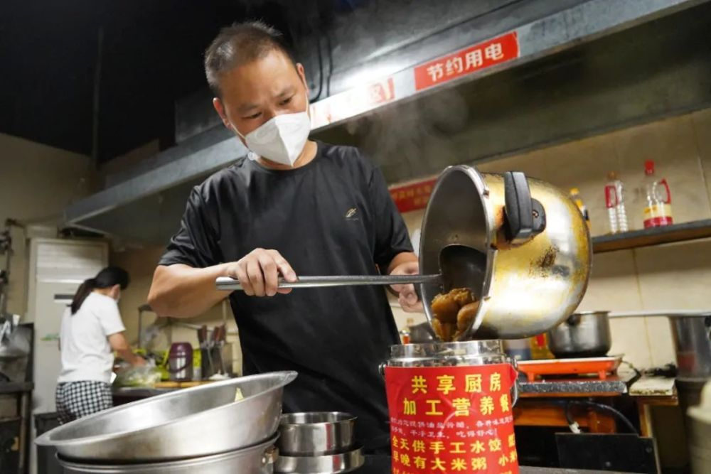

# 从同情到质疑，合伙人被称“卖惨”“诈骗”，抗癌共享厨房为何被反转？

_2021年1月10日，郑州市东明路，一位陪护人员进入共享厨房。_

原本是一个关于“好人好事”的暖心新闻，只过了一天，事情就有了各种版本的“反转”。

近日，郑州“抗癌共享厨房”负责人之一张广兵发布告别信，称共享厨房经营困难可能被迫关停，引发舆论关注。爱心人士捐赠的善款和物资纷纷涌来，但质疑的声音也接踵而至。

从同情到质疑

“广大的病属朋友：郑州抗癌厨房坚持九年，现今经营困难，很有可能坚持不下去了。给大家说声对不起，因为经营九年了非常不舍，就像亲手带大的孩子一样，谁会愿意舍弃呢？非常迫不得已。因为我们每天消耗巨大，已无以为继。”

这份动情的告别信来自位于河南省肿瘤医院和河南省胸科医院之间的一家“郑州抗癌共享厨房”（下称“共享厨房”）。根据当地媒体的报道，2014年，共享厨房合伙人之一王战胜在菜市场经营一家粮油店，那个时候经常有患者家属找他，想用他家的火做饭，王战胜都答应了。久而久之，越来越多患者家属找上门来，有人心里过意不去，就主动拿出5元“使用费”，后来逐渐形成了这样一个规矩。

后来，同样在菜市场开店的张广兵、魏兴江也加入进来。2020年菜市场拆迁，3位合伙人共同盘下目前的房子，继续经营共享厨房。

_4月10日，抗癌共享贴出“告别信”，称由于经营困难，可能被迫停业。_

现在的共享厨房有120平方米，50多个炉子，每天前来做饭的患者家属有上百人。

张广兵在接受媒体采访时表示，自己大学毕业后就一直在郑州经营共享厨房，来这里做饭的人基本都是周边医院的病人家属，厨房每餐收取来做饭的人员5元加工费，同时还会提供米、面、油以及厨具、调料等供其使用，9年来一直未曾涨价。

告别信贴出后，立即引发大量关注和同情。爱心人士纷纷慷慨解囊，有人亲自到店里送来20万元，还有两位网红博主捐了10万元，小额的捐赠则不计其数。除此之外，还有许多人送来米、面、油等物资。

很快，共享厨房门口堆满了全国各地运送过来的爱心物资，后续物资还在源源不断送来。

随后，张广兵撕下了“关门通知”，并发布了一条感谢视频。

不过，事情在这个时候发生了转折。4月13日下午，有人探访现场后发现，“5元做一顿饭”并非实情，而是不同的菜品会被收取不同的加工费，比如排骨汤、牛肉汤这样的菜品每道菜收费为10元，砂锅煲汤则是15元，凉拌菜3元，炖鸡蛋5元。在收费标准的表格上，右下方还有“附加服务费”，比如使用破壁机的话，费用为3元，加热米饭的费用也是3元。

于是，有人开始质疑当事人“卖惨”“诈骗”，甚至还有人说，“共享厨房的老板开宝马住别墅”。

面对舆论的质疑，郑州市金水区成立了联合调查组，4月15日发布报告称，“共享厨房”合伙人张广兵家庭名下有90.2平方米小产权房一套、40.52平方米小公寓一套，分期付款购买白色马自达3轿车一辆。社会爱心人士赠予款额579888.25元，款项保存在银行卡、微信及支付宝中，均未支出。赠予的米面油等生活物资正在清点中，当事人已停止接受各类社会赠予。

_2021年1月10日，郑州市东明路，共享厨房的工作人员在讲解炒菜、炖汤的收费标准。_

早在2021年就公开募捐

有观点认为，张广兵等人的行为在法律上较难界定。虽然《慈善法》修订草案中，已明确了个人救助内容，规定不具有公开募捐资格的组织或者个人，不得采取公开募捐方式开展公开募捐，但可以与有公开募捐资格的慈善组织合作开展公开募捐，募得款物由具有公开募捐资格的慈善组织管理。

不过，这仅限于“个人为了解决本人或者家庭的困难向社会发布的求助信息”。草案要求，求助人和信息发布人应当对信息真实性负责，不得通过虚构事实等方式骗取救助。网络服务提供者应当承担求助信息真实性审查义务。

显然，共享厨房不适用上述条款。

面对质疑，张广兵在4月14日回应称，爱心物资和款项已经清点出来，正在向河南省慈善总会申请公益慈善账户，将专款专用。

河南省慈善总会工作人员在接受《中国慈善家》采访时表示，张广兵确实与该会联系过，“但目前没有开展相关合作，还在研判中”。

上述工作人员还解释，不存在“公益账户”一说，只有相关基金账户，从基金设立的条款来看，首先要对基金的资金来源进行背景调查，比较复杂。

“联合调查组介入后，目前认定爱心网友的资金不属于‘捐赠’，而是‘赠与’。”工作人员说，至于后续会不会与共享厨房开展合作，要根据调查组最终的调查结果来决定。

不过，《中国慈善家》调查发现，河南省慈善联合总会早在2021年就设立了“河南省慈善联合总会大象客户端公益基金共享厨房项目”进行公开募捐，2021年3月24日至2023年4月11日，陆续有爱心人士捐款。

_河南省慈善联合总会有关“共享厨房”项目截图。_

该项目的详情中写道，郑州市有三人合作在河南省肿瘤医院旁边开了一个200平米的共享厨房，用于帮助癌症患者及家属日常生活。店内前有一个平价蔬菜摊点儿，顾客可以自选蔬菜食材；店后有厨房可以自己做饭，56个锅灶满足患者及家属同时做饭。面、菜、一般汤类的加工费5元一锅；店里免费提供清洗、用水、厨具、油盐酱醋之类的调料，早晚提供免费的稀饭；三名店主有厨艺，可以帮助不会做饭的人制作。

截至发稿时，该基金共募集资金49878.61元。收支明细显示，2022年1月19日，该基金拨付给魏兴江44200元。

也就是说，共享厨房和河南慈善总会的合作从2021年就开始了。而郑州市金水区联合调查组的通报也没有平息质疑的声音，比如通报并没有提及共享厨房的真实收费情况，前几年接受的爱心善款及物资情况，为什么是“赠与”而不是“捐赠”等。

_2021年8月10日，河南郑州，河南省肿瘤医院附近的“抗癌共享厨房”内，共享厨房合伙人把做好的订制饭菜装盒。_

没有保障的个人赠与

由于共享厨房并没有明确向社会“求助”，如果网友并非基于公益目的，而是基于同情、怜悯等缘由给予当事人财物帮助，属于民事赠与，法律并未禁止，也不受《慈善法》约束，并没有向社会公开账目的义务，除非赠与人提出要求。

“但是，捐赠也是赠与的一种形式，《民法典》的赠与合同也提到‘普通的赠与’和‘公益目的赠与’。《慈善法》范畴的捐赠是出于救灾、扶贫等目前的公益性的赠与，即自然人，法人和其他组织基于慈善目的，自愿、无偿赠与财产的活动。捐赠人可以通过慈善组织捐赠，也可以直接向受益人捐赠。”北京市致诚律师事务所律师何国科告诉《中国慈善家》。

何国科认为，共享厨房事件中，无论爱心人士的行为被定义为“赠与”，还是“捐赠”，其目的都是希望共享厨房能继续为患者及家属服务，很明显是基于公益慈善目的，所以也是一种捐赠，需要履行《慈善法》中规定的义务，包括公开账目详情。

实际上，这种个人发起的公益活动，由于在公开透明方面存在天然不足，一直以来饱受诟病。对于个人账户接收捐赠，对捐赠者没有任何法律保障，对接收管理方来说也没有保障，容易出现所谓的“反转”。

根据《慈善法》规定，不具有公开募捐资格的组织或者个人基于慈善目的，可以与具有公开募捐资格的慈善组织合作，由该慈善组织开展公开募捐并管理募得款物。慈善组织通过互联网开展公开募捐的，应当在国务院民政部门统一或者指定的慈善信息平台发布募捐信息，并可以同时在其网站发布募捐信息。

上述法条已经为个人参与公益指明了方向，即通过组织路径来实现公益目的，比如通过慈善组织、民非等一般社会组织，还可以通过代管、专项基金、甚至公司来达到公开透明的目的。

作者：温如军

图片来源：视觉中国、中国新闻图片网

图片编辑：张旭

值班编辑：万小军

