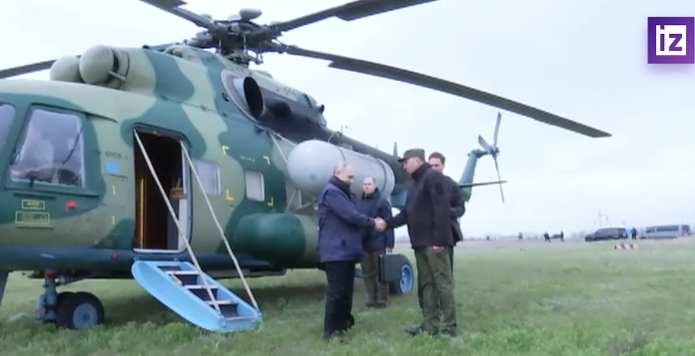
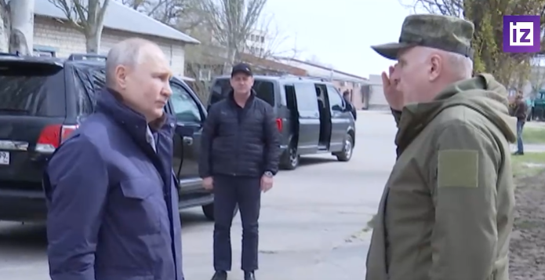

# 克里姆林宫发布“普京访问赫尔松”，外媒称未透露具体时间

环视频/制作 何卓谦

【环球网快讯】法新社18日刚刚发布一句话快讯称，克宫表示，俄罗斯总统普京已到访赫尔松地区。

_克宫新闻处称俄罗斯总统普京到访赫尔松地区。俄罗斯《消息报》所配视频截图_

据俄罗斯卫星通讯社早些时候消息，克宫在一份声明中称，“弗拉基米尔·普京视察了卢甘斯克人民共和国的‘东方’国民警卫队，在那里他听取了亚历山大·拉平上将和其他高级军官关于该地区局势的报告。”
报道说，这是普京（自特别军事行动以来）首次到访卢甘斯克。

报道还称，当天早些时候，普京还会见了赫尔松地区“第聂伯”部队人员。“弗拉基米尔·普京在赫尔松地区‘第聂伯’部队的参谋部听取了空降部队指挥官米哈伊尔·特普林斯基上校、‘第聂伯’部队指挥官奥列格·马卡列维奇上校和其他军事领导人的报告，”克里姆林宫新闻处称。

法新社称，克宫没有透露普京到访赫尔松地区的具体时间，但这是普京（自对乌特别军事行动以来）首次到访赫尔松地区，赫尔松部分地区目前被俄军控制。

