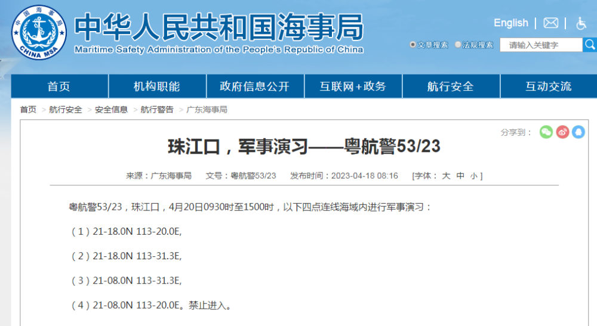

# 广东海事局：珠江口部分海域内进行军事演习，禁止进入

来源：广东海事局

珠江口，军事演习——粤航警53/23

粤航警53/23，珠江口，4月20日0930时至1500时，以下四点连线海域内进行军事演习：

（1）21-18.0N 113-20.0E,

（2）21-18.0N 113-31.3E,

（3）21-08.0N 113-31.3E,

（4）21-08.0N 113-20.0E。禁止进入。

