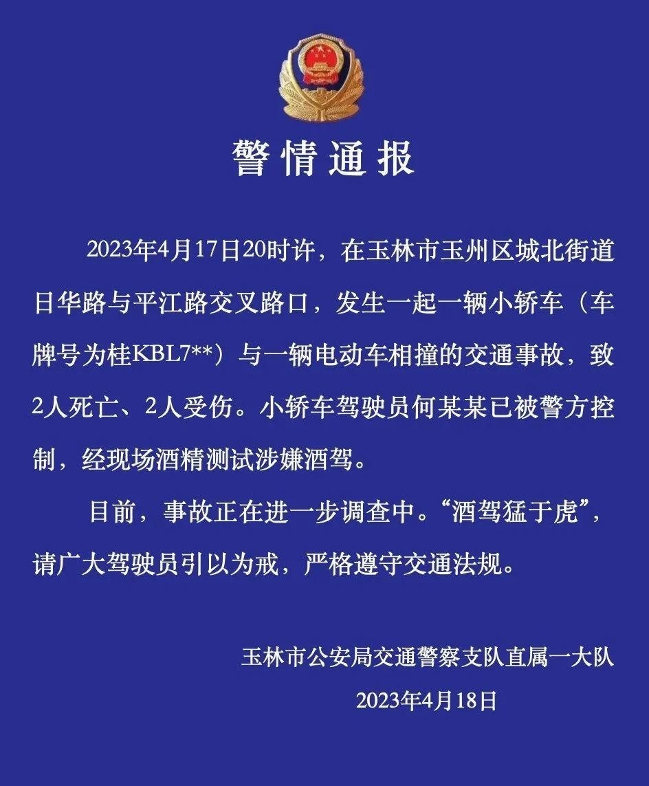

# 广西男子酒驾致2死2伤，目击者：他喝的都不清醒了，肇事后竟倒地大睡

4月18日，据百姓关注报道，4月17日，广西玉林一交叉路口发生车祸，致2人死亡、2人受伤，引起广泛关注。

事发时，一辆小轿车与一辆电动车相撞，多人被撞后倒地，轿车前保险杠变形。

_图/百姓关注_

_图/百姓关注_

目击者称，轿车司机是酒后驾车，事故发生后，他下车后竟然倒在地上呼呼大睡，一动不动。“那个人喝的都不清醒了，有人把他拉出来的时候都睡着在那里了。”

目击者表示，有一人当场死亡，另外三人被送医救治，警方赶到后将轿车司机控制。

18日，玉林交警发布通报称，2023年4月17日20时许，在玉林市玉州区城北街道日华路与平江路交叉路口，发生一起一辆小轿车(车牌号为桂KBL7**)与一辆电动车相撞的交通事故，致2人死亡、2人受伤。小轿车驾驶员何某某已被警方控制，经现场酒精测试涉嫌酒驾。

目前，事故正在进一步调查中。“酒驾猛于虎”，请广大驾驶员引以为戒，严格遵守交通法规。

**【来源：九派新闻综合百姓关注、玉林交警】**

