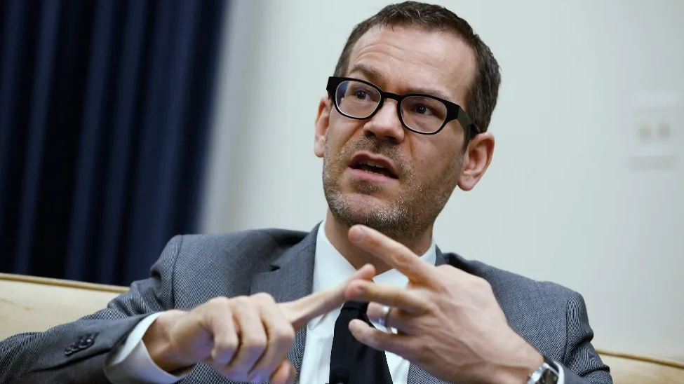

# 思路清奇！美国防部高官抱怨：中方不接电话，是想用沉默吓跑我们

（观察者网讯）据《华盛顿观察家报》当地时间17日报道，不满中方始终不接电话，美国国防部负责制定国防政策的副部长科林·卡尔（Colin
Kahl）接受采访时又是大发牢骚不说，还思路清奇地憋出了一个新说法。

他脑洞大开称，中方拒接电话是在实施一个“新奇”的计划（a novel plan），即用“沉默以对”（the silent
treatment）吓跑美军，逼他们放弃一切“撤离西太平洋”。

本月早些时候，中方就曾回应美方炒作“中方冻结与美方高层外交接触”的说法，强调当前中美关系遭遇困难，责任不在中方。不过美方仍不思己过，反述于人。

《华盛顿观察家报》援引美国防部副部长卡尔周一参加《外交政策》访谈时的发言内容报道称，卡尔认为“沉默应对”是中国军方故意为之的“新奇”计划。

这位美国防长的高级顾问还猜测道：“（中国官员认为）如果我们想避免危机，有一个简单的解决办法，那就是（美军）撤出西太平洋，放弃我们的联盟和伙伴关系，然后离开。”

卡尔更颠倒黑白地指责中方在高度紧张的危机时刻拒接美军电话，抱怨中方在“很大程度上忽视了美方做出的沟通努力”。报道称，美国政府认为中方的沉默不仅是愤怒的表达，而是有意提高美国继续在该地区军事存在所要面临的风险。

_科林·卡尔（Colin Kahl）
资料图_

当地时间4月11日，美国国务卿布林肯和防长奥斯汀等人在华盛顿举行美菲“2+2”部长联合发布会。会上针对记者提问，布林肯就其访华计划、中美关系等涉华议题作出最新表态。

布林肯当时表示，中美关系是最重要同时也是最复杂的双边关系，美方并不寻求遏制中国、不搞“新冷战”，将继续寻找加强双边沟通渠道的途径，他仍期待“在条件成熟时”访华。

_布林肯出席美菲“2+2”部长联合发布会视频截图_

今年2月，拜登政府屡屡炒作中国无人飞艇因不可抗力误入美领空事件，布林肯称受该事件影响决定推迟访华行程。

美国“政客”新闻网曾报道称，在布林肯的中国之行搁浅后，拜登政府一直试图重启中美高层会谈。一位现任美国官员和一位前国务院官员表示，其中就包括重新安排布林肯的访华行程。

在4月11日中国外交部举行的例行记者会上，有记者就美方重新安排布林肯访华一事提问。中国外交部发言人汪文斌指出，当前中美关系遭遇困难，责任不在中方。

他表示，美方应停止干涉中国内政，停止损害中国利益，停止一边声称要为中美关系加装“护栏”、一边破坏两国关系的政治基础，（应）同中方相向而行，推动中美关系重回健康稳定发展正轨。

今天（18日），对于布林肯在G7外长会上关于“中国必须表现出继续与美国接触的意愿”的说法，汪文斌再度回应表示，中国始终按照相互尊重、和平共处、合作共赢三原则，看待和发展中美关系。当前中美关系紧张的根源，在于美方基于错误的对华认知，制定和执行错误的对华政策。

**本文系观察者网独家稿件，未经授权，不得转载。**

