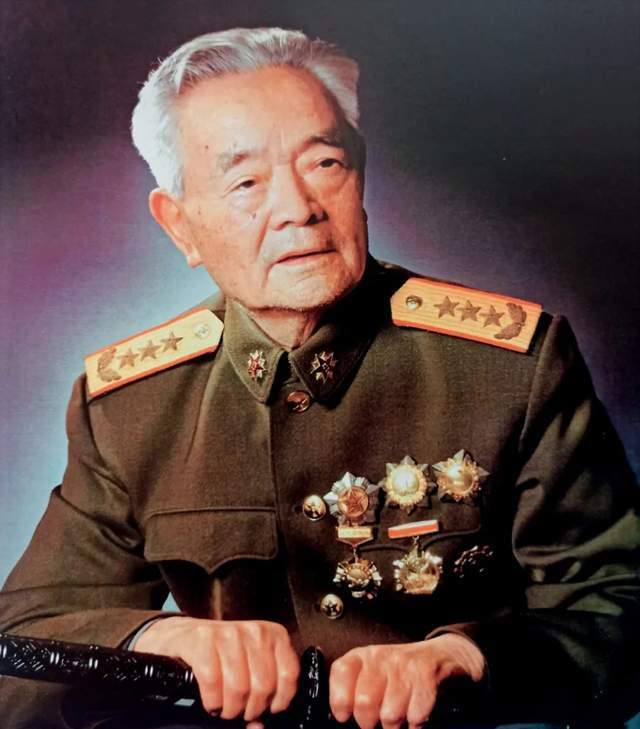

# 最后一位中顾委委员走了

2023年3月31日上午，最后一位原中顾委委员、原成都军区政委万海峰在卧床休息时安静离世，享年103岁。

万海峰是开国大校，1988年实行新军衔制后成为首批上将，这是新时期中国人民解放军的最高军衔。

他去世后，与他同批授衔的17位上将中，仅迟浩田一人健在了。他的去世，也为红28军的历史画上了句号。两届共372名委员组成的中顾委的历史，也翻过了最后一页。

_上将万海峰，摄于2000年前后。图/受访者提供_

处理历史遗留问题

1982年，中共十二大召开，时任北京军区副政委万海峰当选为中央委员。不久后，他被中央军委任命为成都军区政委。

深秋时节，万海峰轻装赴任。到任后，他首先面对的是军区内部积累已久的矛盾。

成都军区机关是“文革”中的“重灾区”，形成了错综复杂的派性矛盾。粉碎“四人帮”后，在清查工作中又打击了一批人，机关内部团结出现严重裂痕。成都军区已有11年未召开党代会，这在各大军区是绝无仅有的。

万海峰上任不久就收到各级干部要求落实政策的大量申诉信。他与十二大后同时到任的成都军区司令员王诚汉取得共识，成立了调查小组，要求有错必纠，错多少改多少。一些人担心这会否定那段时期的工作，万海峰提出：“要彻底否定‘文化大革命’，首先要勇于否定自己在‘文化大革命’中的错误。”

全军区共为“文革”中受迫害的5300人平反，为被错划为“右派”的近千人作了改正，对2300件历史遗留案件中的1700余件改变了原结论或处分。1983年11月，中共成都军区第五次代表大会顺利召开，选举万海峰为军区党委书记，王诚汉为副书记。

万海峰面临的另一个历史遗留问题是，“文革”中军队执行的“三支两军”损害了军地关系，这在民族关系复杂的西南地区尤其严重，其中矛盾最突出的是军队占用地方土地和房屋的问题。

改革开放后，邓小平指出，军队要自觉地服从和服务于国家经济建设的大局，要在这个大局下面行动。因此，上任伊始万海峰就提出，要积极主动解决军地关系问题。

成都军区和四川省政府联合成立了退房领导小组。万海峰多次主持会议，逐一研究重大案子的解决方案。他强调，要尊重地方政府，绝不能与民争利。

陆军47医院与新都宝光寺有地产争议，虽然产权属于军方，但军区从宗教政策和支持地方发展旅游业出发，将5200平方米的地产和房屋无偿移交给了宝光寺。军区三局驻地当年多占用了无主荒山坡200多亩，军区主动把190亩好地和能耕种的坡地退给了群众。南充军用机场长期闲置未用，万海峰指示驻军将宿舍的平房改为楼房，收缩营区，腾出大片良田交给当地农民。

至1983年底，军区处理了259件较大的遗留问题，其中仅一个军就清退房屋56600多平方米、土地1680多亩，赔偿现金609万元。

“成昆之变”

进入1985年，酝酿已久的百万大裁军脚步渐近。

邓小平在会见外宾时几次谈起，世界大战一二十年内打不起来。他说：“我们既然看准了这一点，就犯不着花更多的钱用于国防开支，要腾出更多的钱来搞建设。可以下这个决心。”他反复说，军队要“消肿”。“肿”在哪里，主要是肿在各级领导机关，再就是大军区。

按照总参谋部初步拟定的精简整编方案，三总部机关人员编制将精简一半，原来的11个大军区合并成7个。

1985年3月，消息传来，成都军区将被撤掉，合并到昆明军区中去。4月，全军各大单位参谋长会议在京召开，讨论后的方案仍是如此。这很自然，因为当时昆明军区是全军唯一有作战任务的大军区，邓小平曾三次通令嘉奖参战部队，胡耀邦曾亲临前线视察，还题词“国威军威看西南”。

这一消息在位于北较场的成都军区大院中引起了巨大的波动。在建的现代化通讯情报中心大楼，挖好的地基三次填平，又三次重新动工，足见其波动之剧。万海峰和王诚汉尽力安定人心，确保各项工作有序进行，同时也在组织人力，对保留成都军区的合理性收集论据。

昆明军区政委谢振华形容，在定案公布之前，一种“到底鹿死谁手还很难说”的想法仍在大家脑中萦绕。

1985年5月，中央军委扩大会议在北京京西宾馆召开，方案就要最后“定盘子”了。

万海峰和王诚汉召集一起来参会的成都军区军务部部长刘国斌、干部部部长程功明、干部部处长李德义开会，商定在军委做出最后决定前按正当程序向军委反映意见。李德义执笔，连夜起草了《关于昆明、成都军区合并后定点问题的几点想法》的建议信。

信中提出，大军区定点要有利于作战指挥，便于组织部队向其他战区机动，因此设置上应具有一定的弹性和稳定性，不宜过于靠前。信中强调，成都到昆明、西藏的交通和通信设施比较完善，特别是成都到拉萨一线经过30多年建设，公路、通讯、仓库、兵站等都比较完善，而仅仅新开通昆明到拉萨的通讯线路一项就需要投资上亿元。

信写好后，以万海峰和王诚汉的名义，分送军委常务副主席杨尚昆以及军委副秘书长杨得志、余秋里、张爱萍和洪学智。在军委扩大会议分组讨论会上，万海峰和王诚汉又根据这封信的内容作了联名发言，得到不少人的响应。

总参谋长杨得志征求拟在昆明、成都军区合并后出任新司令员的第一军军长傅全有的意见，傅全有说，领率机关驻地应该从长远考虑，云南边境的战事是阶段性、局部的，不是永远的战场，一旦战争结束，昆明偏于一角，对于整个军区部队建设和管控西藏方向都是不利的，定点成都更有利。副总参谋长何政文兼任军委精简整编领导小组办公室主任，最初支持定点昆明，这时也改变了看法，向军委提出了定点成都的建议。

6月3日下午，方案将在中央军委扩大会议全体会议上公布，成为定局。当天中午，成都军区的人比其他人早两小时得到消息：“定了！变了……”

新组建的成都军区包括云、贵、川、藏三省一区。6月5日，中央军委任命了新的军区领导班子。65岁的万海峰担任政委，是原昆明军区和成都军区班子中唯一留任的，新组建的军区党委共8位常委，除他之外都是从军级领导职务上提升上来的，新班子平均年龄54岁，比过去老班子年轻10岁。

在万海峰的带领下，新班子在“择优任用、一视同仁”的前提下，在干部调配中大体做到原成都、昆明两个军区各一半。机关住房紧张，万海峰动员原成都军区机关干部优先照顾来自原昆明军区的干部，并把一幢刚建成的宿舍楼全部让给由昆明来的机关干部及其家属居住。

8月23日，在新落成的成都军区大礼堂召开了欢迎昆明军区机关干部大会，成都军区翻开了新的一页。

百岁上将

1987年，万海峰在十三大上当选中顾委委员。这年，孙德阁成为他在北京的驻地的工作人员，他回京开会时，孙德阁经常陪同。

孙德阁告诉《中国新闻周刊》，中顾委开会地点在中南海九号会议室。一些久经沙场的委员们发言果敢，即便最高层领导莅会他们有意见也直言不讳。相比之下，万海峰算是中顾委中的“小字辈”，发言不多，很讲分寸。

1990年，万海峰达到最高服役年限，退出军队领导岗位。1998年9月，他正式离休。

从那以后，他每到一地，哪怕只能逗留三五天，也要留出足够时间去探望当地的老战友、老部属。离休后五年里，他看望了240多位老战友。

每次他对秘书孙德阁讲起自己的老领导、恩人高敬亭，都会流泪。

1933年，红军长征后留在鄂豫皖根据地的红28军政委高敬亭在行军途中“捡到了”快要冻饿而死的红军小战士万海峰，破例将13岁的他收入麾下，留在身边做勤务员，对他视如己出。他本来只有一个乳名叫“毛头”，是高敬亭给他取名“万海峰”，寓意“红军从四面八方汇集而来，像海洋一样大，像山峰一样高，部队和个人都有光辉灿烂的前程”。

国共第二次合作后，高敬亭率领的红28军被改编为新四军第四支队，成为新四军四个支队中战斗力很强的支队，身为四支队司令员的高敬亭也成为新四军著名战将。但1939年6月的一天，高敬亭奉新四军军部电令，带着万海峰等20名战士前往安徽肥东县青龙厂开会，一到却被关押起来。

6月24日是万海峰一生中最为刻骨铭心的日子。在这一天，高敬亭因“破坏党的统一战线”等罪名被错误处决，年仅32岁。

这件事对年轻的万海峰而言是一次精神上的重创，如同晴天霹雳一般。他第一次亲身领略了斗争的残酷，这对他一生的性格和作风影响至深。他后来曾说，这件事从反面教育了他，遇事三思而行，不可轻率鲁莽，不能捕风捉影，对待干部的处理必须持慎重态度。

1977年，中央为高敬亭平了反。多年来，万海峰一直为高敬亭之事而奔走。1989年，在高敬亭牺牲50周年之际，万海峰主持出版了《被错杀的将军》，全国政协主席李先念和徐向前元帅等题词。万海峰为该书作序时写道：“高敬亭同志被错杀，是新四军的一大冤案。他的死，是我党我军的一个巨大损失。”

退下来后，万海峰依旧繁忙，他一直很挂念老区，有机会就去走访。

京九铁路项目1992年上马，当时有两个方案：一是经安徽阜阳到江西九江，二是经河南信阳到九江。第一个方案被采纳的可能性更大，因为第二个方案要绕行大别山，会增加投资。河南信阳地区副专员郑淑真找到万海峰，希望他为家乡说话。

万海峰联系了李德生、尤太忠、郑维山、高厚良、陈明义、潘焱、曹思明七位老将军，上书中央，建议国家对老区进行帮助和扶持。中央很快批下来，同意京九线走老区，让京九线成为了一条扶贫线。

1998年，万海峰到安徽舒城县新四军四支队旧址视察，发现旁边的小学条件很差，就与高敬亭的老战友汪道涵、裴先白等一同倡议，建设一所希望小学。20多位四支队老战士积极响应，集资30万元，将新小学命名为“敬亭小学”。

从1972年就任北京军区副司令开始，北京北新仓胡同16号院就成为万海峰的家。院落清幽静谧，室内简素，会客厅的墙上挂着毛泽东、刘少奇、周恩来和朱德的大幅合影，还挂着万海峰与邓小平、江泽民等中央领导的合照。

万海峰的离休生活很有规律，最喜欢的运动就是散步。他每天早上6点起床，带上小收音机外出，边散步边收听新闻。回来后，他用早餐，看报刊杂志，会见来自家乡和部队的客人。

他和夫人赵政感情很好。赵政也是一位老革命，是五六十年代授衔的43位女校官之一。1943年，还是新四军团职干部的万海峰与女军医赵政经组织介绍于10月在苏中抗日战场结婚。他们的结婚证被赵政视若珍宝，缝在了内衣里，片刻从不离身，使之在多年的战火中保存下来。后来军事博物馆希望收藏这张结婚证，被赵政婉拒。

万海峰对儿子万晓平、万晓松、万晓援和女儿万晓荆要求严格，很忌讳子女躺在父辈的功劳簿上，并立下规矩：不许子女到自己和夫人领导的部队当兵。万晓援后来成为了总参四部部长、共和国少将。

他晚年时，家里四世同堂，儿孙绕膝，其乐融融。作为老红军、老将军，他工资水平不低，但平日里院子里的生活简单朴素，院子里的人也一贯低调。

他晚年出版了自己的传记《跨越硝烟与鲜花》。在组稿期间，万海峰对秘书孙德阁回忆起很多旧事。

高敬亭牺牲后，万海峰被送到新四军教导队学习，毕业后分配到陈毅和粟裕任正副指挥的新四军江南指挥部任侦察参谋，陈毅和粟裕对他这位高敬亭的部下很是关照，他也表现出色。皖南事变后，新四军一师师长粟裕提拔21岁的万海峰出任营长，有人把这次火线提拔称为他人生的“四级跳”。受粟裕提携和培养，万海峰在敌后抗日战场迅速成长。在解放战争中，他几乎参加了华东战场的每一次重大战役，他常说：“我这点儿参谋本事，都是粟裕首长手把手教的。”

皮定均是万海峰口中“很会打仗”的人，他既是万海峰的第三位伯乐，也是其莫逆之交。抗美援朝战争开始后，时为24军71师副师长的万海峰要随机关被编入空军，军长皮定均劝他留下来当炮兵主任，因为朝鲜战场能起重要作用的一定是炮兵，万海峰据此婉拒了升迁。事实的确如此，手榴弹、大炮和坑道成了志愿军的“三大法宝”。

离休后，万海峰每年都会到唐山看看。他从朝鲜战场回国后驻军唐山近20年，唐山大地震发生时，抗震救灾的最初名单里没有他，已任北京军区副政委的他主动提出去前线救灾，被任命为抗震救灾前线指挥部副总指挥。

2007年，万海峰担任了“红军小学”建设工程理事会荣誉理事长。到目前为止，全国已建成400多所“红军小学”。万海峰夫妇还加入“一帮一”助学行动，常年资助贫困儿童。

2020年，万海峰住进301医院。“八一”前夕，医院想拍摄一段他寄语建军节的视频，他爽快答应了，特地穿上崭新的红军军服，面对镜头端坐在沙发上，铿锵有力地说：“我是1933年入伍的，今年100岁。”

2021年“七一”前期，101岁的万海峰获得“光荣在党50年纪念章”，是荣获此项殊荣的党龄最长的老党员之一。

河南新县（原鄂豫皖根据地首府）的“鄂豫皖苏区将帅馆”有一面铜制的将帅墙，雕刻着大别山走出去的349位共和国将帅的塑像。第一排正中为刘伯承元帅和徐向前元帅，两侧为徐海东大将、陈赓大将和王树声大将，此外还有21位上将、43位中将和280位少将。万海峰的雕像在第一排最右侧，他也是这些将帅中最后一位离世的。

多年来，万海峰一直尽力照顾高敬亭的幼女高凤英。他去世后，年过八旬的高凤英发来悼文，称万海峰“如同我的父亲一样”，万海峰的离去使她感到“从此失去精神的依靠”，落款是“女儿”。

（本文参考了李庆丰著《跨越硝烟与鲜花》、袁厚春著《百万大裁军》）

发于2023.4.17总第1088期《中国新闻周刊》杂志

杂志标题：万海峰：最后一位中顾委委员走了

记者：宋春丹

