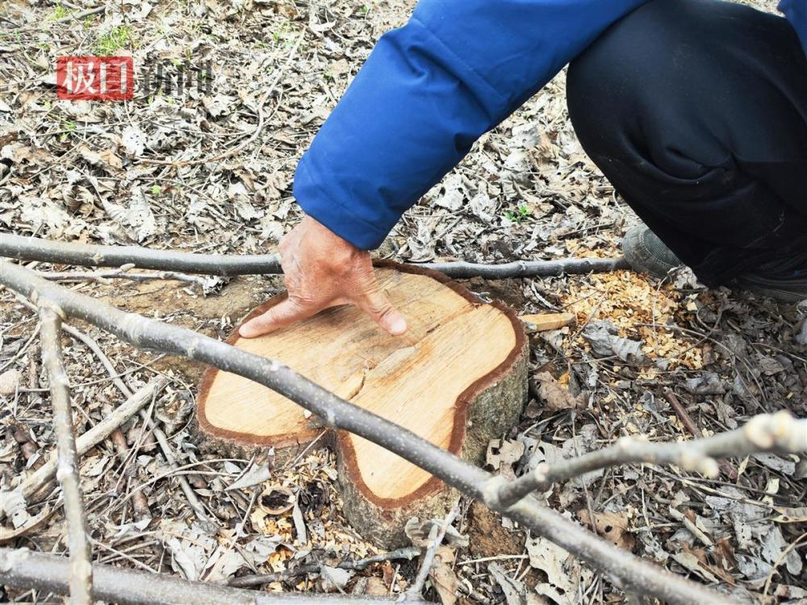
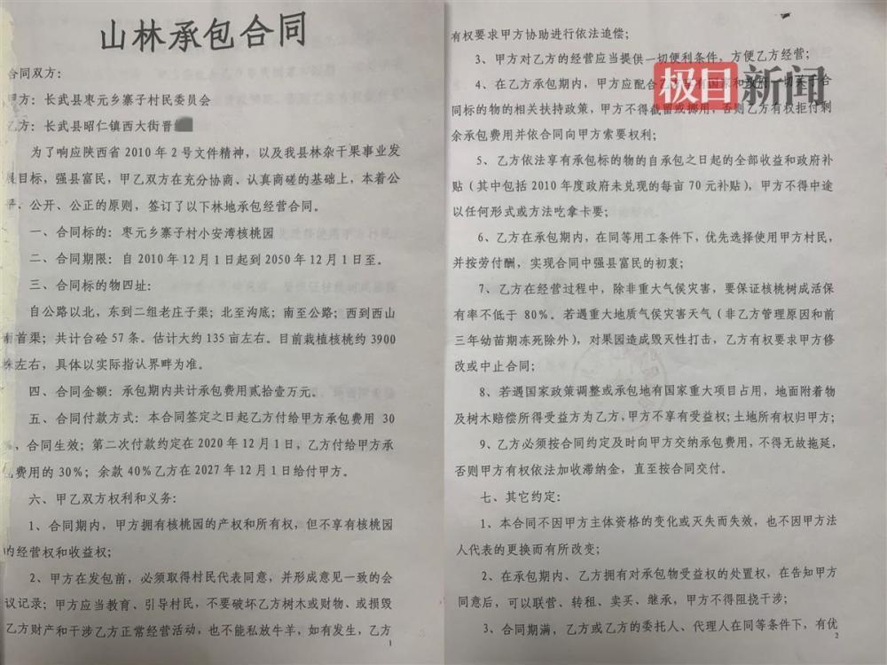
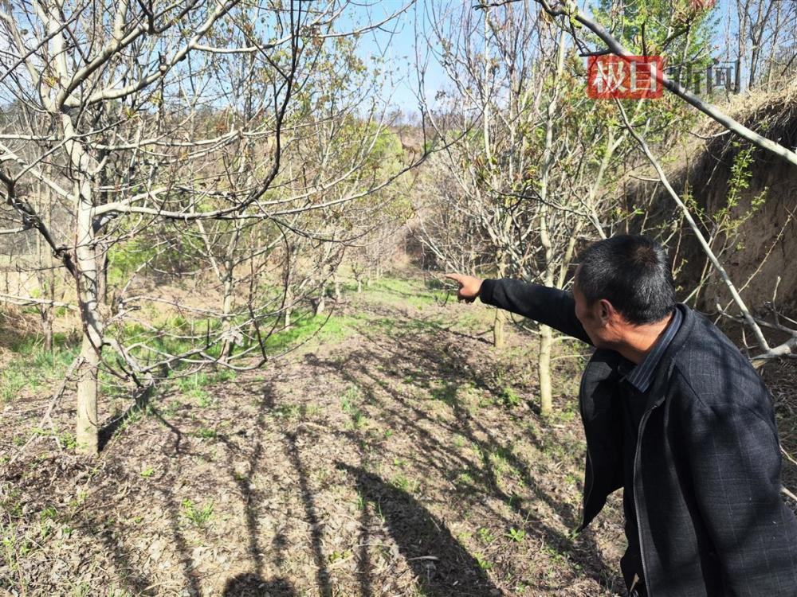

# 村民百亩核桃树被砍：镇政府称其与村委会合同存疑，专家建议相互起诉

极目新闻记者 舒隆焕

近日，陕西咸阳长武县枣园镇寨子村承包户晋先生向媒体反映称，他承包的一处核桃园约4500棵核桃树在3月初被人砍伐，数日后报警。

寨子村村干部和村民称，他们砍树是因为晋先生违约在先，其未支付承包合同约定应于2020年12月1日支付的7万元承包费。晋先生则表示，拒付承包费是因为他未能拿到一笔涉林补贴。

枣园镇政府有关人员称，本次村民砍树的行为，源于晋先生与村委会存在合同纠纷。晋先生承包的核桃园里一共近3000棵树，村里组织村民砍了1637棵，留下1094棵。

律师表示，此案例中双方均有不妥之处，可通过诉讼解决双方纠纷。专家称，若将该案例纳入清理“不能最大化保障村集体利益和群众利益”合同的范畴，应对合同的有效性，损害集体经济组织利益的程度，拖欠承包费情况等进行依法依规的调查、评估。

_航拍被砍的核桃园局部_

**村民：砍树1600余棵只因被欠承包费**

近日，陕西省咸阳市长武县枣园镇寨子村承包户晋先生向媒体反映称，他承包的一处核桃园约4500棵核桃树，在今年3月初遭当地村民无故砍伐，数日后报警。

此事经媒体报道，引发各方关注，而寨子村村支书李永旺对晋先生“约4500棵核桃树被砍”的说法不认同，他称核桃树只是被砍了一部分。

4月14日，极目新闻记者到寨子村实地探访了解到，核桃园确有部分核桃树未被砍伐，已砍的核桃树树干被砍树人变卖。李永旺告诉记者，4月13日村里组织村民对核桃树进行了清查，“135亩核桃树，砍了1637棵，未砍1094棵。”

枣园镇政府向记者证实了李永旺的说法，并提供了4月13日清查核桃树的证明。该镇政府一位工作人员称，双方签承包合同时，已有核桃树3900棵，后来补种了600棵，其间有一些核桃树死了。所以本次砍树之前，核桃园的核桃树只有近3000棵。

_地面上剩下的核桃树墩_

寨子村多位村民告诉记者，核桃园被晋先生承包十余年来，曾常年聘请管护员看护核桃园，农忙时雇佣村民修整土地、剪枝除草等，“前几年还卖过核桃，后来核桃收购价走低，核桃园也没人管了。”

寨子村村民张师傅认为，核桃园效益不行了，承包方也不愿意投入更多的精力和财力。村民分不到承包费，就把核桃树砍了，要么种玉米，要么流转给他人，有收益且更高，“最近是春耕时节，但因为砍树一事，那片地今年估计种不了玉米了。”

对于砍伐核桃树的直接原因，寨子村村民、村干部称，因为晋先生未支付承包合同约定于2020年12月1日应支付的第二笔7万元承包费，晋先生违约了。

枣园镇政府表示，寨子村多次联系晋先生要求支付承包费，均无音讯。同时，寨子村委会分别于2022年3月17日、2022年7月11日，先后两次向晋先生送达了《解除山林承包合同收回承包地通知书》。

2023年3月，晋先生发现其所承包的核桃树被齐根砍断。

**承包方：没收到补贴才拒付承包费**

晋先生究竟为何拒付第二笔承包款？

晋先生向记者介绍，2010年，为响应长武县大力发展林杂干果的号召，他与寨子村村委会签订承包合同，承包了该村约135亩的经济林。约定承包40年，承包费21万元，分三次缴清。

合同签订后，晋先生当即将首笔7万元的承包费付给了寨子村村委会，后在长武县林业局的支持下，在核桃园原有3900棵核桃树的基础上，追加补植了600棵左右的核桃苗，将承包的核桃树数量扩充至4500棵左右。

晋先生坦言，承包之初，栽种的核桃苗只有十几厘米高，到2015年开始挂果，后青皮核桃陆续开始销售，才有所收益，“2015年至2020年，因天灾欠收、市场等原因，真正卖核桃也就两三年，收益不大。”

到2020年，晋先生应支付第二笔7万元承包费时，他却不打算继续支付这笔钱了，理由是他未能拿到一笔涉林补贴。

晋先生认为，根据《长武县林业局关于2017年整合涉林财政扶贫资金计划的通知》的涉林补贴政策，他承包的135亩核桃林，理应在2017年获得5万元左右的林业补贴。但这钱一直未发到他手中，他曾多次到寨子村村委会及枣园镇政府讨要补贴，均无结果。

_承包合同（受访者供图）_

晋先生表示，承包合同有约定，“在乙方承包期内，甲方应配合其享有国家和政府一切关于合同标的物的相关扶持政策，甲方不得截留或挪用，否则乙方有权拒付剩余承包费用并依合同向甲方索要权利。”据此，他才未向寨子村村委会支付第二笔承包费。

关于被砍核桃树是不是4500棵，晋先生表示，核桃树被砍后，他只是站在远处看了看。他曾回村欲进核桃园查看树木被砍情况，村委会不让他进入，“部分核桃树还活着，我不知情。”

对于上述2022年两次告知解除承包合同的说法，晋先生告诉记者，2022年他只收到了一个经亲戚传递的《解除山林承包合同收回承包地通知书》。当时他已告知村委会，不接受村委会单方面解除承包合同。

晋先生表示，他4月14日再次到镇上沟通此事，“工作人员跟我说，当地有关部门正在调查。”

**官方：承包合同是否有效待商榷**

经枣园镇政府进一步了解得知，此次砍树，系村民整理撂荒地用于种粮。

寨子村村民向镇里反映，晋先生承包的核桃园所属地块为耕地，其承包后一直疏于管理，属于撂荒失管状态，导致核桃树死亡较多。加之第二笔承包费拖欠2年之久，村民对占用浪费耕地、无法收回承包费意见很大，要求收回核桃园后用于种植粮食作物，便对荒芜的核桃树进行了清理。

枣园镇政府有关负责人表示，晋先生与村委会存在合同纠纷，但本次村民砍树的行为，确实是寨子村村干部、部分村民法律意识淡薄。

长武县林业局此前接受媒体采访时也表明，经查明，因晋先生拖欠枣园镇寨子村承包费，所以该村组织村民砍伐核桃树。长武警方对媒体称，此事属于合同纠纷，不予立案。

_部分核桃树未被砍_

对于晋先生提到的林业补贴，长武县林业局向媒体称，该局确实于2017年下发了《长武县林业局关于2017年整合涉林财政扶贫资金计划的通知》，用于扶持当地林业经济发展。补贴钱款也第一时间拨付到长武县枣园镇政府，但对于后续发放情况，因年代久远已记不太清楚。

此前，该镇政府一名工作人员对媒体称，对于晋先生维权的正当性，有两点有待商榷。第一，晋先生是否有权申领林业补贴？该负责人认为，相关补贴款应由枣园镇拨付给寨子村村集体，再由其进一步分发到符合条件的农户手上。晋先生作为寨子村村集体的林地承包人，只有林地的经营权和收益权，并无产权和所有权，因此不一定有权领取这笔补贴。

第二，晋先生同寨子村村委会签订的承包合同是否有效？该负责人称，目前咸阳全市、县、乡镇正大力清理“不能最大化保障村集体利益和群众利益”的合同，而晋先生和寨子村村委会签订合同约定40年承包期限，违背了《民法典》第七百零五条的规定：“签订农村集体土地租赁合同最长期限不得超过20年。”

陕视新闻报道称，其实今年3月，陕西省就启动了农村集体经济合同清理规范专项行动，全面梳理规范农村集体经济组织对外订立的经济合同。依法完善口头合同，终止到期合同和无效合同；变更、解除严重损害集体经济组织利益、显失公平的低价、无偿合同以及因情势变更导致继续履行会对村集体明显不公的合同；依法终止集体不认可、群众反映大、长期拖欠租金等严重违约的合同。

**专家：双方可相互起诉解决纠纷**

北京中闻（西安）律师事务所律师谭敏涛向极目新闻记者表示，此案例中双方均有不妥之处。他认为，核桃园的承包费是合同约定的，晋先生以未能领到林业补贴为由拒付承包费是不对的。而村民砍树的行为，侵犯了晋先生对承包核桃园及其核桃树的使用权、收益权。同时，晋先生承包期间，核桃园所支出的林木管护、土地修整、剪枝打药等费用，属于间接损失，均可要求寨子村村委会及村民给予赔偿。

谭敏涛律师分析称，该案例中双方均认为对方违约，可通过诉讼解决。晋先生可以将寨子村村委会及参与砍树的村民一并作为被告，向法院起诉，要求村委会及村民承担侵权责任及连带侵权责任，主张赔偿损失。而村委会及村民也可以通过诉讼，依法依规变更或解除承包合同。此外，对于村民砍伐核桃树的行为，致使晋先生的收益权有损失，虽然警方认为此事属民事纠纷不予立案，但可对晋先生的收益权进行鉴定，再根据鉴定结果进一步处理。

此前，有律师对媒体表示，该案例中即便寨子村村委会想行使撤销权，单方面撤销承包合同，其前提是应当根据当事人双方签订承包合同的相关约定，即在什么情况下可以撤销。而就承包合同内容来看，没有关于此的明确规定，因此寨子村村委会没有撤销权。退一步说，即便寨子村村委会有撤销权，也应当将行使撤销权的意愿直接送达给晋先生才能生效，而非通过其亲戚这一第三方进行转达，其行为不具备撤销效力。

_航怕核桃园局部_

长期研究土地法的专家崔向前教授对极目新闻记者表示，近年来，多地陆续开展农村集体经济合同专项清理整治行动，其目的是解决农村集体土地、资产管理混乱问题。随着时间、关系和利益等多种因素叠加，此类问题在一些农村变得更加复杂，合同清理就是要向这一乱象宣战。

崔向前教授建议，此案例中，双方解决合同纠纷，首先当地有关部门需核对承包合同签订之时的程序，例如核查村民代表会议及会议记录等环节是否合规。其次，对承包方是否有权领取林业补贴的资格进行认定，确认补贴受益人到底是享有林业产权和所有权的寨子村村委会，还是享有林业经营权和收益权的实际承包人晋先生。同时，若将该案例纳入上述清理“不能最大化保障村集体利益和群众利益”合同的范畴，也应对合同的有效性、损害集体经济组织利益的程度、拖欠承包费情况等进行依法依规的调查评估。

同时，崔向前教授提醒，要审慎、稳步、依法依规推进涉地类涉众型纠纷解决，不能一蹴而就，农地承包经营权合同不能简单地一废了之，否则容易引发更大的矛盾，激发基层不稳定因素。

（来源：极目新闻）

