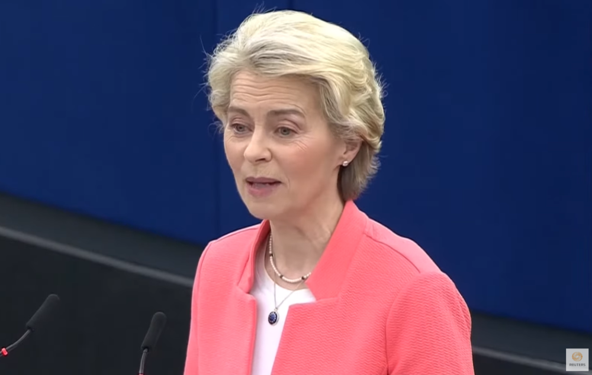

# 欧盟委员会主席冯德莱恩提中国行：对华脱钩不实际，但需降低对华依赖

（观察者网讯）当地时间4月18日，欧盟委员会主席冯德莱恩在欧洲议会全体会议上发表讲话，谈到了自己4月5日至7日的中国之行。冯德莱恩强调欧洲需要一个“连贯的、独特的”对华战略，并重申降低对华依赖并非“脱钩”。她指出：“对欧洲来说，脱钩不可行、不可取、不实际。”

_冯德莱恩18日发表讲话，视频截图_

冯德莱恩先从访华行程说起，称自己“很幸运地”在中国最传统的节日——清明节到访了北京。她称赞中国丰富的历史文化，并表达了自己对于中国人民的尊重和敬佩：几世纪以来，中国人帮助塑造了世界文明；过去几十年来，中国人改变了国家经济、令8亿多人口脱贫。

“我们永远不应忽视中国向现代经济强国、全球主要参与者和许多尖端技术的领导者转变的重要性……”冯德莱恩同时表示，中国如今的国际和经济地位涉及欧洲利益，也使得欧洲必须谨慎处理与中国的关系。

“在我看来，这也表明，对欧洲来说，（与华）脱钩显然是不可行的、不可取的，甚至是不切实际的（decoupling is clearly not viable,
desirable or even practical）”，她说。

冯德莱恩随后重申，她的看法一如既往，即欧洲需降低对华依赖、降低对华关系中一些“重要且敏感领域”的风险，但这叫做“避险”，而非“脱钩”。她指出，“中欧关系太重要了”，所以欧洲必须开辟出“我们自己独特的”欧洲道路，制定自己的欧洲对华战略和原则。

谈及原因时，她提到了南海问题、台湾问题、以及所谓的“人权”和“贸易胁迫”等问题，并称“这表明中国正在强化战略姿态，进入一个‘安全与控制’的新时代”。但她同时声明，无论对话多么困难，中欧双方都要通过外交努力减少误解和沟通不畅。

冯德莱恩说，在华访问期间，她向中方表明：欧洲不希望切断经济、社会、政治和科学联系，中国对欧洲来说是一个重要的贸易伙伴。与此同时，欧洲迫切需要在“透明、可预见性和互惠的基础上”重新平衡中欧关系，并在经济领域降低经济和国安风险。

为此，她向在场的欧洲议会议员们提出四点建议：一、增加欧洲经济弹性，降低对外依赖性；二、“更加大胆”地使用欧盟现有的贸易防御工具；三、为一些关键部门开发新的工具，防止“新兴和敏感技术”泄露；四、在经济和贸易安全领域，加强与七国集团（G7）等伙伴国家的合作。

“世界发生了巨大变化，中国已经变了，欧洲也已经变了”，冯德莱恩最后呼吁调整欧洲对华战略，各成员国应团结一致地与中国相处。

“避免与华脱钩”是冯德莱恩的一贯立场。在访华期间，4月6日，冯德莱恩指出：“当前，欧盟与中国的联系广泛而复杂。我们如何管理欧中关系，对我们经济发展的前景起决定性作用。正因如此，我认为与中国‘脱钩’的战略既不可行，也不可取。”

**本文系观察者网独家稿件，未经授权，不得转载。**

