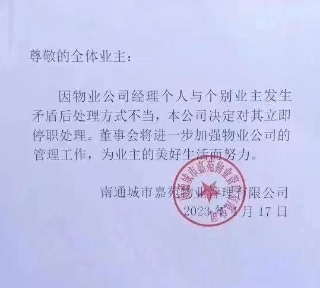

# 物业经理上门扇业主耳光 物业公司：已停职并解除劳动合同

近日，一则江苏南通城市嘉苑物业经理上门扇业主耳光引发关注。4月18日，北京青年报记者从涉事物业公司获悉，公司已对涉事物业经理停职并解除劳动合同。

据网传视频显示，涉事物业经理上门找业主交谈时，业主走出家门口，物业经理突然动手扇业主耳光，业主也还了手。随后，几名身穿制服的人员赶到现场劝阻。

据媒体报道，视频中的这一幕发生于4月17日凌晨，此前当事业主在业主群反映小区垃圾桶堆满未及时清理的问题，涉事物业经理随后私信业主，骂业主是“垃圾”，双方由此发生口角。

18日，南通城市嘉苑物业管理有限公司工作人员告诉北青报记者，因物业公司经理个人与个别业主发生矛盾后处理不当，决定对其进行停职处理，目前公司已与涉事物业经理解除劳动合同。

（北京青年报记者 戴幼卿）

