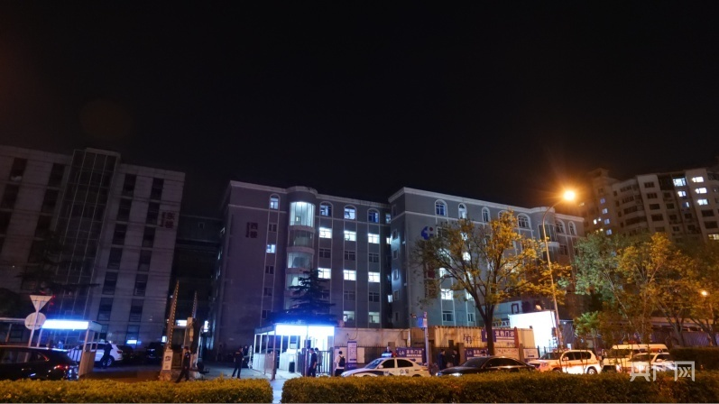

# 组图｜媒体走访北京长峰医院火灾现场：空气中仍有烧焦味道

央广网4月18日消息（记者阮修星朱冠安庞婷）4月18日21时25分许，记者来到位于北京丰台区靛厂路291号的北京长峰医院。虽然发生火灾大楼的明火早已扑灭，但院外的空气中仍有一股烧焦的味道。

_北京长峰医院大门外（央广网记者朱冠安摄）_

医院周围交通已恢复正常，道路边停着多辆警车，多名民警在不同点位维持现场秩序，一名民警提醒记者，“注意来往的车辆！”

_被烟熏黑的窗户口（央广网记者朱冠安摄）_

发生火情的住院部东楼目前依然处于封锁状态，记者和多方联系尝试进入大楼，截至发稿，未获得允许进入拍摄。

_仍在现场工作的消防救援人员（央广网记者朱冠安摄）_

_北京长峰医院院内（央广网记者朱冠安摄）_

_夜色中的北京长峰医院（央广网记者朱冠安摄）_

4月18日12时57分，北京丰台区消防救援支队接警：北京长峰医院住院部东楼发生火情。接警后，消防、公安、卫健、应急等部门即赴现场处置。13时33分许，现场明火被扑灭。15时30分，现场救援工作结束，共疏散转移患者71人。截至18时，经转院救治无效，21人不幸死亡。事故原因正在进一步调查。

（来源：央广网）

