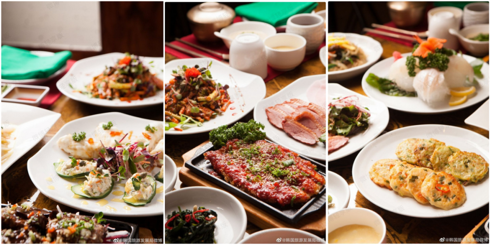
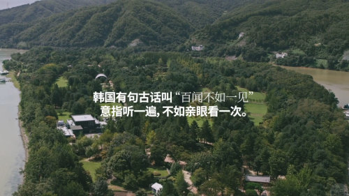

# 韩国宫廷“满汉全席”表述引发热议，专家：不算剽窃

连日来，韩国旅游发展局宣传韩国宫廷“满汉全席”，被怼上热搜。

在其官方微博中，韩国“满汉全席”被称为是“韩国传统饮食文化精华”。其还附上7张图片，图中是精致摆盘的拌菜、鱼虾、肉类和主食，配有多种调料。

其称，“每一道料理都是严格选用时令季节进贡的新鲜食材，经过顶级‘大长今’之手，才能出现在王公贵族的餐桌上”。

有人指出，“韩国宫廷满汉全席”的表述不妥，韩国没有“满族”和“汉族”，这是“明抢”。所谓宫廷宴更像是火锅店“小料台”、村子流水席。

引发群嘲后，韩国旅游发展局删除了争议微博，并对评论区开启防护模式。

_韩国旅游发展局宣传韩国宫廷“满汉全席”。图/@韩国旅游发展局微博_

**【1】“满汉全席”可以有两种理解**

青岛大学纺织服装学院助理教授李艾真曾在韩国留学多年，她对九派新闻表示，韩国旅游发展局微博中的韩国宫廷菜肴应该是韩定食，是韩国料理里配菜最丰富、级别最高的一种美食类型，“我理解的就是针对中国人的宣传，使用中国人熟悉的形容词，上升不到抢的层面。”

她认为，“满汉全席”可以有两种理解，一个是中国传统文化真正意义上的满汉全席，烹调方法、菜肴内容都是固定、规定好的；另一种是作为形容词，来形容菜式非常丰富，“就像年夜饭特别丰富，就会说，‘哎呀，今天吃满汉全席’。”

公开资料显示，“满汉全席”兴起于清朝，是集满族与汉族菜点之精华的著名中华大宴，菜单主要通过师承、文献发掘而形成。有观点认为，“满汉全席”更多是一种“叫法”。

据央广网报道，故宫方面曾明确，“满汉全席”在清朝宫廷并不真实存在。有一种说法是，清乾隆年间，李斗所著《扬州画舫录》中，记录了一份菜单，称其“所谓满汉席也”。据文化学者韦明铧考据，“满汉席”在扬州曾是官场菜。

故宫博物院研究员、宫廷史专家苑洪琪接受中新网采访时表示，“我在文献记载中看到，有满席、有汉席，但是就没有满汉全席。”在诸多史料记载中，满席和汉席都是分列的。康熙二十三年(公元1684年)，皇帝做出一项重要决定：“后元旦赐宴，应改满席为汉席。”苑洪琪认为，这段话正显示了满人入关后饮食习惯的变化。

青岛大学政治与公共管理学院教授高鹏告诉九派新闻，“满汉全席来源于中国，是毋庸置疑的，但关键是看谁能在现代去定义它，如果我们不去推陈出新，可能会被别人抢先标注、改良推进。”

“一些传统文化就要求我们一定要守好了，并对它进一步发展，去加入时代的内容。”

他认为，“韩国宫廷满汉全席”的表述并不算剽窃，“那个年代，没有商标和知识产权保护的概念，在日本和韩国的引领下，东亚地区才有了对文化产品的知识产权抢注的问题，除了嘲讽，我们为什么不抢先进行展示？”

**【2】历史上韩国长期受中国文化圈的影响**

韩国旅游发展局微博并非第一次“借”中国语言宣传韩国旅游。

2021年1月，因韩国旅游业受疫情影响，为吸引中国游客，其微博策划了宣传“韩国游”的活动。在中文宣传片中称，“韩国有句古话叫‘百闻不如一见’。意指听一遍，不如亲眼看一次。”

该宣传片立即引发质疑。据《古汉语成语典故词典》，“百闻不如一见”出自《汉书·赵充国传》：“百闻不如一见，兵难隃度。臣愿驰至金城，图上方略。”

历史上韩国长期处于中国文化圈的影响下，受到中国文化的熏陶。随着时间的推移，中国文化在韩国本土化，汉字在韩国地名中的影响却仍然存在。韩国很多地方与中国同名，也有汉江、襄阳、利川、广州、湖南大学等。

高鹏说，中国文化在古代是整个东亚地区的范本，周边的朝鲜半岛地区、日本列岛地区的一些文化元素都是来源于中国。

“中日韩其实往前溯源，有很多共同的东西，文字、语言、礼仪等等，这就是特殊历史时期的产物，我们只需要正视历史就好。”李艾真表示，“作为中国人，大可以一种博大宽广的胸襟和骨子里的文化自信去看待这个事情。我们坚持尊重任何一个文化圈和任何一段史实，但是也不允许任何有损文化在内的国家有形、无形资产的行为。”

对于传统文化，高鹏认为，“应做好分类和拯救工作，还有抢注、再开放工作，要高效率去保护文化产品。”

**九派新闻记者李曾卓**

版权归原作者所有，向原创致敬

