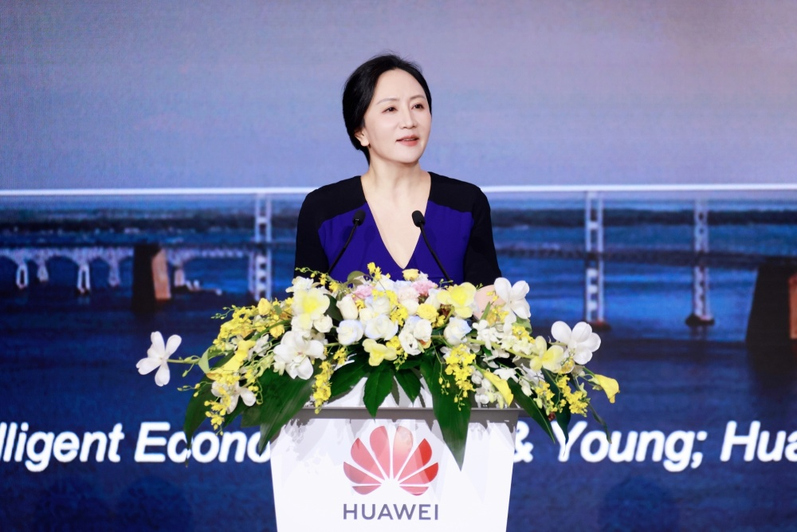

# 一线｜孟晚舟当值董事长首秀 畅谈数字化对华为战略意义

腾讯新闻《一线》 作者 肖枫

4月19日，华为副董事长、轮值董事长、CFO孟晚舟亮相2023华为全球分析师大会，畅谈数字化对华为的战略意义，这是她自2023年4月1日当值后首次公开露面。

孟晚舟阐述，“数字化是整个产业链的新蓝海，跃升数字生产力正当时。华为将在联接、计算、存储、云等方面保持投入。”她指出，目前有170多个国家发布了数字化发展报告，预计2025年55%经济增长来自于数字驱动，2026年全球数字化转型支出将达到3.41万亿美元。此外，到2030年通用计算能力将增长10倍，AI计算能力将增长500倍，全球联接总数达到2000亿，万兆企业WiFi渗透率达40%，云服务占企业应用支出比例为87%。

因此，无论是正在进行数字化转型的企业，还是那些支撑数字化转型的企业，都会面临巨大的市场空间。面对数字化机遇，华为将在连接、计算、存储、云等方面保持投入，为客户提供极简架构、提高质量、极低成本、极优体验的4极数字基础设施，即作业数字化，数字平台化，平台智能化，智能实战化。

结合华为近年来的实践，针对数字化转型，孟晚舟认为有三方面需要注意。首先，战略驱动是根本，数字化本质是战略选择和战略规划，成功的数字化转型都是由战略驱动，而非技术驱动。

其次，数据治理是基础，只有通过对数据的科学治理，数据在企业内部的流动才具有意义，不同维度的数据汇聚在一起才能创造新的价值。

同时，数据智能是方向，随着数据成为生产力，作业数字化、数字平台化使得数据清洁、透明、聚合，这是转型的基础。平台智能化、智能实战化使得数据随需、易懂、有用，这是数字转型的深化。

从华为的数字化业务布局看，华为已经形成了全栈式的数字化底座。具体而言可以分为四个模块，其一是基础软件生态，在外部打压下华为从底层软件开始重构，包括欧拉操作系统、高斯数据库等等；其二是网络基础设施，这是华为立身之本，涵盖了5.5G、F5G等领先的通讯能力；其三是算力体系，包括鲲鹏、昇腾、数据中心等业务；其四是云服务，在此基础上华为对产业界进行数字化赋能。

比如，华为云盘古大模型选择了B端产业路线，华为云目前已经陆续推出了矿山、药物分子、电力、气象、海浪等大模型。再比如，在医药领域，华为云联合西安交通大学第一附属医院，基于华为云盘古药物分子大模型研发出全新的广谱抗菌药物，将先导药的研发周期从数年缩短至一个月。

孟晚舟表示，数字化转型从来都不是一蹴而就。“华为和很多企业一样，也面临了同样的困境，这个困境就是，我们不是一个数字原生的企业，通过一系列的改变，我们以数字化的方式，数字化的思维及能力重构了业务。这是一个遍布研发、制造、销售、交付、财经等领域的数字化转型工作，在这个过程中，我们也得到了极大地提升。”

据称，华为还将持续推动建设5.5G时代领先的数字基础设施，构建干亿物联、万兆体验的网络能力，让计算产业未来的算力像今天的水和电一样触手可及，随需而用。

