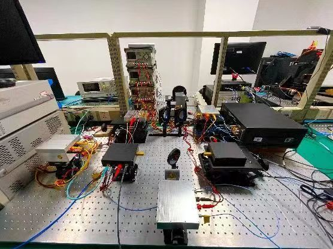

# 中国6G通信技术研发取得重要突破

【环球时报-环球网报道 记者
樊巍】《环球时报》记者4月19日从中国航天科工二院获悉，近日，二院25所在北京完成国内首次太赫兹轨道角动量的实时无线传输通信实验，利用高精度螺旋相位板天线在110GHz频段实现4种不同波束模态，通过4模态合成在10GHz的传输带宽上完成100Gbps无线实时传输，最大限度提升了带宽利用率，为我国6G通信技术发展提供重要保障和支撑。

无线回传技术是移动回传网络中连接基站与核心网设备的关键技术。随着通信速率需求的不断提升，移动通信频段被扩展至毫米波和更高的太赫兹频段，信号传输损耗大大增加，基站部署密度将成倍增长。在基站“高度致密化”的5G/6G通信时代，传统基于光纤的承载网传输将面临成本高、部署周期长、灵活性差等问题，无线回传技术将逐渐占据主导地位。据研究报告指出，2023年全球基站使用无线回传的比例将高达62%以上。

据《环球时报》记者了解，太赫兹通信作为新型频谱技术，可提供更大传输带宽，满足更高速率的传输需求，逐渐成为6G通信关键技术之一。面向未来，6G通信峰值速率将达到1Tbps，需要在已有频谱资源下进一步提高利用率，实现更高的无线传输能力。

25所自2021年瞄准6G通信的热点需求，紧跟国际通信技术前沿，选择太赫兹轨道角动量通信作为全新突破方向，在太赫兹频段上实现多路信号复用传输，完成超大容量的数据传输，频谱利用率提升两倍以上。未来，该技术还可服务于10m-1km的近距离宽带传输领域，为探月、探火着陆器和巡航器之间的高速传输，航天飞行器内部的无缆总线传输等航天领域应用提供支撑，为我国深空探测、新型航天器研发提供信息保障能力。

