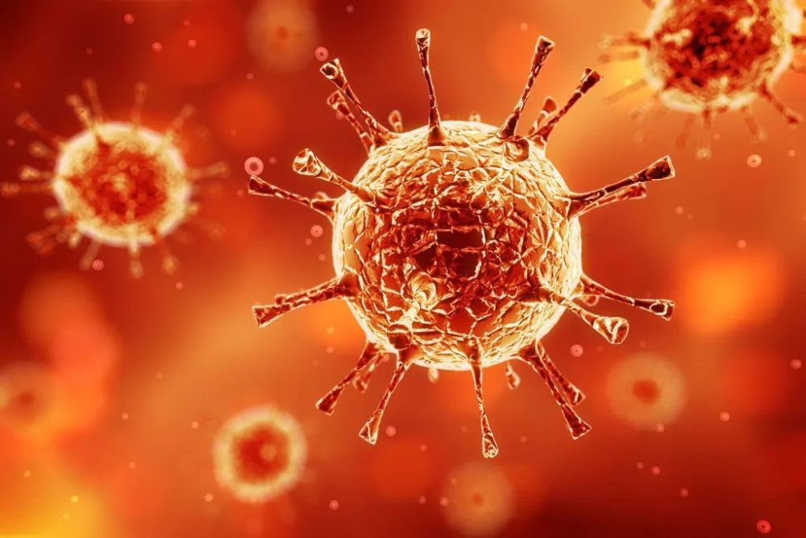
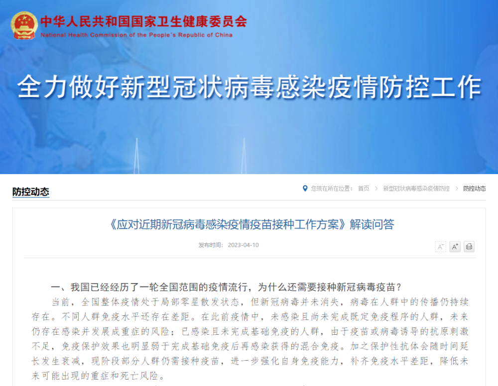

# 如何预防新冠XBB.1.16感染？哪些人需要补打疫苗？专家回应

自2022年底国内各地一波感染高峰过后，新冠慢慢淡出大众视野，人们的生活也逐步回归正轨。

近日，一种名为XBB.1.16的病毒新变异株引发关注。中疾控称，已在我国监测到新毒株。

**受访专家 西安交通大学第二附属医院感染科主任 党双锁**

**新冠新变种病毒肆虐多国**

新冠变异株XBB.1.16被称为Arcturus，别名“大角星”，属于奥密克戎毒株。今年1月23日首次在印度被发现，3月22日，世卫组织指定XBB.1.16为“监测中的变种”。

在印度、新加坡、美国、英国和澳大利亚等29个国家和地区，XBB.1.16感染病例呈现快速增长趋势。据了解，XBB.1.16已经成为美国排名第二的变种病毒；导致印度新增新冠病例重回过去八个月新高。

世卫组织新冠技术负责人玛丽亚·范·科克霍夫博士表示，XBB.1.16在刺突蛋白中有一个额外的突变，使得其传染性提高，并有致病性提高的可能性。提醒各国需对XBB.1.16保持高度警惕，对老年人以及合并呼吸系统疾病的人来说非常危险。

4月15日，中国疾控中心公布全国新冠病毒感染疫情最新情况。对比4月8日公布的数据，4月7日至4月13日，新监测到本土重点关注变异株124例（共计21个分支）。
**首次监测到15例XBB.1.16和2例XBB.1.16.1，表明这一变种病毒也已经进入我国** 。

**关于XBB.1.16的7个疑问**

《生命时报》专访西安交通大学第二附属医院感染科主任党双锁，解答关于新冠变异株XBB.1.16大众关心的问题。

**1、感染后为什么会出现结膜炎？**

美国和印度的报道中称，XBB.1.16感染者出现了一种与此前毒株不同的 **结膜炎症状，特征是眼红、有沙砾感并伴有瘙痒** 。

党双锁表示，尽管奥密克戎仍主要以攻击上呼吸道为主，但病毒感染是全身性问题，不仅只作用在某个靶器官上。眼睛不舒服，也属于病毒本身感染后会出现的、意料之中的症状。

《中国新型冠状病毒眼病防控专家共识(2022年)》中指出，新型冠状病毒可引起眼部疾病，比例为0~35.71%，眼表是病毒感染的潜在途径。

XBB.1.16是否更容易攻击眼部，还需要继续分析观察。

**2、需要囤眼药水吗？**

党双锁认为，感染后出现结膜炎症状，可以对症使用普通眼药水或抗炎眼药水，来缓解眼部不适。

一般病毒性结膜炎具有自限性，1~3周左右就会好转，不用药也能够达到治愈的目的， **无需大量囤眼药水**
。若症状较重，病毒性结膜炎可能波及眼角膜，需及时就医诊治。

**3、感染XBB.1.16该如何治疗？**

XBB.1.16毒株感染和此前 **新冠病毒感染的治疗方式一样**
，无症状、轻症患者可以居家休息，对症用药。对于有高风险因素或病情加重的患者，可以遵医嘱进行新冠抗病毒治疗以及器官功能支持等。

**4、会造成第二波疫情高峰吗？**

日本和捷克的研究人员称，XBB.1.16的传播效率比XBB.1和 XBB.1.5毒株高约1.17至1.27倍。

香港大学病毒学家金冬雁表示，感染XBB.1.16部分患者出现结膜炎症状，但症状仍属于轻微，该变种的整体致病性也没有升高，目前
**没有证据证明该变种能在短时间造成大规模二次感染** 。

上海肺科医院呼吸科副主任医师胡洋认为，和其他变异株一样，XBB.1.16也有引起重症肺炎的可能性，但 **并没有比前代毒力更强**
，目前还没有证据证明新冠药物对其耐药。

**5、感染过新冠，会再次感染吗？**

感染新冠病毒后，获得针对该毒株的免疫力一般可持续半年以上。是否会再次感染，与人体内抗体水平有关。

党双锁认为，“阳过”之后人体内抗体可以达到1500甚至2000以上。但在近期接受新冠抗体水平检测人群中，部分人的抗体水平已经不足500。
**若抗体水平低于50，再次感染的风险就相对较高。**

**6、如何预防XBB.1.16感染？**

党双锁强调：“觉得新冠消失了，不需要防护了”这个观点一定要改变。

仍建议做好个人防护，勤洗手、戴口罩，出现疑似症状注意自我隔离，前往发热门诊就诊，避免传染给其他人。

**7、现有疫苗能防住XBB.1.16吗？**

美国芝加哥公共卫生局局长Allison
Arwady博士认为，目前的新冠疫苗仍能够为个体提供免疫保护，来应对XBB.1.16亚变种，“总体来说，它们都是奥密克戎”。

党双锁表示，现阶段还是要强调新冠疫苗的接种，对于过去没有接种或没有接种完的人，现在是最好的接种时机。

**哪些人需要补打新冠疫苗？**

4月10日，国家卫建委发文称，新冠病毒并未消失，病毒在人群中的传播仍持续存在。

疫苗接种及感染获得的保护性抗体会随时间延长发生衰减。世界卫生组织及美国、英国、德国等主要机构和国家均推荐在感染后3-6个月进行疫苗接种。

是否需要接种疫苗要根据感染情况、既往接种史以及年龄、身体状况等因素确定。如果在此前疫情中未感染，但尚未完成既定免疫程序，需要继续完成后续剂次的疫苗接种。

如果在此前疫情中已感染，但在感染前尚未完成基础免疫，需要在感染3个月后再接种1剂次疫苗。对于感染高风险人群、60岁以上老年人群、具有较严重基础性疾病人群和免疫力低下人群，还需完成第二剂次加强免疫。

本文作者：生命时报记者罗榕、赵子莹 本期编辑：罗榕

