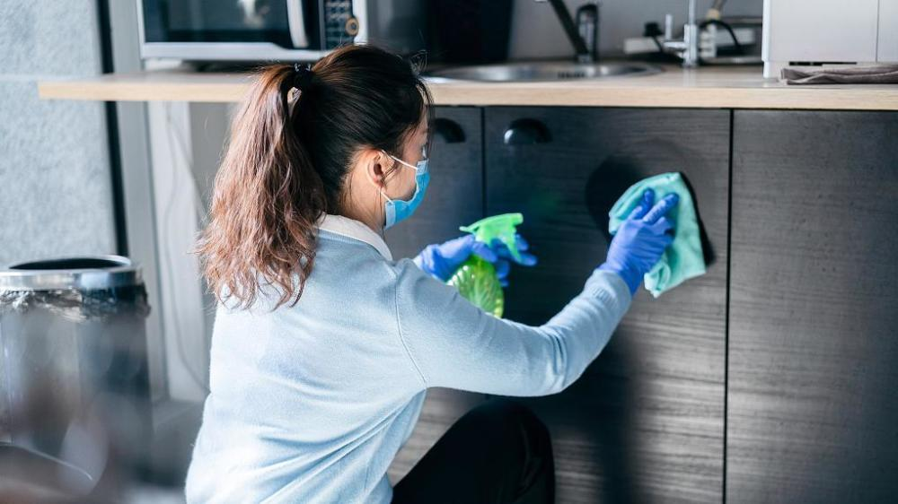

# 妇女蓝皮书：中国女性仍承担着家务劳动、养育照料的主要职责

4月19日，中华女子学院（全国妇联干部培训学院）全球女性发展研究院与社会科学文献出版社共同发布《妇女蓝皮书：新时代中国妇女发展报告（2022）——妇女参与经济社会发展分析》。蓝皮书指出，目前互助平等型家庭成员关系已成为社会主流，夫妻共同参与家庭决策的情况明显，但在履行其他家庭责任包括家务劳动、家庭教育上还存在以女性为主的现象。

蓝皮书指出，2020年第四期中国妇女社会地位调查显示，尊老爱幼、男女平等价值理念在家庭中受到尊崇，70%以上被访问者认为夫妻两性地位相当，80%以上选择“共同商量”是家庭重大事务决策的主要方式。“生育决策”由夫妻共同商量的占91.1%，“投资或贷款”和“买房或盖房”妻子参与决策的分别占89.5%和90.0%，这两项分别比2010年提高14.8个、15.6个百分点。

但同时，蓝皮书指出，女性依然承担着养育与照料家庭成员的主要职责，在日常生活中与子女有更多情感上的互动，也承担着主要的家庭教育职责，包括子女思想品德、性格习惯、智力与学识等方面的培养，也包括学业督促、业余生活的安排，课外业余兴趣班的选择、未来个人发展规划等。

据第四期中国妇女社会地位调查数据显示，0至17岁孩子的辅导作业主要由母亲承担的占67.5%。调查显示，我国家庭中父母双方共同照料孩子的家庭只占7.5%。

此外，蓝皮书还指出，虽然女性仍是主要的承担者，但是男性对家庭照顾责任的贡献有所增加，承担家庭劳动的两性时间差距有所缩小。

