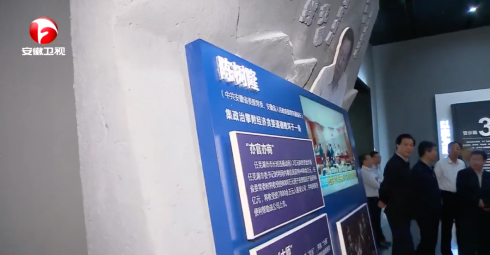
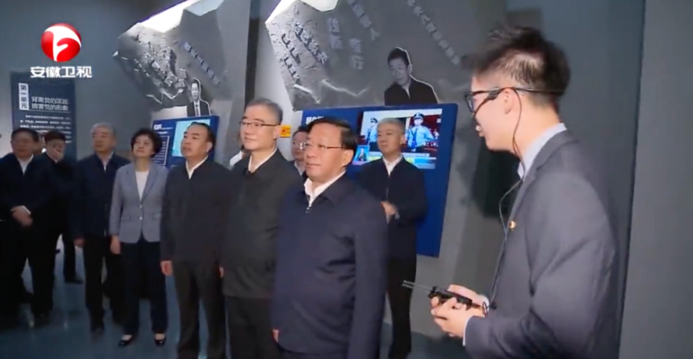
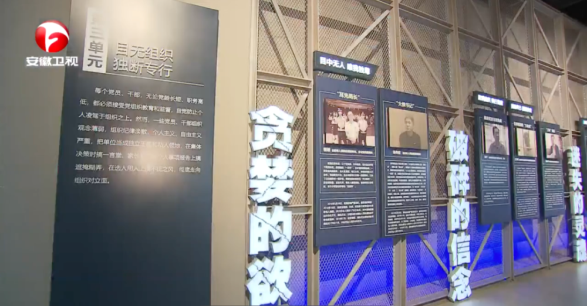

# 安徽省委书记等驻足观看“老虎”受审画面：不少都是熟悉的人，教训深刻

**撰文 | 余晖**

今天的话题，聚焦警示教育。

据《安徽新闻联播》消息，4月18日上午，安徽省领导集体赴省党风廉政教育馆开展主题警示教育。

此举意在“以案为鉴、以案示警、以案促改，推动全省主题教育高标准高质量开展，推动党风廉政建设和反腐败斗争向纵深发展”。

在现场，安徽省委书记韩俊说，“这些案例很多就发生在我们身边，不少都是熟悉的人、熟悉的事，教训非常深刻。”

**履新一月后，省委书记赴警示教育现场**

政知君注意到，此次开展主题警示教育，安徽省四套班子全员出席。参加此次活动的有：

安徽省委书记韩俊，安徽省委副书记、省长王清宪，安徽省政协主席唐良智，安徽省委副书记程丽华，安徽省委常委，省人大常委会、省政府负责人。

值得一提的是，韩俊是今年3月赴安徽履新的。

韩俊曾任中央农村工作领导小组办公室副主任，农业农村部党组副书记、副部长，2020年11月到吉林工作，后任吉林省代省长、省长。

今年3月14日，安徽省召开全省领导干部会议，韩俊接替郑栅洁，担任安徽省委书记。

在履新现场，韩俊提到， **坚决反对和防止“圈子文化”，一体推进不敢腐、不能腐、不想腐，持续营造风清气正的政治生态。**

一个月后，4月18日上午，韩俊等安徽省领导集体赴安徽省党风廉政教育馆开展主题警示教育。

据介绍，韩俊等首先到了序厅，认真观看专题片《永远在路上》。

之后，韩俊等依次参观“纪律立党·从严治党”“廉润江淮·清风扬帆”“以案为鉴·警钟长鸣”“不忘初心·永葆清廉”四个展厅。

另据《安徽新闻联播》披露的画面显示，展厅中展示了不少落马“老虎”，包括：

西藏自治区政府原副主席张永泽，中国人寿保险（集团）公司原党委书记、董事长王滨，广西壮族自治区政府原副主席刘宏武，四川省人大常委会原副主任王铭晖，中国储备粮管理集团有限公司原党组成员、副总经理徐宝义，黑龙江省人大常委会原副主任宋希斌，河北省人大常委会原副主任谢计来，中国联合网络通信集团有限公司原党组副书记、总经理李国华等。

**在落马虎画面前驻足观看**

**电视画面显示，韩俊、王清宪等人还在陈树隆等“老虎”受审的画面前驻足观看。**

公开资料显示，陈树隆曾长期在安徽任职，担任过芜湖市市长、市委书记，安徽省委常委、省委秘书长，安徽省委常委、常务副省长等，2016年11月被查，后因受贿罪、滥用职权罪、内幕交易、泄露内幕信息罪被判无期。

展板上称，陈树隆“集政治攀附经济贪婪道德败坏于一身”。

展板上还提到了陈树隆案件的相关细节——
**陈树隆任芜湖市市长时违规动用2.2亿财政资金炒股；任芜湖市委书记时利用内幕信息获利4400余万元；任省委常委时将收受的8000万元用于投资信托产品获利6亿元，将收受的7800余万元入股某公司，并利用职务便利帮助该公司上市。**

上述不少细节，都是首次披露。

除了“老虎”之外，展厅还展现了安徽当地不少落马官员，包括“耳光局长”——安徽省司法厅原党委委员、副厅长程瀚等。

有媒体报道称，程瀚曾是合肥乃至安徽有名的“霸道官员”。有两个打人故事广为流传：一个是说程瀚到某派出所视察，一名民警在电脑前忙工作没看见，没及时起立敬礼，被程瀚一个耳光打上去，骂其“不长眼”；另一个是说在一次公务接待上，程瀚嫌某位副局长“没陪好”他的客人，当众大骂后动手打人，用力过猛打掉这位副局长一颗牙。

在一幅幅图片、一个个案例、一份份忏悔书前，韩俊不时询问，与周围人交流。

他说，
**“这些案例很多就发生在我们身边，不少都是熟悉的人、熟悉的事，教训非常深刻，给我们上了一堂生动的政治课、思想课、廉政课，也是过了一次党内生活、接受了一次党性锤炼。”**

**提要求：带头管好自身、带头管好家人亲戚和身边人**

在现场，韩俊强调， **要把严的基调、严的措施、严的氛围长期坚持下去** ，一体推进“三不腐”同时发力、同向发力、综合发力，坚决打赢反腐败斗争攻坚战持久战。

他提到：

要 **保持反腐高压态势，紧盯重点人、重点岗位、重点领域**
，严格落实中央八项规定及其实施细则精神，坚决纠治“四风”特别是形式主义、官僚主义，增强“不敢腐”的震慑效能。

要强化权力约束监督，加强重点领域监督机制改革和制度建设，完善及时发现问题的防范机制、精准纠正偏差的矫正机制，扎牢“不能腐”的制度笼子。

要加强廉洁文化建设，教育督促广大党员、干部立根固本，知敬畏守底线，增强“不想腐”的思想自觉。

韩俊指出，全省各级领导干部作为“关键少数”，在全面建设现代化美好安徽中发挥着重要作用、担负着重要职责。

**要认清权力是人民赋予的，平台是组织提供的，必须为人民所用、对组织负责，** 坚持“忠专实”“勤正廉”，
**带头管好自身，带头管好家人亲戚和身边人，带头管好主管分管领域风气** ，当好良好政治生态和社会风气的引领者、营造者、维护者。

**资料 ｜ 新华社 安徽新闻联播 安徽日报等**

**【版权声明】本文著作权归政知新媒体独家所有，未经授权，不得转载。**

